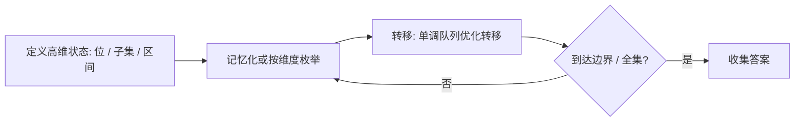

# 单调队列优化转移：进阶动态规划训练题解

这篇不是背模板，而是把 **单调队列优化转移** 拆成可以手写、可以检查的步骤。训练时建议先遮住题解，只看图和不变量，自己写一版，再展开代码对照。

## 适用场景

线性状态不够用时升维：按数位、按子集 bitmask、按区间 [l, r] 编码状态。

- 普通线性 DP 不够用时，状态往往要升维：数位题按“第几位 + 是否贴上界”，集合题按 bitmask，区间题按 `[l, r]`。
- 先确定状态每一维的含义，再写转移。

## 图解思路



按这张图写代码时，先不要急着写完整函数，先把图里的三个变量写出来：

- `state`：高维状态，如 `(pos, tight, mask)` 或 `(l, r)`。
- `memo`：记忆化表，避免重复子问题。
- `transition`：枚举这一维的所有取值。

## 手写步骤

1. 写清楚状态每一维代表什么、取值范围多大。
2. 数位 DP 用 `dfs(pos, tight, ...)` + 记忆化非贴边状态。
3. 状压 DP 用枚举子集 `sub = (sub-1) & mask`。
4. 区间 DP 按长度从小到大枚举 `[l, r]` 和断点 `k`。

## Go 参考骨架

```go
// 数位 DP 骨架：统计 [0, n] 中满足条件的数，state 按题意扩展
func digitCount(n int) int {
	digits := []int{}
	for n > 0 {
		digits = append([]int{n % 10}, digits...)
		n /= 10
	}
	memo := map[[2]int]int{}
	var dfs func(pos, state int, tight bool) int
	dfs = func(pos, state int, tight bool) int {
		if pos == len(digits) {
			return 1
		}
		if !tight {
			if v, ok := memo[[2]int{pos, state}]; ok {
				return v
			}
		}
		limit := 9
		if tight {
			limit = digits[pos]
		}
		res := 0
		for d := 0; d <= limit; d++ {
			res += dfs(pos+1, state, tight && d == limit)
		}
		if !tight {
			memo[[2]int{pos, state}] = res
		}
		return res
	}
	return dfs(0, 0, true)
}
```

## Rust 参考骨架

```rust
// 数位 DP 骨架：统计 [0, n] 中满足条件的数
pub fn digit_count(n: i32) -> i32 {
    let digits: Vec<i32> = n.to_string().bytes().map(|b| (b - b'0') as i32).collect();
    let mut memo = std::collections::HashMap::new();
    fn dfs(
        pos: usize,
        state: i32,
        tight: bool,
        digits: &[i32],
        memo: &mut std::collections::HashMap<(usize, i32), i32>,
    ) -> i32 {
        if pos == digits.len() {
            return 1;
        }
        if !tight {
            if let Some(&v) = memo.get(&(pos, state)) {
                return v;
            }
        }
        let limit = if tight { digits[pos] } else { 9 };
        let mut res = 0;
        for d in 0..=limit {
            res += dfs(pos + 1, state, tight && d == limit, digits, memo);
        }
        if !tight {
            memo.insert((pos, state), res);
        }
        res
    }
    dfs(0, 0, true, &digits, &mut memo)
}
```

## 为什么这样写

升维 DP 的正确性仍来自“无后效性”：高维状态把影响未来的全部信息都编码进去，于是子问题互不干扰。

## 复杂度

- 时间复杂度：数位 $O(\text{位数}\times\text{状态})$；状压 $O(2^n n)$ 或枚举子集 $O(3^n)$；区间 $O(n^3)$。
- 空间复杂度：状态总数。

## 易错点

- 数位 DP 把 `tight=true` 的状态也缓存，污染其他上界。
- 状压枚举子集写成 `for s in 0..mask` 而非真子集枚举。
- 区间 DP 枚举顺序错，用了还没算的更长区间。

## 练习顺序

建议按这个顺序刷：#664, #1411, #879, #233, #600, #902。每题都先写 Go 或 Rust，再对照题解。
