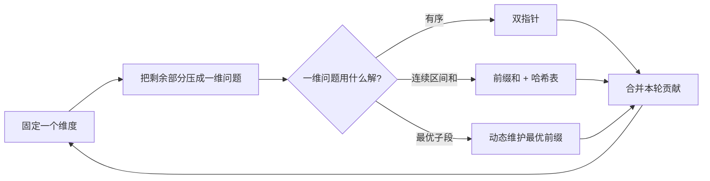

# 固定一维枚举另一维：数组与字符串训练题解

很多数组题的暴力解法都是枚举两个边界：`left` 和 `right`，或者矩阵里的上边界和下边界。打磨这类题时，不要第一反应就写双层循环，而是先问一句：**固定其中一维以后，剩下那一维能不能变成熟悉的一维问题**？

这就是“固定一维枚举另一维”的价值。它不一定把复杂度降到 $O(n)$，但能把不可接受的暴力枚举，压到题目数据范围能承受的层级。

## 适用场景

适合这类思路的题，往往有“选一段”“选几个数”“选一个子矩阵”的结构。

- 三数之和：固定第一个数，剩下两个数用相向双指针找。
- 四数之和：固定前两个数，剩下两个数继续双指针。
- 最大子数组和：固定右端时，用“最小前缀和”替代枚举所有左端。
- 和为 K 的子数组：固定右端时，用哈希表统计之前出现过的前缀和。
- 子矩阵目标和：固定上下边界，把每一列压成一维数组，再套 #560。

判断这类题的关键，是固定一维以后，剩余状态有没有可复用的单调性、前缀和或计数关系。

## 图解思路



这张图里最容易漏掉的是“压成一维问题”这一步。比如子矩阵求和，不要枚举四个边界后再逐格求和；固定上下边界后，每列在这两行之间的和就是一个一维数组，接下来问题变成“这个数组里有多少个子数组和等于 target”。

写代码前先确认三个对象：

- 固定量：本轮外层循环确定了什么，比如第一个数、上边界、右端点。
- 派生量：固定后能维护什么状态，比如列和、前缀和、剩余目标。
- 合并方式：一维子问题的答案如何计入总答案。

## 手写步骤

1. 先写最直接的暴力枚举，确认有几个维度。
2. 选择一个维度固定，让外层循环负责它。
3. 把固定后的剩余部分转成一维数组、剩余目标或前缀差。
4. 对这个一维问题套对应方法：双指针、前缀和哈希、动态规划。
5. 合并答案，并检查固定维度变化时哪些状态可以增量更新。

## Go 参考骨架

```go
func subarraySum(nums []int, k int) int {
	count := map[int]int{0: 1}
	prefix, ans := 0, 0
	for _, x := range nums {
		prefix += x
		ans += count[prefix-k]
		count[prefix]++
	}
	return ans
}
```

## Rust 参考骨架

```rust
use std::collections::HashMap;

pub fn max_sub_array(nums: Vec<i32>) -> i32 {
    let mut best = nums[0];
    let mut min_prefix = 0;
    let mut prefix = 0;
    for x in nums {
        prefix += x;
        best = best.max(prefix - min_prefix);
        min_prefix = min_prefix.min(prefix);
    }
    best
}

pub fn count_subarrays_with_sum(nums: Vec<i32>, k: i32) -> i32 {
    let mut count = HashMap::from([(0, 1)]);
    let (mut prefix, mut ans) = (0, 0);
    for x in nums {
        prefix += x;
        if let Some(v) = count.get(&(prefix - k)) {
            ans += *v;
        }
        *count.entry(prefix).or_insert(0) += 1;
    }
    ans
}
```

## 为什么这样写

以 #560 和为 K 的子数组为例，它可以理解成“固定右端，快速统计左端”。设当前前缀和为 `prefix`，如果某个历史前缀和等于 `prefix - k`，那么从那个位置之后到当前右端的子数组和就是 `k`。

所以我们不需要枚举所有左端，只需要用哈希表记录每种历史前缀和出现了几次。每读到一个新右端，就把所有可行左端一次性加进答案。

二维版本也是同理。固定上下边界后，列和数组里的任意一段连续列，就对应原矩阵里的一个子矩阵。此时再套一维的前缀和计数即可。

## 复杂度

- 一维前缀和计数：时间复杂度 $O(n)$，空间复杂度 $O(n)$。
- 三数之和：排序后固定一维加双指针，时间复杂度 $O(n^2)$，空间复杂度取决于排序。
- 子矩阵目标和：固定两条行边界后做一维统计，时间复杂度通常是 $O(m^2 n)$。

## 易错点

- 前缀和计数必须先查 `prefix - k`，再把当前 `prefix` 加入哈希表，否则会把空区间算进去。
- 忘记初始化 `count[0] = 1`，导致从下标 `0` 开始的合法子数组漏计。
- 固定维度变化时，没有清空或正确增量维护本轮状态。
- 三数之和固定第一个数后，去重应该放在同一层级，不能把不同固定值的答案误删。

## 练习顺序

建议按这个顺序刷：#53, #560, #974, #15, #18, #1074。

先用 #53/#560 建立“固定右端，快速处理左端”的感觉，再做 #15/#18 练“固定一个数，剩余部分降成双指针”，最后用 #1074 把一维方法迁移到二维矩阵。
