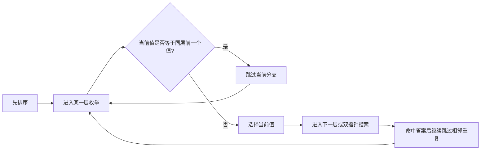

# 排序后跳过重复值：数组与字符串训练题解

很多去重题都能先排序，因为排序会把相同值放在一起，让“重复选择”变成相邻元素之间的判断。但排序只是准备工作，真正决定正确性的，是你在哪一层跳过重复值。

一句话记法：**同一层枚举相同值，只保留第一次；进入下一层后，是否还能使用相同值，要看题目是否允许复用或多次出现**。

## 适用场景

适合排序去重的题，通常要求返回不重复的组合、排列、三元组或集合。

- 三数之和、四数之和：固定数时跳过同层重复值，双指针命中答案后继续跳过左右重复值。
- 子集 II、组合总和 II：递归同一层遇到相同值时跳过，避免生成重复分支。
- 全排列 II：同层不要把相同数字放到同一个位置两次。
- 数组交集：排序后用双指针跳过已经输出过的值。

如果题目只要求计数，不要求列出具体方案，有时哈希表或计数数组更直接，不必为了去重先排序。

## 图解思路



这里的“同层”很重要。以回溯为例，`for i in start..n` 这一轮循环就是同一层；如果 `i > start && nums[i] == nums[i-1]`，说明这一层已经用前一个相同值开过分支，当前值再开一次会得到重复答案。

但如果已经进入下一层，`nums[i] == nums[i-1]` 不一定要跳。比如 `[1, 1, 2]` 的子集里，`[1, 1]` 是合法答案；不能因为两个 `1` 相同就永远只能取一个。

## 手写步骤

1. 先排序，让相同值相邻。
2. 明确当前循环属于哪一层：固定第几个数、回溯的第几层、双指针的哪一侧。
3. 同层枚举时，如果当前值等于同层前一个值，跳过当前分支。
4. 找到一个答案后，移动指针或回溯返回前，继续跳过相邻重复值。
5. 复查边界：跳重复值时必须保证指针仍在合法范围内。

## Go 参考骨架

```go
func threeSum(nums []int) [][]int {
	sort.Ints(nums)
	ans := [][]int{}
	for i := 0; i < len(nums)-2; i++ {
		if i > 0 && nums[i] == nums[i-1] {
			continue
		}
		left, right := i+1, len(nums)-1
		for left < right {
			sum := nums[i] + nums[left] + nums[right]
			if sum == 0 {
				ans = append(ans, []int{nums[i], nums[left], nums[right]})
				left++
				right--
				for left < right && nums[left] == nums[left-1] {
					left++
				}
				for left < right && nums[right] == nums[right+1] {
					right--
				}
			} else if sum < 0 {
				left++
			} else {
				right--
			}
		}
	}
	return ans
}
```

## Rust 参考骨架

```rust
pub fn subsets_with_dup(mut nums: Vec<i32>) -> Vec<Vec<i32>> {
    nums.sort_unstable();
    let mut ans = Vec::new();
    let mut path = Vec::new();

    fn dfs(start: usize, nums: &[i32], path: &mut Vec<i32>, ans: &mut Vec<Vec<i32>>) {
        ans.push(path.clone());
        for i in start..nums.len() {
            if i > start && nums[i] == nums[i - 1] {
                continue;
            }
            path.push(nums[i]);
            dfs(i + 1, nums, path, ans);
            path.pop();
        }
    }

    dfs(0, &nums, &mut path, &mut ans);
    ans
}
```

## 为什么这样写

排序后，重复答案一定来自“在同一个决策位置选择了相同的值”。所以去重条件应该绑定决策层级，而不是简单地看到相等就跳。

三数之和有两处去重：

- 外层固定 `i` 时，`nums[i] == nums[i-1]` 说明同一个固定值已经处理过，直接跳过。
- 双指针找到答案后，`left` 和 `right` 都要跨过相邻重复值，否则会输出相同三元组。

子集 II 的去重也是同理：同一层 `for` 循环中，相同值只开一次分支；进入下一层后，相同值仍然可以作为数组里的第二个元素被选择。

## 复杂度

- 三数之和：排序 $O(n \log n)$，主过程 $O(n^2)$。
- 子集 II：最坏需要输出 $O(2^n)$ 个子集，排序额外 $O(n \log n)$。
- 空间复杂度主要取决于输出规模；递归栈通常是 $O(n)$。

## 易错点

- 把 `i > start` 写成 `i > 0`，导致回溯下一层的合法重复值被错误跳过。
- 三数之和命中答案后只移动一侧指针，或者只跳过一侧重复值。
- 在没有排序的情况下使用相邻去重条件，条件本身就不成立。
- 去重放在加入答案之后还是之前，要和题型一致；三数之和固定点去重应在搜索前，双指针去重应在记录答案后。

## 练习顺序

建议按这个顺序刷：#349, #90, #40, #47, #15, #18。

先用 #349 感受排序后相邻重复的处理，再用 #90/#40 分清回溯同层去重，最后做 #15/#18，把固定点去重和双指针去重放到同一题里练。
