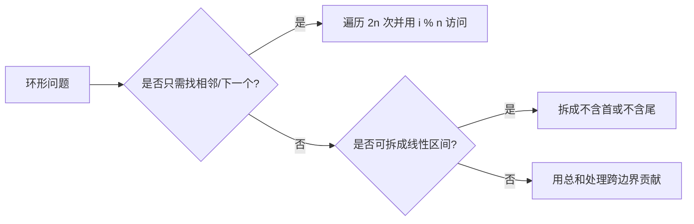

# 循环数组取模遍历：数组与字符串训练题解

循环数组的难点不是 `% n`，而是边界：到底要绕几圈？什么时候停止？跨过末尾接回开头后，答案是否仍然只允许使用每个元素一次？

常见建模有三种：直接取模访问、把数组逻辑展开成两倍长度、或者用总和把“跨边界子数组”转成“排除中间一段”。

## 适用场景

看到“循环”“环形”“下一个更大元素”“旋转数组”“首尾相邻”时，先把普通数组的边界条件改成环形边界。

- 下一个更大元素 II：逻辑遍历 `2n` 次，用 `i % n` 访问元素。
- 旋转数组：下标映射或三次反转。
- 环形最大子数组和：答案要么不跨边界，要么等于总和减去最小子数组和。
- 打家劫舍 II：首尾不能同时选，拆成两个线性区间。
- 加油站：绕一圈的可行性由总油量和当前亏空决定。

## 图解思路



循环数组题的停止条件必须写清楚：

- 遍历 `2n` 是为了让每个位置看到右侧一整圈，不是无限循环。
- 如果答案不能重复使用元素，窗口长度最多是 `n`。
- 如果首尾互斥，可以拆成 `[0, n-2]` 和 `[1, n-1]` 两个线性问题。

## 手写步骤

1. 明确环形限制：能否绕多圈、是否允许重复使用元素。
2. 选择建模方式：取模、两倍遍历、拆区间或总和转换。
3. 如果用取模，循环次数写成固定上界，避免无限循环。
4. 如果用单调栈或滑动窗口，确保每个真实下标最多入栈/出栈有限次。
5. 单独处理 `n == 0`、`n == 1` 或全负数等特殊情况。

## Go 参考骨架

```go
func nextGreaterElements(nums []int) []int {
	n := len(nums)
	ans := make([]int, n)
	for i := range ans {
		ans[i] = -1
	}
	stack := []int{}
	for i := 0; i < 2*n; i++ {
		idx := i % n
		for len(stack) > 0 && nums[stack[len(stack)-1]] < nums[idx] {
			top := stack[len(stack)-1]
			stack = stack[:len(stack)-1]
			ans[top] = nums[idx]
		}
		if i < n {
			stack = append(stack, idx)
		}
	}
	return ans
}
```

## Rust 参考骨架

```rust
pub fn max_subarray_sum_circular(nums: Vec<i32>) -> i32 {
    let mut total = 0;
    let (mut max_sum, mut cur_max) = (nums[0], 0);
    let (mut min_sum, mut cur_min) = (nums[0], 0);

    for x in nums {
        cur_max = x.max(cur_max + x);
        max_sum = max_sum.max(cur_max);
        cur_min = x.min(cur_min + x);
        min_sum = min_sum.min(cur_min);
        total += x;
    }

    if max_sum < 0 {
        max_sum
    } else {
        max_sum.max(total - min_sum)
    }
}
```

## 为什么这样写

以 #503 下一个更大元素 II 为例，一个元素的答案可能在它右侧，也可能绕到数组开头后才出现。遍历 `2n` 次可以覆盖“一整圈”的候选；但每个下标只在前 `n` 次入栈一次，避免重复记录同一个位置。

以 #918 环形最大子数组和为例，最大子数组只有两种形态：不跨边界，直接用最大子数组和；跨边界，则等价于总和减去中间那段最小子数组和。全负数时不能选空数组，所以要单独返回普通最大子数组和。

## 复杂度

- 时间复杂度：常见循环数组技巧仍是 $O(n)$，两倍遍历也是 $O(2n)$。
- 空间复杂度：单调栈通常是 $O(n)$；Kadane 转换可以做到 $O(1)$。

## 易错点

- `i % n` 只是访问方式，不能代表可以无限重复使用元素。
- 下一个更大元素中，第二圈不应该再次把下标压栈。
- 环形最大子数组全负数时，`total - min_sum` 会变成 0，但空数组不是合法答案。
- 打家劫舍 II 中，长度为 1 时不能拆成两个空区间。

## 练习顺序

建议按这个顺序刷：#189, #503, #134, #213, #918, #457。

先用旋转数组和下一个更大元素练取模/两倍遍历，再做加油站和打家劫舍理解环形约束，最后用环形最大子数组和循环数组检测处理复杂边界。
