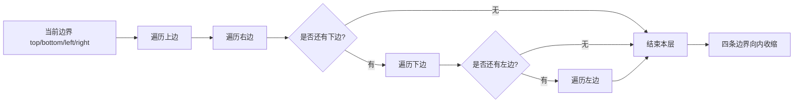

# 矩阵按层模拟：数组与字符串训练题解

矩阵按层模拟题不要靠“脑内转弯”写代码，而要把边界变量写出来。无论是螺旋遍历、生成螺旋矩阵，还是原地旋转，本质都是一圈一圈处理。

最常用的不变量是：**`top..bottom` 和 `left..right` 围成尚未处理的子矩阵**。每处理完一条边，就把对应边界向内收缩。

## 适用场景

看到矩阵里的“螺旋”“旋转”“按层”“边界走一圈”，就应该先画四条边界。

- 螺旋矩阵：按上、右、下、左四条边依次走。
- 生成螺旋矩阵：遍历顺序一样，只是把读取改成写入。
- 旋转图像：按层交换四条边上的对应位置。
- 矩阵置零：虽然不是按层，但同样要谨慎处理首行首列这类边界状态。

如果题目只是普通的行列扫描，不需要强行套按层模拟；按层模拟适合边界不断向内收缩的题。

## 图解思路



单行、单列是按层模拟最容易错的地方。处理完上边和右边后，必须重新判断 `top <= bottom`、`left <= right`，否则会重复读取同一行或同一列。

四个边界的含义要固定：

- `top`：尚未处理的第一行。
- `bottom`：尚未处理的最后一行。
- `left`：尚未处理的第一列。
- `right`：尚未处理的最后一列。

## 手写步骤

1. 初始化四条边界：`top = 0, bottom = m - 1, left = 0, right = n - 1`。
2. 在边界合法时，依次处理上边、右边、下边、左边。
3. 每处理完一条边，立即收缩对应边界。
4. 处理下边和左边前重新检查边界，避免单行单列重复。
5. 原地旋转时按层枚举偏移量，四个位置一组交换。

## Go 参考骨架

```go
func spiralOrder(matrix [][]int) []int {
	if len(matrix) == 0 || len(matrix[0]) == 0 {
		return nil
	}
	top, bottom := 0, len(matrix)-1
	left, right := 0, len(matrix[0])-1
	ans := []int{}
	for top <= bottom && left <= right {
		for col := left; col <= right; col++ {
			ans = append(ans, matrix[top][col])
		}
		top++
		for row := top; row <= bottom; row++ {
			ans = append(ans, matrix[row][right])
		}
		right--
		if top <= bottom {
			for col := right; col >= left; col-- {
				ans = append(ans, matrix[bottom][col])
			}
			bottom--
		}
		if left <= right {
			for row := bottom; row >= top; row-- {
				ans = append(ans, matrix[row][left])
			}
			left++
		}
	}
	return ans
}
```

## Rust 参考骨架

```rust
pub fn rotate(matrix: &mut Vec<Vec<i32>>) {
    let n = matrix.len();
    for layer in 0..n / 2 {
        let last = n - 1 - layer;
        for i in layer..last {
            let offset = i - layer;
            let top = matrix[layer][i];

            matrix[layer][i] = matrix[last - offset][layer];
            matrix[last - offset][layer] = matrix[last][last - offset];
            matrix[last][last - offset] = matrix[i][last];
            matrix[i][last] = top;
        }
    }
}
```

## 为什么这样写

以 #54 螺旋矩阵为例，每一轮都处理当前外圈。上边处理完后，`top` 加一；右边处理完后，`right` 减一。此时如果已经没有剩余行，就不能再走下边；如果已经没有剩余列，就不能再走左边。

以 #48 旋转图像为例，这是另一种按层模拟：一圈里的四个对应位置循环交换。比起先转置再翻转，按层交换更能训练边界和偏移量，但也更容易写错下标。

## 复杂度

- 螺旋遍历：时间复杂度 $O(mn)$，输出数组不计时额外空间为 $O(1)$。
- 原地旋转：时间复杂度 $O(n^2)$，额外空间 $O(1)$。

## 易错点

- 单行矩阵中，下边会和上边重复，必须在走下边前检查 `top <= bottom`。
- 单列矩阵中，左边会和右边重复，必须在走左边前检查 `left <= right`。
- Go 中 `for col := right; col >= left; col--` 要保证 `col` 是有符号整数，避免无符号下溢。
- 原地旋转时偏移量 `offset` 写错，会把四个角以外的位置交换乱。

## 练习顺序

建议按这个顺序刷：#54, #59, #48, #885, #1914, #73。

先用螺旋遍历和生成矩阵练四边界收缩，再做旋转图像和网格循环位移，最后用矩阵置零训练边界状态复用。
