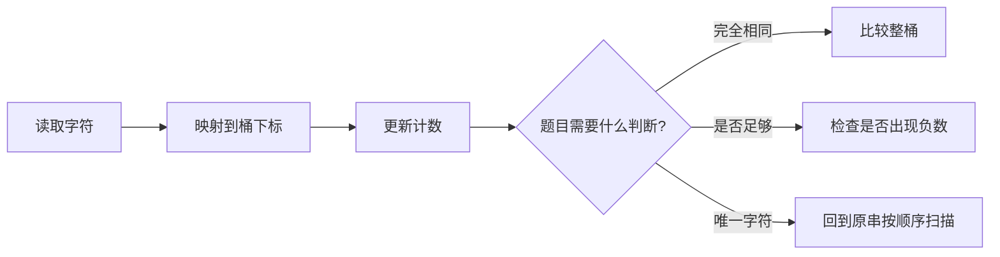

# 字符桶替代哈希表：数组与字符串训练题解

字符计数题不一定要上哈希表。如果题目限定只有小写字母、大小写字母或 ASCII 字符，用定长数组做“桶”通常更清晰。

桶的本质是把字符映射成下标：`'a' -> 0`，`'b' -> 1`。然后计数、抵消、比较都变成数组操作。

## 适用场景

适合字符桶的前提是字符集范围明确且不大。

- 字母异位词：两个字符串的 26 个计数完全相同。
- 赎金信：目标字符计数不能超过来源字符计数。
- 第一个唯一字符：先计数，再扫描原串找第一个计数为 1 的位置。
- 滑动窗口匹配：窗口内字符计数和目标计数对齐。

如果输入是 Unicode 字符，或者字符集没有明确上限，哈希表更稳妥。

## 图解思路



写之前先确认三件事：

- 字符集大小：26、52、128 还是 256。
- 映射方式：`c - 'a'` 只适用于小写字母。
- 判断目标：比较两个桶，还是用一个桶做加减抵消。

## 手写步骤

1. 根据字符集创建定长计数数组。
2. 扫描字符串，把字符转成桶下标并更新计数。
3. 如果是两个字符串比较，可以一个加、一个减。
4. 最后检查桶是否全部为 0，或是否存在负数。
5. 需要返回原位置时，计数后再扫描原字符串。

## Go 参考骨架

```go
func isAnagram(s string, t string) bool {
	if len(s) != len(t) {
		return false
	}
	cnt := [26]int{}
	for i := 0; i < len(s); i++ {
		cnt[s[i]-'a']++
		cnt[t[i]-'a']--
	}
	for _, v := range cnt {
		if v != 0 {
			return false
		}
	}
	return true
}
```

## Rust 参考骨架

```rust
pub fn first_uniq_char(s: String) -> i32 {
    let bytes = s.as_bytes();
    let mut cnt = [0; 26];
    for &b in bytes {
        cnt[(b - b'a') as usize] += 1;
    }
    for (i, &b) in bytes.iter().enumerate() {
        if cnt[(b - b'a') as usize] == 1 {
            return i as i32;
        }
    }
    -1
}
```

## 为什么这样写

以 #242 有效的字母异位词为例，两个字符串只要每个字符出现次数相同，就一定能重排成彼此。用一个桶对 `s` 加一、对 `t` 减一，最后全为 0 就说明计数完全抵消。

以 #387 第一个唯一字符为例，它不能只看桶，还要回到原字符串顺序扫描。桶负责回答“出现了几次”，原串负责回答“第一个在哪里”。

## 复杂度

- 时间复杂度：$O(n + k)$，`k` 是字符集大小；固定 26 个小写字母时可视为 $O(n)$。
- 空间复杂度：$O(k)$，固定字符集时是常数空间。

## 易错点

- 题目没有限定小写字母时，直接用 `c - 'a'` 会越界或错误。
- Go 字符串按 byte 遍历只适合 ASCII；Unicode 要按 rune 处理。
- Rust 中 `b - b'a'` 前要确认字节确实是小写字母。
- 找唯一字符时，只看桶无法得到“第一个”，还要按原顺序扫描。

## 练习顺序

建议按这个顺序刷：#242, #383, #389, #387, #451, #567。

先用异位词和赎金信练固定桶，再做第一个唯一字符和按频率排序，最后把字符桶放进滑动窗口里处理排列匹配。
