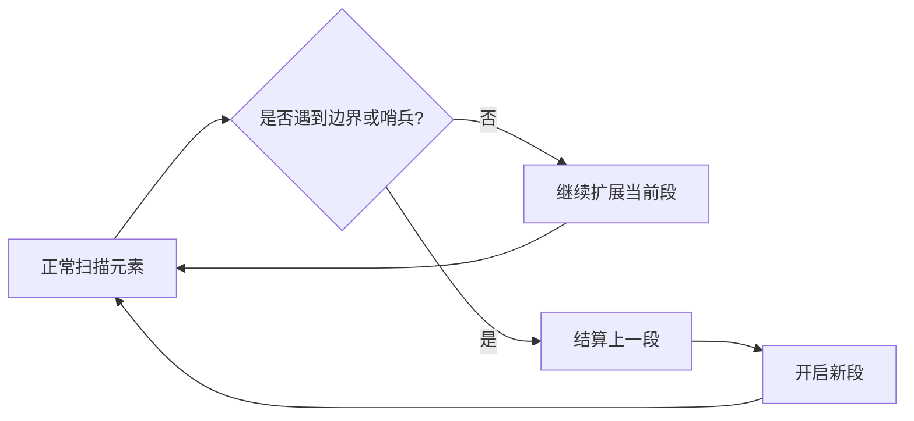

# 哨兵简化边界：数组与字符串训练题解

很多扫描题最烦人的不是主逻辑，而是最后一段怎么收尾、空输入怎么处理、边界位置要不要单独判断。哨兵的作用，是人为放一个“必定触发结算”的值，把边界情况纳入普通循环。

哨兵不是为了炫技。只有当它能明显减少重复分支、让结算逻辑更统一时才值得使用。

## 适用场景

常见场景是连续分组、区间汇总、栈边界和字符串末尾结算。

- 扫描连续相同字符：在末尾补一个不同字符，迫使最后一组结算。
- 汇总连续区间：在末尾补一个断开的值，统一输出最后区间。
- 单调栈：在末尾补一个极小值，清空栈中剩余元素。
- 双指针分段：用 `i == n` 作为虚拟哨兵，不一定真的修改数组。

如果哨兵值可能和真实数据冲突，就不要直接追加真实值；可以用 `i == n` 这种条件哨兵。

## 图解思路



哨兵最适合处理“上一段”的结算。当前元素一旦和上一段不连续，就先把 `[start, i - 1]` 结算掉，再从 `i` 开启新段。

要注意两类哨兵：

- 数据哨兵：真的在末尾追加一个不会出现的值。
- 条件哨兵：循环到 `i == n` 时手动触发结算，不改原数据。

## 手写步骤

1. 明确每一段何时开始、何时结束。
2. 初始化 `start` 或栈底哨兵。
3. 循环时把 `i == n` 当作边界，或者追加一个安全哨兵。
4. 遇到边界先结算上一段，再开启下一段。
5. 检查空输入和单元素输入是否仍能走通。

## Go 参考骨架

```go
func summaryRanges(nums []int) []string {
	ans := []string{}
	if len(nums) == 0 {
		return ans
	}
	start := 0
	for i := 1; i <= len(nums); i++ {
		if i == len(nums) || nums[i] != nums[i-1]+1 {
			if start == i-1 {
				ans = append(ans, strconv.Itoa(nums[start]))
			} else {
				ans = append(ans, strconv.Itoa(nums[start])+"->"+strconv.Itoa(nums[i-1]))
			}
			start = i
		}
	}
	return ans
}
```

## Rust 参考骨架

```rust
pub fn compress(chars: &mut Vec<char>) -> i32 {
    let mut write = 0usize;
    let mut start = 0usize;
    for read in 0..=chars.len() {
        if read == chars.len() || chars[read] != chars[start] {
            chars[write] = chars[start];
            write += 1;
            let count = read - start;
            if count > 1 {
                for ch in count.to_string().chars() {
                    chars[write] = ch;
                    write += 1;
                }
            }
            start = read;
        }
    }
    write as i32
}
```

## 为什么这样写

以 #228 汇总区间为例，如果只在发现断点时输出上一段，最后一段没有“下一个断点”触发。循环到 `i == n` 时把它当成断点，就能统一输出最后一段。

以 #443 字符串压缩为例，它也是一样：当读到不同字符，才知道上一组结束。末尾没有不同字符，所以用 `read == len` 作为条件哨兵，强制结算最后一组。

## 复杂度

- 时间复杂度：$O(n)$，每个元素扫描一次。
- 空间复杂度：多数哨兵扫描题是 $O(1)$ 额外空间；输出不计入额外空间。

## 易错点

- 真的追加哨兵时，哨兵值和真实数据冲突。
- 用 `i == n` 做条件哨兵时，又访问了 `nums[i]`。
- 结算上一段后忘记把 `start` 更新到当前下标。
- 字符串压缩写入计数时，`12` 要写成 `'1'`、`'2'` 两个字符。

## 练习顺序

建议按这个顺序刷：#485, #674, #228, #830, #443, #58。

先用最大连续 1 和最长连续递增序列练“断点结算”，再做汇总区间和较大分组位置，最后处理字符串压缩和末尾空格这类边界细节。
