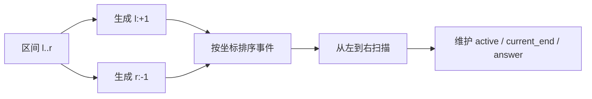

# 区间压缩为事件点：数组与字符串训练题解

区间题有两种常见视角：按区间本身排序合并，或者把区间拆成事件点。事件点的好处是可以把“某一时刻有多少区间活跃”“最大重叠数是多少”这类问题转成一次扫描。

区间 `[l, r)` 可以拆成两个事件：`l` 处活跃数加一，`r` 处活跃数减一。按坐标排序后从左到右扫描，就能得到任意位置的覆盖状态。

## 适用场景

适合区间重叠、会议室、日程预订、覆盖统计、最小包含区间等题。

- 合并区间：按左端排序，维护当前合并区间的右端。
- 会议室 II：开始事件加一，结束事件减一，最大活跃数就是房间数。
- 拼车：站点处上车加人数，下车减人数，本质也是事件点。
- My Calendar III：每次预订都加入两个事件，扫描最大重叠。

如果坐标范围很小，可以用差分数组；坐标很大但事件数量少时，用事件点排序更合适。

## 图解思路



事件点最容易错的是端点语义：

- 半开区间 `[start, end)`：同一时刻结束和开始不重叠，结束事件应先于开始事件处理。
- 闭区间 `[start, end]`：如果要用事件点，常写成 `start:+1, end+1:-1`。
- 合并区间通常不拆事件，而是直接按左端排序维护右端。

## 手写步骤

1. 判断区间是闭区间还是半开区间。
2. 如果要合并区间，按左端排序并维护当前右端。
3. 如果要统计重叠，把每个区间拆成开始事件和结束事件。
4. 对事件排序；同坐标时，根据端点语义决定先处理开始还是结束。
5. 扫描事件，维护活跃数量或当前覆盖范围。

## Go 参考骨架

```go
func merge(intervals [][]int) [][]int {
	sort.Slice(intervals, func(i, j int) bool {
		return intervals[i][0] < intervals[j][0]
	})
	ans := [][]int{}
	for _, in := range intervals {
		if len(ans) == 0 || ans[len(ans)-1][1] < in[0] {
			ans = append(ans, []int{in[0], in[1]})
		} else if in[1] > ans[len(ans)-1][1] {
			ans[len(ans)-1][1] = in[1]
		}
	}
	return ans
}
```

## Rust 参考骨架

```rust
pub fn min_meeting_rooms(intervals: Vec<Vec<i32>>) -> i32 {
    let mut events = Vec::new();
    for interval in intervals {
        events.push((interval[0], 1));
        events.push((interval[1], -1));
    }
    events.sort_by_key(|&(time, delta)| (time, delta));

    let (mut active, mut ans) = (0, 0);
    for (_, delta) in events {
        active += delta;
        ans = ans.max(active);
    }
    ans
}
```

## 为什么这样写

以 #56 合并区间为例，只需要按左端排序。当前区间的左端如果大于已合并区间的右端，就开启新区间；否则说明重叠，更新右端最大值。

以 #253 会议室 II 为例，它更适合事件点：会议开始需要一间房，会议结束释放一间房。半开区间语义下，如果一个会议 10 点结束，另一个 10 点开始，它们可以共用房间，所以同一时间应先处理结束事件。

## 复杂度

- 时间复杂度：排序主导，通常是 $O(n \log n)$。
- 空间复杂度：合并区间除输出外可接近 $O(1)$；事件点扫描需要 $O(n)$ 存事件。

## 易错点

- 闭区间和半开区间混用，导致端点相接时错误判断重叠。
- 会议室同一时间的开始/结束事件顺序写反，多算一个房间。
- 合并区间时只比较相邻原区间，忘记用当前合并区间的最大右端。
- 坐标很大时试图开差分数组，内存会爆；应改用事件点排序。

## 练习顺序

建议按这个顺序刷：#56, #57, #253, #1094, #732, #1851。

先用合并区间和插入区间练排序合并，再用会议室、拼车、日程预订练事件点扫描，最后做最小区间查询这类需要事件点配合堆的题。
