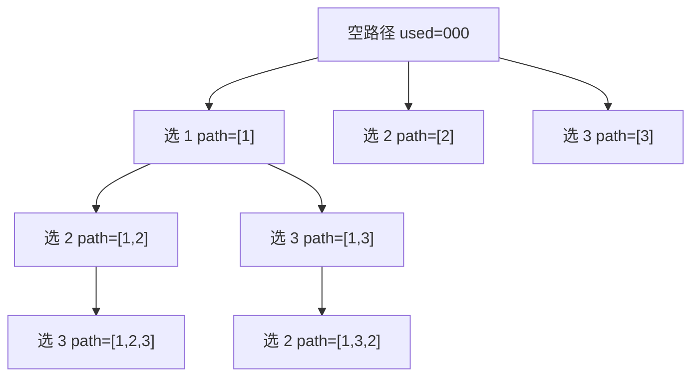

# 排列问题使用 used 数组：回溯训练题解

排列问题训练的是“填位置”的思路：第 `depth` 层决定排列中的第 `depth` 个位置放谁。每个元素最多使用一次，所以需要一个 `used` 数组记录当前路径里已经放过哪些下标。

一句话记法：**排列看位置，组合看起点；排列每层都从头枚举，但已经在路径里的元素不能再选。**

## 适用场景

适合用 `used` 的题，通常有这几个特征：

- 答案和选择顺序有关，比如 `[1,2,3]` 与 `[2,1,3]` 是两个不同排列。
- 每个输入元素在同一个答案里最多出现一次。
- 每一层代表答案中的一个位置，而不是从数组中截取一段范围。
- 题目要求输出所有方案，而不是只问数量或最优值。

如果答案不关心顺序，例如组合、子集、选若干个数凑目标，通常不要用 `used`，而是用 `start` 控制只往后选。

## 图解思路

以 `nums = [1,2,3]` 为例，根节点是空路径，第一层决定第一个位置，第二层决定第二个位置：



这里的重点是：进入下一层后，仍然从 `0..n` 枚举，因为任何未使用元素都可能放在当前位置；只是遇到 `used[i] == true` 时跳过。

## 不变量

写代码前先确认三个不变量：

- `path.len()` 等于当前正在填写的位置。
- `used[i] == true` 表示 `nums[i]` 已经在当前 `path` 中。
- 每次递归返回后，`path` 和 `used` 必须恢复到进入当前分支前的状态。

第三条最容易出错。`path.pop()` 和 `used[i] = false` 是一组动作，少任何一个都会污染兄弟分支。

## 手写步骤

1. 准备 `path`、`used`、`ans`。
2. 如果 `path.len() == nums.len()`，复制 `path` 到答案。
3. 从 `0` 到 `n - 1` 枚举所有下标。
4. 如果 `used[i]` 为真，说明当前路径已经用过，跳过。
5. 做选择：标记 `used[i] = true`，把 `nums[i]` 放入 `path`。
6. 递归下一层。
7. 撤销选择：弹出路径，恢复 `used[i] = false`。

## Go 参考实现

```go
func permute(nums []int) [][]int {
	ans := [][]int{}
	path := []int{}
	used := make([]bool, len(nums))

	var dfs func()
	dfs = func() {
		if len(path) == len(nums) {
			ans = append(ans, append([]int(nil), path...))
			return
		}

		for i := 0; i < len(nums); i++ {
			if used[i] {
				continue
			}
			used[i] = true
			path = append(path, nums[i])
			dfs()
			path = path[:len(path)-1]
			used[i] = false
		}
	}

	dfs()
	return ans
}
```

## Rust 参考实现

```rust
pub fn permute(nums: Vec<i32>) -> Vec<Vec<i32>> {
    fn dfs(nums: &[i32], used: &mut [bool], path: &mut Vec<i32>, ans: &mut Vec<Vec<i32>>) {
        if path.len() == nums.len() {
            ans.push(path.clone());
            return;
        }

        for i in 0..nums.len() {
            if used[i] {
                continue;
            }
            used[i] = true;
            path.push(nums[i]);
            dfs(nums, used, path, ans);
            path.pop();
            used[i] = false;
        }
    }

    let mut used = vec![false; nums.len()];
    let mut path = Vec::new();
    let mut ans = Vec::new();
    dfs(&nums, &mut used, &mut path, &mut ans);
    ans
}
```

## 为什么这样写

排列的搜索空间是一棵深度为 `n` 的树。第 `depth` 层要填写第 `depth` 个位置，可选集合是“所有还没用过的元素”。

所以循环不能写成 `for i in depth..n` 或 `for i in start..n`。那是组合题的写法，会把 `[2,1]` 这类合法排列直接删掉。排列题必须每层都从头看一遍，用 `used` 排除当前路径里已经出现过的下标。

对于含重复元素的排列，还要在排序后增加同层去重条件：

```go
if i > 0 && nums[i] == nums[i-1] && !used[i-1] {
	continue
}
```

这不是“看到相等就跳”，而是“同一层同一个值只开一次分支”。`!used[i-1]` 表示前一个相同值没有被放在当前路径里，所以当前 `nums[i]` 和它是在争同一个位置，必须跳过。

## 复杂度

- 时间复杂度：无重复排列需要生成 `n!` 个答案，每个答案复制长度为 `n`，整体是 $O(n \cdot n!)$。
- 空间复杂度：不计输出，递归深度、`path`、`used` 都是 $O(n)$。

## 易错点

- 用 `start` 写排列，导致只剩组合顺序，漏掉大量合法答案。
- 保存答案时直接保存 `path` 引用，没有复制。
- `path.pop()` 后忘记恢复 `used[i]`。
- 全排列 II 中把去重条件写成 `used[i-1]`，会跳错层级。

## 练习顺序

建议按这个顺序刷：#46, #47。

先用 #46 练熟 `used` 的状态恢复，再做 #47，把“同一层同值只开一次分支”加进去。能口头解释 `!used[i-1]` 的含义，排列题才算真正掌握。
