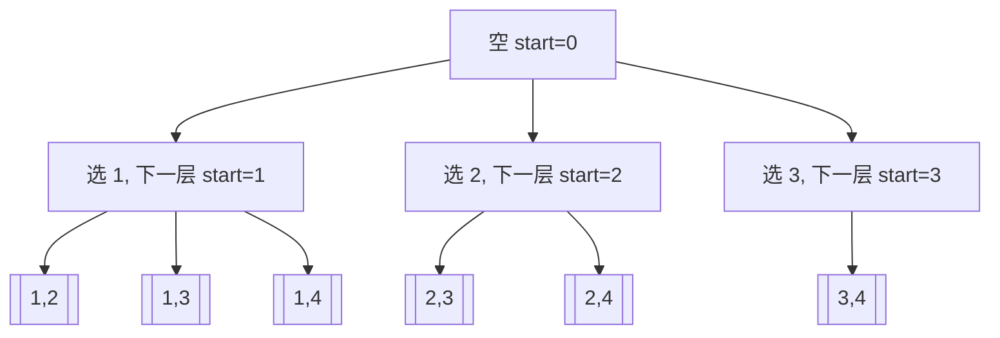

# 组合问题递增 start：回溯训练题解

组合问题和排列问题最关键的差别是：组合不关心顺序。`[1,2]` 和 `[2,1]` 是同一个答案，所以搜索时必须规定一个方向，只允许从左往右选。

一句话记法：**组合用 `start`，每次选择 `i` 后，下一层从哪里开始，决定了能不能复用当前元素。**

## 适用场景

适合用 `start` 的题通常满足：

- 答案是若干元素组成的集合或多重集合，顺序不重要。
- 输入数组中的相对顺序只用来约束搜索，不代表答案顺序。
- 需要避免同一组元素被不同排列顺序重复输出。
- 递归时可以明确“下一层只能从某个位置之后继续选”。

如果每个位置都可以放任意未使用元素，那是排列题；如果每一步有上下左右移动，那更像图搜索或网格 DFS。

## 图解思路

以从 `[1,2,3,4]` 中选长度为 `2` 的组合为例：



这里不会出现 `[2,1]`，因为选了 `2` 以后只允许继续往右选。这个约束不是剪枝技巧，而是组合题避免重复的基本建模。

## 不变量

- `path` 中的下标严格递增。
- `start` 表示当前层第一个可以枚举的下标。
- 如果当前选择了 `i`，下一层通常从 `i + 1` 开始。
- 如果题目允许重复选同一个数，下一层才从 `i` 开始。

最后两条要分清：#77 组合、#40 组合总和 II 用 `i + 1`；#39 组合总和允许同一个候选数重复使用，用 `i`。

## 手写步骤

1. 定义 `dfs(start)`，用 `path` 保存当前组合。
2. 满足目标长度或目标和时，复制 `path`。
3. 从 `start` 开始枚举候选下标 `i`。
4. 做选择，把 `nums[i]` 放进 `path`。
5. 根据能否复用，递归 `dfs(i + 1)` 或 `dfs(i)`。
6. 撤销选择。

如果题目有固定长度 `k`，还可以用剩余数量剪枝：当 `path.len() + (n - i) < k` 时，后面已经凑不够，直接停止。

## Go 参考实现

```go
func combine(n int, k int) [][]int {
	ans := [][]int{}
	path := []int{}

	var dfs func(start int)
	dfs = func(start int) {
		if len(path) == k {
			ans = append(ans, append([]int(nil), path...))
			return
		}

		need := k - len(path)
		for x := start; x <= n-need+1; x++ {
			path = append(path, x)
			dfs(x + 1)
			path = path[:len(path)-1]
		}
	}

	dfs(1)
	return ans
}
```

## Rust 参考实现

```rust
pub fn combine(n: i32, k: i32) -> Vec<Vec<i32>> {
    fn dfs(start: i32, n: i32, k: usize, path: &mut Vec<i32>, ans: &mut Vec<Vec<i32>>) {
        if path.len() == k {
            ans.push(path.clone());
            return;
        }

        let need = k - path.len();
        let last = n - need as i32 + 1;
        for x in start..=last {
            path.push(x);
            dfs(x + 1, n, k, path, ans);
            path.pop();
        }
    }

    let mut path = Vec::new();
    let mut ans = Vec::new();
    dfs(1, n, k as usize, &mut path, &mut ans);
    ans
}
```

## 为什么这样写

组合题真正要避免的是“同一个答案被不同顺序生成”。只要 `path` 对应的下标始终递增，每组下标就只有一种生成路径。

例如 `[1,2,3]` 中选两个数，如果允许每层从 `0` 开始，就会同时得到 `[1,2]` 和 `[2,1]`。它们在排列题里不同，在组合题里重复。`start` 把搜索树砍成只向右生长的形状，重复自然消失。

剪枝 `x <= n - need + 1` 也来自这个不变量：当前还需要 `need` 个数，如果从 `x` 到 `n` 的数量都不够，就没有继续枚举的意义。

## 复杂度

- 时间复杂度：输出 `C(n,k)` 个组合，每个复制长度为 `k`，整体是 $O(k \cdot C(n,k))$。
- 空间复杂度：不计输出，递归深度和路径是 $O(k)$。

## 易错点

- 把组合写成排列，每层都从 `0` 开始，产生重复答案。
- 允许复用和不允许复用没有区分，`dfs(i)` 与 `dfs(i + 1)` 写反。
- 做长度剪枝时边界少了 `+1`，漏掉最后一个合法起点。
- 返回答案时没有复制 `path`。

## 练习顺序

建议按这个顺序刷：#77, #216, #39, #40。

先用 #77 练 `start` 和长度剪枝，再做 #216 加上目标和；最后用 #39/#40 对比“能复用”和“不能复用”的递归起点差异。
