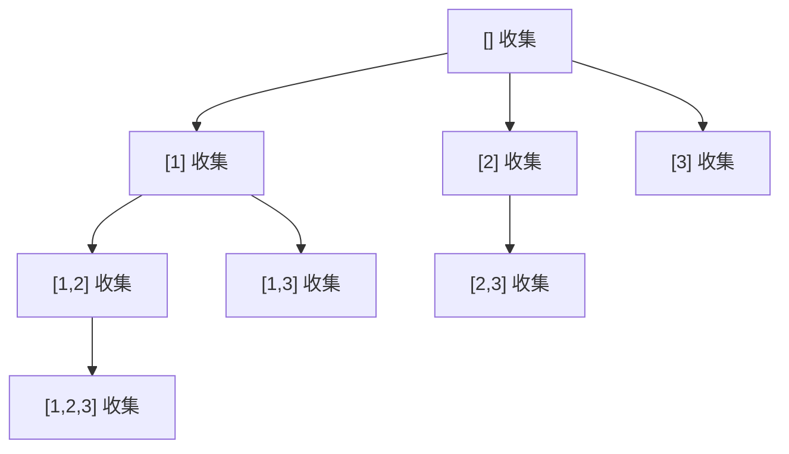

# 子集问题每层都收集：回溯训练题解

子集问题要返回幂集。它和组合题一样不关心顺序，所以也用 `start` 控制只往后选；但它和“选固定长度 k 个数”的组合题不同：**每一个中间节点都是一个合法答案**。

一句话记法：**组合到条件再收集，子集进节点先收集。**

## 适用场景

适合这种写法的题：

- 要返回所有子集、所有可选集合、所有路径前缀。
- 答案长度不固定，从 `0` 到 `n` 都可能合法。
- 同一个元素在一个子集中最多出现一次。
- 输出顺序没有特别要求，只要不重复即可。

如果题目要求长度恰好为 `k`，那就是组合题；如果题目要求排列顺序不同算不同答案，那就是排列题。

## 图解思路

以 `nums = [1,2,3]` 为例：



图里每个节点都要进入答案，不需要等到叶子。叶子只是“不能再继续选”的子集，并不是唯一合法子集。

## 不变量

- `path` 表示当前已经选出的子集。
- `start` 表示下一次只能从哪个下标开始选。
- 进入 `dfs(start)` 时，当前 `path` 已经是一个合法子集，应立即复制到答案。
- 同一路径中下标递增，所以不会出现 `[2,1]` 这种重复顺序。

## 手写步骤

1. 定义 `dfs(start)`。
2. 进入函数后先复制当前 `path` 到答案。
3. 从 `start` 到末尾枚举 `i`。
4. 选择 `nums[i]`，递归 `dfs(i + 1)`。
5. 撤销选择。

子集 II 中先排序，然后在同一层跳过重复值：`if i > start && nums[i] == nums[i-1] { continue }`。

## Go 参考实现

```go
func subsets(nums []int) [][]int {
	ans := [][]int{}
	path := []int{}

	var dfs func(start int)
	dfs = func(start int) {
		ans = append(ans, append([]int(nil), path...))
		for i := start; i < len(nums); i++ {
			path = append(path, nums[i])
			dfs(i + 1)
			path = path[:len(path)-1]
		}
	}

	dfs(0)
	return ans
}
```

## Rust 参考实现

```rust
pub fn subsets(nums: Vec<i32>) -> Vec<Vec<i32>> {
    fn dfs(start: usize, nums: &[i32], path: &mut Vec<i32>, ans: &mut Vec<Vec<i32>>) {
        ans.push(path.clone());
        for i in start..nums.len() {
            path.push(nums[i]);
            dfs(i + 1, nums, path, ans);
            path.pop();
        }
    }

    let mut path = Vec::new();
    let mut ans = Vec::new();
    dfs(0, &nums, &mut path, &mut ans);
    ans
}
```

## 为什么这样写

子集可以理解为：对每个元素做“选或不选”的决定。但实际代码中不一定要写成二叉递归。用 `start` 枚举“下一个被选的元素”，可以天然生成所有递增下标序列：

- 空序列对应空集。
- 长度为 `1` 的递增序列对应单元素子集。
- 长度为 `2` 的递增序列对应两个元素的子集。
- 一直到长度为 `n`。

因为所有长度都合法，所以进入每个节点都要收集。如果只在 `start == n` 时收集，就只能收集到部分叶子，漏掉 `[1]`、`[1,2]` 这类中间节点。

## 复杂度

- 时间复杂度：共有 `2^n` 个子集，每个子集复制成本最多 `O(n)`，整体是 $O(n \cdot 2^n)$。
- 空间复杂度：不计输出，递归深度和路径是 $O(n)$。

## 易错点

- 只在叶子节点收集答案，漏掉中间长度的子集。
- 忘记复制 `path`，导致答案被后续回溯修改。
- 子集 II 中把 `i > start` 写成 `i > 0`，错误跳过下一层的合法重复元素。
- 把子集问题写成排列，产生 `[1,2]` 与 `[2,1]` 重复。

## 练习顺序

建议按这个顺序刷：#78, #90。

先用 #78 练“进节点就收集”，再用 #90 加排序去重。做 #90 时重点复盘 `i > start`，这是区分“同层重复”和“路径内合法重复”的关键。
