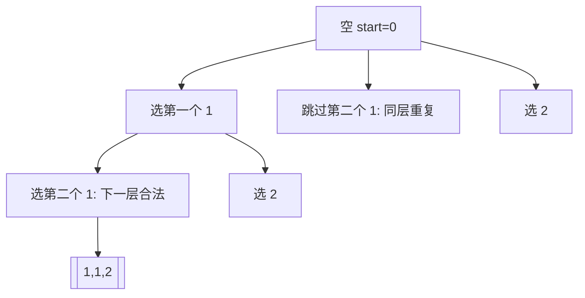

# 重复元素先排序再剪枝：回溯训练题解

很多回溯题的难点不是搜索，而是去重。只要输入里有重复元素，搜索树里就可能出现值相同、路径不同但答案相同的分支。

一句话记法：**先排序，让相同值相邻；同一层相同值只允许第一个开分支。**

## 适用场景

排序去重适合这些题：

- 输入数组里可能有重复值。
- 答案要求“不重复”的排列、组合、子集。
- 输出具体方案，而不是只问方案数量。
- 重复答案来自“同一个决策位置选择了相同的值”。

如果题目给的是字符频次、计数数组，也可以直接按值和次数建模，不一定非要排序原数组。

## 图解思路

以 `nums = [1,1,2]` 的子集为例，排序后两个 `1` 相邻：



同层重复要跳过，但下一层的重复值不一定跳。`[1,1]` 是合法子集，不能因为两个值相等就永远只能选一个。

## 两个经典去重条件

组合、子集类使用 `start`：

```go
if i > start && nums[i] == nums[i-1] {
	continue
}
```

含重复元素的排列使用 `used`：

```go
if i > 0 && nums[i] == nums[i-1] && !used[i-1] {
	continue
}
```

这两个条件看起来相似，但语义不同。`i > start` 直接表示同一层；排列题没有 `start`，所以用 `!used[i-1]` 判断前一个相同值是否还在同一层竞争当前位置。

## 手写步骤

1. 先排序。
2. 判断当前题是组合/子集模型，还是排列模型。
3. 在每层 `for` 循环开头写去重条件。
4. 去重只跳过“当前层的重复分支”，不要跳过路径中合法的重复值。
5. 其余选择、递归、撤销动作保持普通回溯写法。

## Go 参考实现：子集 II

```go
func subsetsWithDup(nums []int) [][]int {
	sort.Ints(nums)
	ans := [][]int{}
	path := []int{}

	var dfs func(start int)
	dfs = func(start int) {
		ans = append(ans, append([]int(nil), path...))
		for i := start; i < len(nums); i++ {
			if i > start && nums[i] == nums[i-1] {
				continue
			}
			path = append(path, nums[i])
			dfs(i + 1)
			path = path[:len(path)-1]
		}
	}

	dfs(0)
	return ans
}
```

## Rust 参考实现：全排列 II

```rust
pub fn permute_unique(mut nums: Vec<i32>) -> Vec<Vec<i32>> {
    nums.sort_unstable();

    fn dfs(nums: &[i32], used: &mut [bool], path: &mut Vec<i32>, ans: &mut Vec<Vec<i32>>) {
        if path.len() == nums.len() {
            ans.push(path.clone());
            return;
        }

        for i in 0..nums.len() {
            if used[i] {
                continue;
            }
            if i > 0 && nums[i] == nums[i - 1] && !used[i - 1] {
                continue;
            }
            used[i] = true;
            path.push(nums[i]);
            dfs(nums, used, path, ans);
            path.pop();
            used[i] = false;
        }
    }

    let mut used = vec![false; nums.len()];
    let mut path = Vec::new();
    let mut ans = Vec::new();
    dfs(&nums, &mut used, &mut path, &mut ans);
    ans
}
```

## 为什么这样写

重复答案来自同一层开了两个等价分支。排序后，相同值挨在一起，我们就能看出“当前值和同层前一个值一样”。

对子集 II 来说，`i > start && nums[i] == nums[i-1]` 表示：在当前层，前一个相同值已经作为分支入口被处理过，当前值再作为入口会生成相同集合。

对全排列 II 来说，当前层是在决定某个位置放什么。若 `nums[i] == nums[i-1]` 且 `used[i-1] == false`，说明前一个相同值没有在当前路径中，也就是说它和当前值正在竞争同一个位置。保留前者、跳过后者，就能固定相同元素的相对顺序，去掉重复排列。

## 复杂度

- 排序成本是 $O(n \log n)$。
- 子集 II 最坏仍要输出 $O(2^n)$ 个答案。
- 全排列 II 最坏仍是 $O(n \cdot n!)$；重复元素只会减少实际分支数。
- 不计输出，递归栈和路径通常是 $O(n)$。

## 易错点

- 没排序就使用相邻去重，条件没有意义。
- 子集/组合去重把 `i > start` 写成 `i > 0`。
- 排列去重把 `!used[i-1]` 写反。
- 以为重复值永远不能被选两次，错误删除 `[1,1]`、`[1,1,2]` 这类合法答案。

## 练习顺序

建议按这个顺序刷：#90, #40, #47。

先用 #90 练 `start` 模型下的同层去重，再做 #40 加目标和剪枝；最后做 #47，专门理解 `used` 模型中的 `!used[i-1]`。
