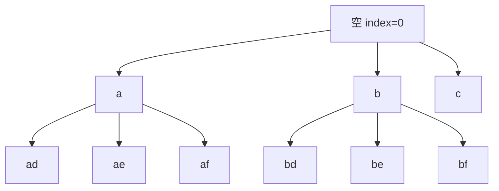

# 电话号码按字符展开：回溯训练题解

电话号码字母组合的搜索树很规整：输入有几个数字，递归就有几层；第 `index` 层只处理 `digits[index]` 对应的那几个字符。

一句话记法：**层数跟输入位置走，分支跟当前数字的映射走。**

## 适用场景

适合这种写法的题：

- 每个输入位置都有一个固定候选集合。
- 答案长度固定，等于输入长度。
- 每层只从当前输入元素对应的候选里选一个。
- 不需要 `used`，也不需要 `start`。

这类题和排列题不同：排列题每层都从全体元素里挑未使用者；电话号码组合每层的候选由当前数字唯一决定。

## 图解思路

以 `digits = "23"` 为例：



第一层只看数字 `2`，候选是 `a,b,c`；第二层只看数字 `3`，候选是 `d,e,f`。

## 不变量

- `index` 表示正在处理 `digits[index]`。
- `path.len() == index`。
- 每进入一层，只能枚举当前数字对应的字母。
- 当 `index == digits.len()` 时，`path` 就是一个完整答案。

## 手写步骤

1. 处理空输入：如果 `digits` 为空，直接返回空数组。
2. 建立数字到字母的映射。
3. 定义 `dfs(index)`。
4. 如果 `index == digits.len()`，复制当前字符串。
5. 遍历 `digits[index]` 对应的每个字符。
6. 选择字符、递归 `index + 1`、撤销字符。

## Go 参考实现

```go
func letterCombinations(digits string) []string {
	if len(digits) == 0 {
		return nil
	}

	letters := []string{"", "", "abc", "def", "ghi", "jkl", "mno", "pqrs", "tuv", "wxyz"}
	ans := []string{}
	path := []byte{}

	var dfs func(index int)
	dfs = func(index int) {
		if index == len(digits) {
			ans = append(ans, string(append([]byte(nil), path...)))
			return
		}

		for _, ch := range []byte(letters[digits[index]-'0']) {
			path = append(path, ch)
			dfs(index + 1)
			path = path[:len(path)-1]
		}
	}

	dfs(0)
	return ans
}
```

## Rust 参考实现

```rust
pub fn letter_combinations(digits: String) -> Vec<String> {
    if digits.is_empty() {
        return Vec::new();
    }

    const MAP: [&str; 10] = ["", "", "abc", "def", "ghi", "jkl", "mno", "pqrs", "tuv", "wxyz"];

    fn dfs(index: usize, digits: &[u8], path: &mut String, ans: &mut Vec<String>) {
        if index == digits.len() {
            ans.push(path.clone());
            return;
        }

        let d = (digits[index] - b'0') as usize;
        for ch in MAP[d].chars() {
            path.push(ch);
            dfs(index + 1, digits, path, ans);
            path.pop();
        }
    }

    let mut path = String::new();
    let mut ans = Vec::new();
    dfs(0, digits.as_bytes(), &mut path, &mut ans);
    ans
}
```

## 为什么这样写

这道题最容易被误套成排列模板。实际上没有任何元素会被“用掉”，也不存在“从某个 start 往后选”。每个数字都是一个独立位置，只需要把该位置的所有候选字母展开。

`path.len() == index` 是很好的自检条件：如果递归到了第 `index` 层，却已经放了更多或更少字符，说明选择和撤销不匹配。

## 复杂度

- 设输入长度为 `n`，每个数字最多对应 `4` 个字母，答案数最多是 $4^n$。
- 每个答案复制长度为 `n`，时间复杂度是 $O(n \cdot 4^n)$。
- 不计输出，递归深度和路径空间是 $O(n)$。

## 易错点

- 空输入返回 `[""]`，而题目通常要求返回空数组。
- 用 `used` 或 `start`，把本来固定位置的题复杂化。
- 忘记撤销字符，导致后续答案带上前一个分支的内容。
- Rust 中直接按字节索引中文字符串会有问题；本题输入是数字，可以安全使用字节。

## 练习顺序

建议先刷 #17。

复盘时重点把它和 #46 区分开：#46 是每层从全体未用元素选，#17 是每层只从当前数字对应的字符集合选。
