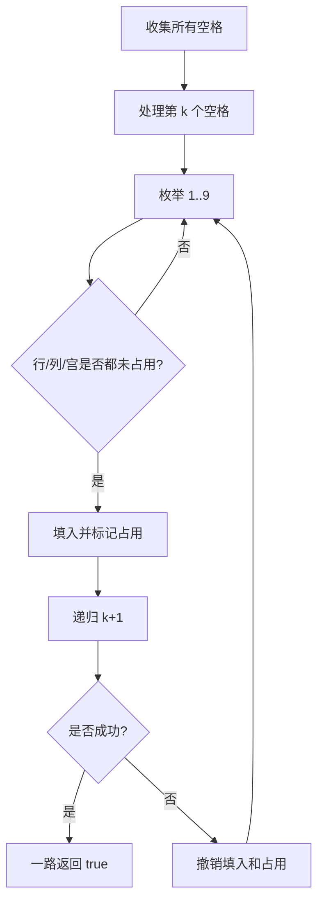

# 数独按空格递归：回溯训练题解

数独不是简单地从左到右试数字。真正有效的写法是先收集所有空格，然后递归填这些空格；每次判断一个数字是否合法时，只看它所在的行、列、九宫格是否已经占用。

一句话记法：**递归对象是空格，不是整个棋盘；合法性由行、列、宫三个表共同决定。**

## 适用场景

这类写法适合：

- 棋盘上有固定空位需要填。
- 每个空位的候选值受多个约束同时限制。
- 找到一个解即可停止，不需要输出所有解。
- 约束可以用布尔数组、集合或位掩码维护。

如果只是判断当前棋盘是否合法，不需要回溯；直接扫描已有数字即可。

## 图解思路



因为题目只要求修改原棋盘为一个可行解，递归函数可以返回 `bool`：找到解就停止继续搜索。

## 不变量

- `spaces[k]` 是第 `k` 个待填空格。
- `rows[r][d]` 表示第 `r` 行是否已经有数字 `d`。
- `cols[c][d]` 表示第 `c` 列是否已经有数字 `d`。
- `boxes[b][d]` 表示第 `b` 个九宫格是否已经有数字 `d`。
- 填入一个数字后，棋盘和三个占用表必须同步更新；回退时也必须同步撤销。

九宫格编号通常写成 `(r/3)*3 + c/3`。

## 手写步骤

1. 扫描棋盘，初始化行、列、宫占用表，同时收集空格。
2. 定义 `dfs(pos)`，表示正在填第 `pos` 个空格。
3. 如果 `pos == spaces.len()`，说明全部填完，返回 `true`。
4. 枚举数字 `1..9`。
5. 如果行、列、宫都没占用，就填入并递归。
6. 递归成功直接返回 `true`。
7. 递归失败则撤销，继续试下一个数字。

## Go 参考实现

```go
func solveSudoku(board [][]byte) {
	rows, cols, boxes := [9][10]bool{}, [9][10]bool{}, [9][10]bool{}
	spaces := [][2]int{}

	for r := 0; r < 9; r++ {
		for c := 0; c < 9; c++ {
			if board[r][c] == '.' {
				spaces = append(spaces, [2]int{r, c})
				continue
			}
			d := int(board[r][c] - '0')
			b := (r/3)*3 + c/3
			rows[r][d], cols[c][d], boxes[b][d] = true, true, true
		}
	}

	var dfs func(int) bool
	dfs = func(pos int) bool {
		if pos == len(spaces) {
			return true
		}

		r, c := spaces[pos][0], spaces[pos][1]
		b := (r/3)*3 + c/3
		for d := 1; d <= 9; d++ {
			if rows[r][d] || cols[c][d] || boxes[b][d] {
				continue
			}
			board[r][c] = byte('0' + d)
			rows[r][d], cols[c][d], boxes[b][d] = true, true, true
			if dfs(pos + 1) {
				return true
			}
			rows[r][d], cols[c][d], boxes[b][d] = false, false, false
			board[r][c] = '.'
		}
		return false
	}

	dfs(0)
}
```

## Rust 参考实现

```rust
pub fn solve_sudoku(board: &mut Vec<Vec<char>>) {
    let mut rows = [[false; 10]; 9];
    let mut cols = [[false; 10]; 9];
    let mut boxes = [[false; 10]; 9];
    let mut spaces = Vec::new();

    for r in 0..9 {
        for c in 0..9 {
            if board[r][c] == '.' {
                spaces.push((r, c));
            } else {
                let d = board[r][c].to_digit(10).unwrap() as usize;
                let b = (r / 3) * 3 + c / 3;
                rows[r][d] = true;
                cols[c][d] = true;
                boxes[b][d] = true;
            }
        }
    }

    fn dfs(
        pos: usize,
        spaces: &[(usize, usize)],
        board: &mut Vec<Vec<char>>,
        rows: &mut [[bool; 10]; 9],
        cols: &mut [[bool; 10]; 9],
        boxes: &mut [[bool; 10]; 9],
    ) -> bool {
        if pos == spaces.len() {
            return true;
        }

        let (r, c) = spaces[pos];
        let b = (r / 3) * 3 + c / 3;
        for d in 1..=9 {
            if rows[r][d] || cols[c][d] || boxes[b][d] {
                continue;
            }
            board[r][c] = char::from_digit(d as u32, 10).unwrap();
            rows[r][d] = true;
            cols[c][d] = true;
            boxes[b][d] = true;
            if dfs(pos + 1, spaces, board, rows, cols, boxes) {
                return true;
            }
            rows[r][d] = false;
            cols[c][d] = false;
            boxes[b][d] = false;
            board[r][c] = '.';
        }
        false
    }

    dfs(0, &spaces, board, &mut rows, &mut cols, &mut boxes);
}
```

## 为什么这样写

数独的分支数很大，不能每次试数字时再扫描整行、整列、整宫。占用表把一次合法性判断从扫描 27 个格子降成三个布尔查询。

递归按空格走还有一个好处：跳过已填数字后，递归层数等于真正需要决策的空格数量。代码也更清楚，`pos` 就是第几个决策点。

## 复杂度

- 最坏情况下每个空格最多尝试 9 个数字，搜索复杂度是指数级。
- 占用表让单次判断是 $O(1)$。
- 空间复杂度主要是空格列表和递归深度，最多 $O(81)$。

## 易错点

- 填棋盘后忘记同步标记行、列、宫。
- 回溯时只撤销棋盘，没有撤销占用表。
- 九宫格编号写错，常见错误是少乘一个 `3`。
- 找到解后没有立即返回，继续搜索把正确答案又撤销了。

## 练习顺序

建议先刷 #37。

复盘时重点说清楚为什么递归函数返回 `bool`，以及为什么占用表必须和棋盘同步更新。
