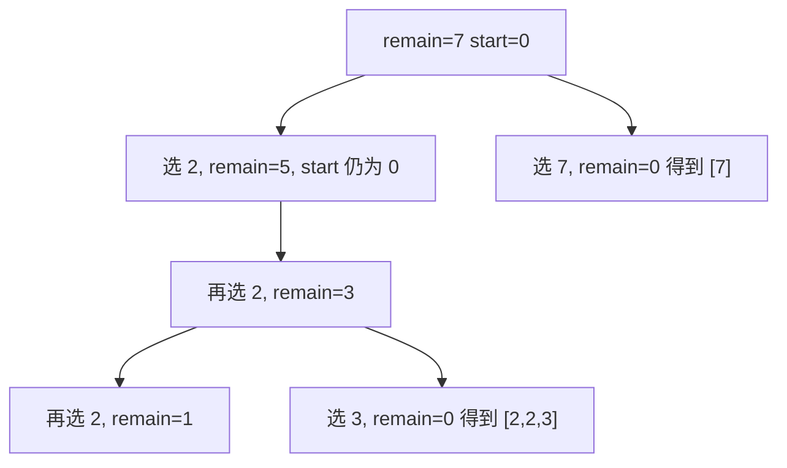

# 组合总和控制重复选择：回溯训练题解

组合总和系列看起来都是“选一些数凑 target”，但关键差别在于候选数能不能重复使用、输入里有没有重复值。

一句话记法：**能复用递归 `i`，不能复用递归 `i + 1`；有重复值先排序，同层跳重。**

## 适用场景

这类写法适合：

- 答案是组合，不关心顺序。
- 需要输出所有满足目标和的方案。
- 候选数通常为正数，可以用当前和或剩余和剪枝。
- 题目明确说明元素能否重复使用。

如果候选里有负数，`remain < 0` 或排序后提前 break 的剪枝就不一定成立。

## 图解思路

以 #39 `candidates = [2,3,6,7], target = 7` 为例：



因为 #39 允许重复使用同一个候选，选了下标 `i` 后，下一层还是从 `i` 开始。

## 三种常见变体

| 题型 | 能否复用当前元素 | 是否需要同层去重 | 下一层起点 |
| --- | --- | --- | --- |
| #39 组合总和 | 能 | 通常不需要，输入无重复 | `i` |
| #40 组合总和 II | 不能 | 需要，输入可能重复 | `i + 1` |
| #216 组合总和 III | 不能 | 不需要，数字 1..9 无重复 | `i + 1` |

这张表比模板更重要。先判断题型，再写递归参数。

## 手写步骤

1. 如果需要去重或提前剪枝，先排序。
2. 定义 `dfs(start, remain)`。
3. `remain == 0` 时复制路径。
4. 从 `start` 枚举候选。
5. 如果候选大于 `remain`，排序后可以直接 `break`。
6. 做选择。
7. 根据能否复用，递归 `dfs(i, remain - x)` 或 `dfs(i + 1, remain - x)`。
8. 撤销选择。

## Go 参考实现：组合总和

```go
func combinationSum(candidates []int, target int) [][]int {
	sort.Ints(candidates)
	ans := [][]int{}
	path := []int{}

	var dfs func(start, remain int)
	dfs = func(start, remain int) {
		if remain == 0 {
			ans = append(ans, append([]int(nil), path...))
			return
		}

		for i := start; i < len(candidates); i++ {
			x := candidates[i]
			if x > remain {
				break
			}
			path = append(path, x)
			dfs(i, remain-x)
			path = path[:len(path)-1]
		}
	}

	dfs(0, target)
	return ans
}
```

## Rust 参考实现：组合总和 II

```rust
pub fn combination_sum2(mut candidates: Vec<i32>, target: i32) -> Vec<Vec<i32>> {
    candidates.sort_unstable();

    fn dfs(start: usize, remain: i32, nums: &[i32], path: &mut Vec<i32>, ans: &mut Vec<Vec<i32>>) {
        if remain == 0 {
            ans.push(path.clone());
            return;
        }

        for i in start..nums.len() {
            if i > start && nums[i] == nums[i - 1] {
                continue;
            }
            if nums[i] > remain {
                break;
            }
            path.push(nums[i]);
            dfs(i + 1, remain - nums[i], nums, path, ans);
            path.pop();
        }
    }

    let mut path = Vec::new();
    let mut ans = Vec::new();
    dfs(0, target, &candidates, &mut path, &mut ans);
    ans
}
```

## 为什么这样写

组合总和不是排列题，所以必须用 `start` 保持路径中的下标不下降，避免 `[2,3,2]` 和 `[2,2,3]` 这种顺序重复。

#39 允许同一个候选反复使用，所以选择 `i` 后下一层还是 `i`。但这不等于从 `0` 开始；从 `0` 开始会重新选择更靠左的数，制造顺序重复。

#40 不允许复用每个下标，所以选择 `i` 后必须从 `i + 1` 开始。又因为输入可能有重复值，同一层还要跳过相同候选，否则会出现重复组合。

## 复杂度

- 回溯搜索最坏是指数级，具体取决于 target、候选数和剪枝效果。
- 排序成本是 $O(n \log n)$。
- 不计输出，递归深度最多与 `target / min(candidates)` 或候选数量相关。

## 易错点

- #39 递归成 `i + 1`，导致不能重复选当前数。
- #40 递归成 `i`，导致同一个下标被重复使用。
- 同层去重写错成 `i > 0`，误删合法分支。
- 排序后遇到 `x > remain` 还继续循环，浪费搜索。

## 练习顺序

建议按这个顺序刷：#39, #40, #216。

先用 #39 把“复用当前候选”练熟，再用 #40 处理“不可复用 + 同层去重”，最后用 #216 把固定长度、固定范围和目标和一起练。
