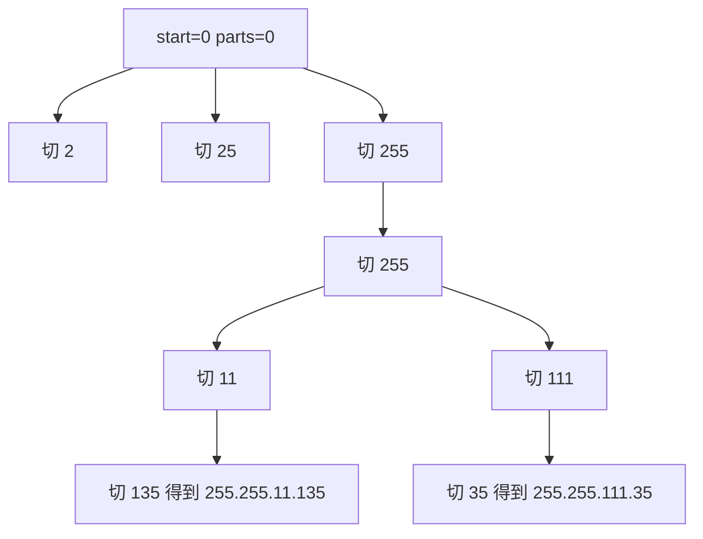

# IP 地址分段校验：回溯训练题解

复原 IP 地址和回文分割很像，都是在字符串上切段。不同点是 IP 地址固定切成 4 段，每段有明确的合法性限制。

一句话记法：**最多切 4 段，每段 1 到 3 位；前导零和超过 255 都非法。**

## 适用场景

适合这种写法的题：

- 字符串要被切成固定段数。
- 每段长度范围很小。
- 每段有独立合法性校验。
- 需要输出所有合法切法。

这类题不需要复杂模板，关键是剪掉长度不可能的分支。

## 图解思路

以 `s = "25525511135"` 为例：



每层只尝试长度 `1..3` 的下一段，不需要枚举更长子串。

## 不变量

- `start` 表示下一段从 `s[start]` 开始。
- `parts.len()` 表示已经切了几段。
- `parts` 中每一段都已经合法。
- 当 `parts.len() == 4` 时，只有 `start == s.len()` 才能收集答案。

还可以加长度剪枝：剩余字符数必须在剩余段数的 `1..3` 倍之间。

## 手写步骤

1. 定义 `dfs(start)`。
2. 如果已经有 4 段，检查是否刚好用完整个字符串。
3. 根据剩余字符数和剩余段数做剪枝。
4. 枚举当前段长度 `1..3`。
5. 校验前导零和数值范围。
6. 选择当前段，递归下一段，撤销。

## Go 参考实现

```go
func restoreIpAddresses(s string) []string {
	ans := []string{}
	parts := []string{}

	var dfs func(start int)
	dfs = func(start int) {
		remainParts := 4 - len(parts)
		remainChars := len(s) - start
		if remainChars < remainParts || remainChars > remainParts*3 {
			return
		}
		if len(parts) == 4 {
			if start == len(s) {
				ans = append(ans, strings.Join(parts, "."))
			}
			return
		}

		value := 0
		for end := start; end < len(s) && end < start+3; end++ {
			if end > start && s[start] == '0' {
				break
			}
			value = value*10 + int(s[end]-'0')
			if value > 255 {
				break
			}
			parts = append(parts, s[start:end+1])
			dfs(end + 1)
			parts = parts[:len(parts)-1]
		}
	}

	dfs(0)
	return ans
}
```

## Rust 参考实现

```rust
pub fn restore_ip_addresses(s: String) -> Vec<String> {
    fn dfs(start: usize, s: &str, parts: &mut Vec<String>, ans: &mut Vec<String>) {
        let remain_parts = 4 - parts.len();
        let remain_chars = s.len() - start;
        if remain_chars < remain_parts || remain_chars > remain_parts * 3 {
            return;
        }
        if parts.len() == 4 {
            if start == s.len() {
                ans.push(parts.join("."));
            }
            return;
        }

        let bytes = s.as_bytes();
        let mut value = 0;
        for end in start..s.len().min(start + 3) {
            if end > start && bytes[start] == b'0' {
                break;
            }
            value = value * 10 + (bytes[end] - b'0') as i32;
            if value > 255 {
                break;
            }
            parts.push(s[start..=end].to_string());
            dfs(end + 1, s, parts, ans);
            parts.pop();
        }
    }

    let mut parts = Vec::new();
    let mut ans = Vec::new();
    dfs(0, &s, &mut parts, &mut ans);
    ans
}
```

## 为什么这样写

IP 地址只有 4 段，所以搜索深度固定为 4；每段最多 3 位，所以每层最多 3 个分支。真正容易错的是合法性校验：

- 单独的 `"0"` 合法。
- `"00"`、`"01"` 非法，因为有前导零。
- `"255"` 合法，`"256"` 非法。

长度剪枝能提前排除明显不可能的分支。例如还剩 2 段，却剩 7 个字符，无论怎么切都不可能合法。

## 复杂度

- 深度固定为 4，每层最多 3 个分支，理论搜索量很小。
- 构造答案时需要复制字符串。
- 空间复杂度不计输出是 $O(1)$，因为最多保存 4 段。

## 易错点

- 允许 `"01"` 这类前导零段。
- 只判断段数为 4，没有判断字符串是否刚好用完。
- 没有做剩余长度剪枝，代码虽然能过但思路不够干净。
- Go 代码需要引入 `strings` 包。

## 练习顺序

建议先刷 #93。

做完后可以和 #131 对比：两题都是切割问题，#131 的合法性是回文，#93 的合法性是段数、长度、前导零和数值范围。
