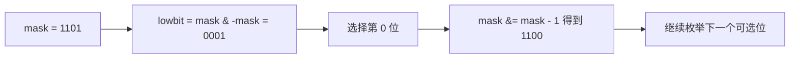

# 位运算加速可选集合：回溯训练题解

位运算回溯适合候选集合规模不大、状态可以用二进制位表示的题。它不会改变搜索树本身，但能把集合判断和枚举候选写得更紧凑。

一句话记法：**一位代表一个候选，`1` 表示可选或已占用，按题目统一语义后别混用。**

## 适用场景

适合位掩码优化的题：

- 候选数量较小，比如 N 皇后的列、数独的数字 1..9。
- 合法性判断频繁发生。
- 状态能用“占用集合”或“可选集合”表达。
- 想在已有回溯正确后再优化常数。

不建议一上来就写位运算。先写清楚普通集合版，再把集合替换成掩码，错误会少很多。

## 图解思路

以 4 个候选为例：



`mask & -mask` 可以取出最低位的 `1`，`mask & (mask - 1)` 可以删除最低位的 `1`。

## 常用操作

| 操作 | 写法 | 含义 |
| --- | --- | --- |
| 判断第 `i` 位是否为 1 | `mask & (1 << i) != 0` | 候选 `i` 是否在集合中 |
| 加入第 `i` 位 | `mask | (1 << i)` | 标记候选 `i` |
| 删除第 `i` 位 | `mask & !(1 << i)` | 取消候选 `i` |
| 取最低位 1 | `mask & -mask` | 枚举一个候选 |
| 删除最低位 1 | `mask & (mask - 1)` | 进入下一个候选 |

在 Go/Rust 中要注意无符号整数没有直接的负数语义，常用 `lowbit := mask & -mask` 时 Go 可以用有符号整型；Rust 更常用 `let bit = mask & (!mask + 1)` 或 `trailing_zeros()`。

## N 皇后位运算模型

普通 N 皇后维护 `cols`、`diag1`、`diag2` 三个集合。位运算版本把它们都变成掩码：

- `cols`：哪些列已经被占。
- `diag1`：下一行被主对角线攻击的位置。
- `diag2`：下一行被副对角线攻击的位置。
- `limit = (1 << n) - 1`：低 `n` 位全为 1。

当前行可放位置：

```text
available = limit & !(cols | diag1 | diag2)
```

选择某个 `bit` 后进入下一行：

```text
cols  -> cols | bit
diag1 -> (diag1 | bit) << 1
diag2 -> (diag2 | bit) >> 1
```

## Go 参考实现：统计 N 皇后方案数

```go
func totalNQueens(n int) int {
	limit := (1 << n) - 1
	ans := 0

	var dfs func(cols, diag1, diag2 int)
	dfs = func(cols, diag1, diag2 int) {
		if cols == limit {
			ans++
			return
		}

		available := limit & ^(cols | diag1 | diag2)
		for available != 0 {
			bit := available & -available
			available &= available - 1
			dfs(cols|bit, (diag1|bit)<<1, (diag2|bit)>>1)
		}
	}

	dfs(0, 0, 0)
	return ans
}
```

## Rust 参考实现：统计 N 皇后方案数

```rust
pub fn total_n_queens(n: i32) -> i32 {
    fn dfs(limit: u32, cols: u32, diag1: u32, diag2: u32, ans: &mut i32) {
        if cols == limit {
            *ans += 1;
            return;
        }

        let mut available = limit & !(cols | diag1 | diag2);
        while available != 0 {
            let bit = available & (!available + 1);
            available &= available - 1;
            dfs(limit, cols | bit, (diag1 | bit) << 1, (diag2 | bit) >> 1, ans);
        }
    }

    let limit = (1u32 << n as u32) - 1;
    let mut ans = 0;
    dfs(limit, 0, 0, 0, &mut ans);
    ans
}
```

## 为什么这样写

位运算版本的本质仍是回溯。它只是把“遍历所有列并判断冲突”改成“直接枚举当前可选位”。当可选集合很小但判断非常频繁时，这个优化很有效。

N 皇后里对角线状态要随行数移动。进入下一行后，上一行某个皇后攻击的位置会向左下或右下偏移一列，所以一个对角线掩码左移，另一个右移。

最重要的是统一掩码语义。上面的 `cols/diag1/diag2` 表示已占用或被攻击，`available` 表示可选。不要在同一个变量里一会儿把 `1` 当可选，一会儿当已占用。

## 复杂度

- 位运算不改变指数级搜索上界。
- 它能降低每层枚举和判断的常数成本。
- 空间复杂度仍主要是递归深度，N 皇后为 $O(n)$。

## 易错点

- 忘记用 `limit` 截断，左移后高位污染可选集合。
- 把 `diag1`、`diag2` 移动方向写反后没有统一验证。
- Rust 中用有符号负数取 lowbit，类型处理混乱；用 `!x + 1` 或 `trailing_zeros()` 更稳。
- 在普通集合版还没写对时直接上位运算，调试成本很高。

## 练习顺序

建议按这个顺序刷：#52, #51, #37。

先用 #52 练纯计数，不需要构造棋盘；再回到 #51 输出方案；最后看数独位掩码，把数字候选 `1..9` 压成 9 个 bit。
