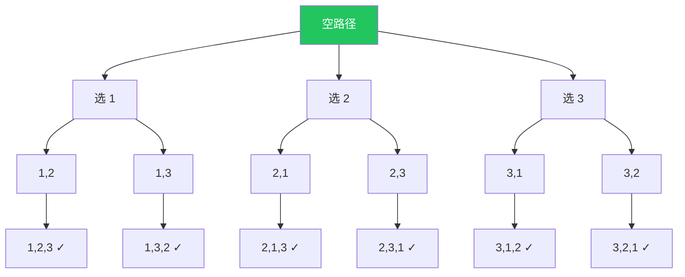
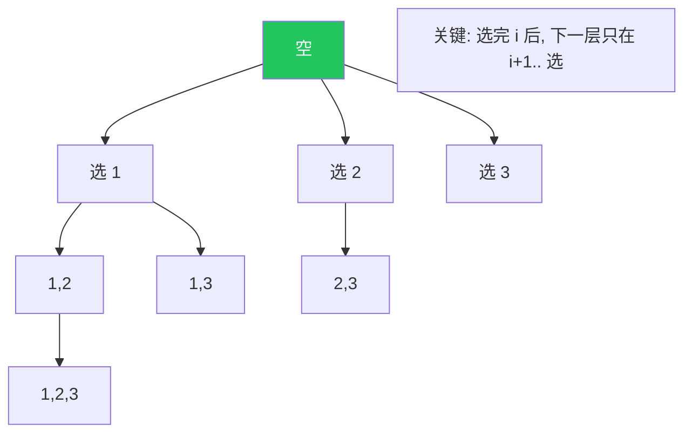

# 回溯算法：用选择树拆解搜索问题

回溯题的共同点是：答案需要一步步构造，中间状态如果走不通，就退回上一层换一个选择。代码看起来都是“选择、递归、撤销”，但真正决定能不能写对的，是先把选择树想清楚。

写回溯前先回答四个问题：

- 当前层在决定什么：填一个位置、选一个元素、切一段字符串，还是移动到一个格子。
- 当前层有哪些候选：全体未使用元素、`start` 之后的元素、当前数字映射的字符，还是邻居节点。
- 什么时候收集答案：到叶子、达到目标和，还是每个节点都算一个答案。
- 哪些分支可以剪掉：重复、越界、冲突、前缀非法、剩余长度不可能。

这四个问题比模板更重要。模板只是最后的代码形状。

## 一图看懂回溯



每条根到叶的路径就是一个完整排列。我们沿一条路向下走（**做选择**），走到底或走不通就**回退**（**撤销选择**）换一条。

不是所有回溯题都只在叶子收集答案。子集题中，每个节点都是一个合法答案；组合题要到长度或目标和满足时收集；网格题可能找到一个答案就直接返回。

## 框架

```text
result = []

def backtrack(path, choices):
    if 满足终止条件:
        result.append(path 的副本)
        return

    for choice in choices:
        if not 可选(choice, path):       # 剪枝
            continue
        做选择(choice, path)             # 改状态
        backtrack(path, 新的 choices)
        撤销选择(choice, path)           # 还原状态
```

三个关键动作：

1. **路径** `path`：当前已经做过的选择构成的序列。
2. **选择列表** `choices`：现在还能做哪些选择。
3. **结束条件**：到叶子节点。

还要补一个关键判断：`choices` 到底怎么来。

| 题型 | 候选来源 | 常见状态 |
| --- | --- | --- |
| 排列 | 所有未使用元素 | `used` |
| 组合 / 子集 | `start` 之后的元素 | `start` |
| 电话号码 | 当前数字映射的字符 | `index` |
| 括号生成 | 当前还能放的括号 | `left/right` |
| 数独 / N 皇后 | 当前位置的合法值 | 占用表 |
| 单词搜索 / 图路径 | 相邻格子或邻居节点 | `visited` |
| 字符串切割 | 下一段的结束位置 | `start` |

如果候选来源判断错，后面的代码再像模板也会错。排列题误用 `start` 会漏答案，组合题误用 `used` 会产生重复顺序。

## 例 1：全排列（无重复）

> 抽象问题：给定不含重复元素的整数数组，返回它的所有排列。

选择列表 = 还没用过的数。用 `used` 数组标记。

```rust
fn permute(nums: Vec<i32>) -> Vec<Vec<i32>> {
    fn go(nums: &[i32], used: &mut Vec<bool>, path: &mut Vec<i32>, out: &mut Vec<Vec<i32>>) {
        if path.len() == nums.len() {
            out.push(path.clone());
            return;
        }
        for i in 0..nums.len() {
            if used[i] { continue; }
            used[i] = true;
            path.push(nums[i]);
            go(nums, used, path, out);
            path.pop();
            used[i] = false;
        }
    }
    let mut used = vec![false; nums.len()];
    let mut path = Vec::new();
    let mut out = Vec::new();
    go(&nums, &mut used, &mut path, &mut out);
    out
}
```

## 例 2：全排列（含重复）

> 抽象问题：和上面一样，但数组中可能有重复元素，要求**去重排列**。

**做法**：先排序，让相同元素相邻；遍历选择时，**同一层**如果前一个相同元素还没被用过，就跳过当前。

为什么是"前一个**没**被用过才跳"？因为我们要保证相同元素的**相对顺序固定**，从而不会产生镜像重复。

```python
def permute_unique(nums):
    nums.sort()
    n, used, path, out = len(nums), [False]*len(nums), [], []
    def go():
        if len(path) == n:
            out.append(path[:])
            return
        for i in range(n):
            if used[i]: continue
            if i > 0 and nums[i] == nums[i-1] and not used[i-1]:
                continue              # 同层去重
            used[i] = True
            path.append(nums[i])
            go()
            path.pop()
            used[i] = False
    go()
    return out
```

## 例 3：子集（组合）

> 抽象问题：返回数组的**所有子集**（幂集）。

跟排列的区别：子集**无序**，所以传一个 `start` 索引避免回头选：



```go
func subsets(nums []int) [][]int {
    var res [][]int
    var path []int
    var go func(start int)
    go = func(start int) {
        cp := make([]int, len(path))
        copy(cp, path)
        res = append(res, cp)               // 每个节点都是一个子集
        for i := start; i < len(nums); i++ {
            path = append(path, nums[i])
            go(i + 1)
            path = path[:len(path)-1]
        }
    }
    go(0)
    return res
}
```

## 例 4：N 皇后（剪枝重头戏）

> 抽象问题：在 $N \times N$ 棋盘上放 N 个皇后，使任意两个不能互相攻击。

关键是**有效剪枝**：纵列、主对角线（`row - col`）、副对角线（`row + col`）都各用一个 set 记录被占。判一次 $O(1)$。

```python
def solve_n_queens(n: int):
    cols, diag1, diag2 = set(), set(), set()    # diag1: row-col, diag2: row+col
    board, res = [-1]*n, []
    def go(row: int):
        if row == n:
            res.append([''.join('Q' if c == j else '.' for c in range(n)) for j in board])
            return
        for col in range(n):
            if col in cols or row - col in diag1 or row + col in diag2:
                continue
            cols.add(col); diag1.add(row - col); diag2.add(row + col)
            board[row] = col
            go(row + 1)
            cols.remove(col); diag1.remove(row - col); diag2.remove(row + col)
    go(0)
    return res
```

## 剪枝四板斧

1. **可行性剪枝**：当前状态已经不合法（如冲突），立刻返回。
2. **最优性剪枝**：当前解已经不可能比最优解好（如求最小，已经超过当前最优）。
3. **重复剪枝**：相同状态（同一层同值），跳过。
4. **顺序剪枝**：对候选排序后从大到小或从小到大，更快触发可行性/最优性剪枝。

## 回溯 vs DFS vs 暴力枚举

| 名字 | 区别 |
| --- | --- |
| 暴力枚举 | 笛卡尔积式枚举所有可能（无剪枝） |
| DFS | 一种树/图遍历策略 |
| 回溯 | 在 DFS 框架上 + "做选择 / 撤销选择"语义 + 剪枝 |

> 回溯本质就是 DFS。区别在于**显式管理状态的更改与还原**。

## 性能粗估

回溯的时间几乎都是 $O(\text{解的总数} \times \text{每个解构造时间})$，最坏指数级。

- 排列：$O(n \cdot n!)$
- 子集：$O(n \cdot 2^n)$
- 组合 $C(n,k)$：$O(k \cdot C(n,k))$

剪枝能显著降低实际运行时间，但**最坏情况复杂度并不改变**。

## 常见坑

| 坑 | 修复 |
| --- | --- |
| 把 `path` 直接 push 到结果 | 必须 `path.clone()`，否则结果共享引用 |
| 忘记撤销选择 | 同一个 `path` 被污染 |
| 子集题不传 `start` | 出现 `[2,1]` 这种重复组合 |
| 含重复元素的去重写错 | 先排序，同层判 `used[i-1]==false` |

## 相关题目

- #46 全排列：练 `used`。
- #47 全排列 II：练排列同层去重。
- #78 子集：练每个节点收集答案。
- #90 子集 II：练 `start` 模型同层去重。
- #39 组合总和：练可重复选择，下一层递归 `i`。
- #40 组合总和 II：练不可重复选择，下一层递归 `i + 1`。
- #51 N 皇后：练列和斜线剪枝。
- #22 括号生成：练前缀合法性剪枝。

## 专项路线

如果是第一次系统练回溯，建议按这个顺序读后续文章：

1. 排列 `used`、组合 `start`、子集每层收集。
2. 重复元素排序去重、括号生成、电话号码展开。
3. 数独、N 皇后、组合总和、单词搜索。
4. 回文分割、IP 分段、图路径、位运算优化。

每篇训练的不是“又一份代码”，而是一个判断：候选怎么来、状态怎么还原、剪枝为什么不漏答案。
