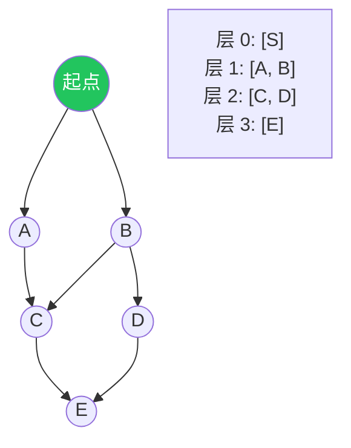
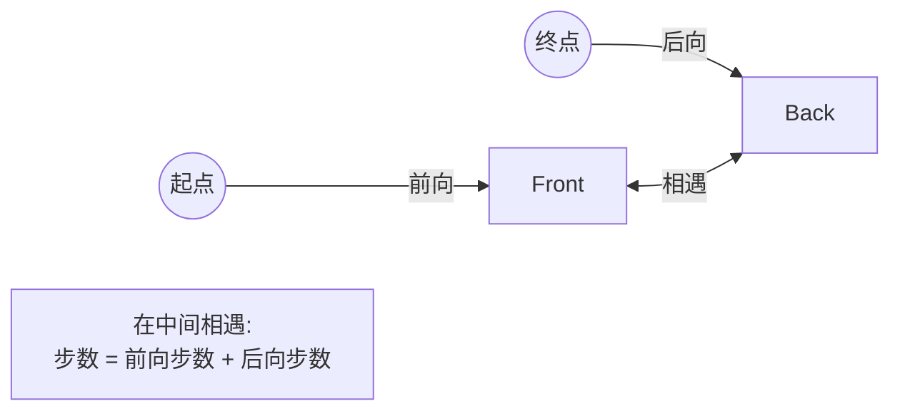

# BFS 通用框架：层序、最短路与多源扩散

## BFS 的本质

广度优先搜索 = 一层一层往外扩。

**为什么 BFS 能求最短路？** 因为每个节点**首次被发现的时刻**就是它到起点的最短距离（前提是边权为 1）。



如果边权不全为 1，BFS 不再保证最短路，要换 Dijkstra 或 0-1 BFS。

## 通用框架

```text
q ← 队列 (起点)
visited ← {起点}
step ← 0
while q 非空:
    sz ← q.size()          // 当前层节点数
    for _ in 0..sz:
        cur ← q.pop_front()
        if cur 是目标: return step
        for nxt in 邻居(cur):
            if nxt 未访问 且 可走:
                visited.add(nxt)
                q.push_back(nxt)
    step += 1
return -1                  // 找不到
```

这套框架核心三点：

1. **按层处理**：循环开始先记下本层节点数 `sz`，否则会把下一层混进来。
2. **visited 在入队时打标**：而不是在出队时 —— 后者会导致重复入队。
3. **step 在每层结束时 +1**。

## 例 1：岛屿数量（隐式图）

> 抽象问题：给定 `m × n` 网格，'1' 代表陆地、'0' 代表海。把上下左右相连的 '1' 视为同一座岛，求岛的数量。

每个格子是一个节点，相邻格子之间隐式有边。**遍历每个未访问的陆地，从它做一次 BFS 把整座岛都标记**，BFS 的次数就是岛屿数量。

```rust
pub fn num_islands(grid: &mut Vec<Vec<char>>) -> i32 {
    let (m, n) = (grid.len(), grid[0].len());
    let mut count = 0;
    let dirs = [(-1, 0), (1, 0), (0, -1), (0, 1)];
    let mut q: std::collections::VecDeque<(usize, usize)> = std::collections::VecDeque::new();

    for i in 0..m {
        for j in 0..n {
            if grid[i][j] != '1' { continue; }
            count += 1;
            q.push_back((i, j));
            grid[i][j] = '0';                       // 入队即标记
            while let Some((x, y)) = q.pop_front() {
                for (dx, dy) in dirs {
                    let nx = x as i32 + dx;
                    let ny = y as i32 + dy;
                    if nx < 0 || ny < 0 || nx >= m as i32 || ny >= n as i32 { continue; }
                    let (nx, ny) = (nx as usize, ny as usize);
                    if grid[nx][ny] == '1' {
                        grid[nx][ny] = '0';
                        q.push_back((nx, ny));
                    }
                }
            }
        }
    }
    count
}
```

## 例 2：腐烂的橘子（多源 BFS）

> 抽象问题：网格中 '2' 是腐烂橘子，'1' 是新鲜橘子，每分钟一个腐烂橘子会让上下左右相邻的新鲜橘子也腐烂。问多少分钟后全部腐烂，若无法全部腐烂返回 -1。

**关键观察**：这是 BFS，但有**多个起点**（所有初始的 '2'）。把它们**一起塞进初始队列**，扩散过程完全一样 —— 不用从每个 '2' 各跑一遍。


```python
from collections import deque

def oranges_rotting(grid):
    m, n = len(grid), len(grid[0])
    q, fresh = deque(), 0
    for i in range(m):
        for j in range(n):
            if grid[i][j] == 2: q.append((i, j))
            elif grid[i][j] == 1: fresh += 1
    if fresh == 0: return 0
    minutes = 0
    while q:
        for _ in range(len(q)):
            x, y = q.popleft()
            for dx, dy in [(-1,0),(1,0),(0,-1),(0,1)]:
                nx, ny = x+dx, y+dy
                if 0 <= nx < m and 0 <= ny < n and grid[nx][ny] == 1:
                    grid[nx][ny] = 2
                    fresh -= 1
                    q.append((nx, ny))
        if q: minutes += 1                   # 还有下一层才计时 +1
    return minutes if fresh == 0 else -1
```

> 多源 BFS 等价于"建一个超级源点，连向所有起点，对超级源点做单源 BFS"。

## 例 3：单词接龙（隐式图 + 转换规则）

> 抽象问题：给定起始单词、结尾单词和词典，每步只能换一个字母且换完后单词必须在词典里，求从起始到结尾的最少步数。

这道题的"图"是隐式的：节点是单词，边是"相差一个字母"。直接枚举所有邻居代价高，常用技巧：

**通配符桶**：把每个词的每个位置替换为 `*`，建从模式串到原词的映射。查邻居就是按模式串查桶。

```text
hot → ["*ot", "h*t", "ho*"]
桶 *ot: [hot, dot, lot]
桶 h*t: [hot, hit]
桶 ho*: [hot, hop]
```

这样邻居查询变成 $O(\text{词长})$ 而不是 $O(N \cdot \text{词长})$。

## 双向 BFS（剪枝利器）

当起点和终点都已知，且分支因子较大时，**两边一起搜，相遇即终止**。复杂度从 $O(b^d)$ 降到 $O(b^{d/2})$。



实现要点：

- 维护两个 `visited` 集合：`front` 和 `back`。
- 每轮**扩张较小的那一侧**（启发式，节省常数）。
- 扩张时如果命中另一侧的 visited，就找到了。

## BFS vs DFS

| 问题类型 | 用 BFS | 用 DFS |
| --- | --- | --- |
| 最短路径（边权 1） | ✅ | ❌（要剪枝 + 全枚举） |
| 是否连通 | ✅ | ✅ |
| 所有路径 | ❌（爆栈） | ✅ |
| 拓扑序、强连通 | 部分 | ✅ |
| 状态空间 + 最少步数 | ✅ | ❌ |

经验：题目里见到"**最少几步**""**最短**""**层数**"，先想 BFS。

## 常见坑

| 坑 | 后果 |
| --- | --- |
| `visited` 出队时才标 | 节点重复入队，爆队列 |
| 忘记记本层 size | step 计算多了一层 |
| 多源 BFS 漏了某些起点 | 计算偏大或死循环 |
| 网格边界检查放在循环里漏写 | 数组越界 |
| 边权不全为 1 还用 BFS | 答案错 |

## 相关题目

- #200 岛屿数量
- #994 腐烂的橘子（多源）
- #1091 二进制矩阵中的最短路径
- #127 单词接龙（隐式图）
- #542 01 矩阵（多源 BFS 求最近 0）
- #752 打开转盘锁（状态图 BFS）
- #433 最小基因变化（与单词接龙同型）
