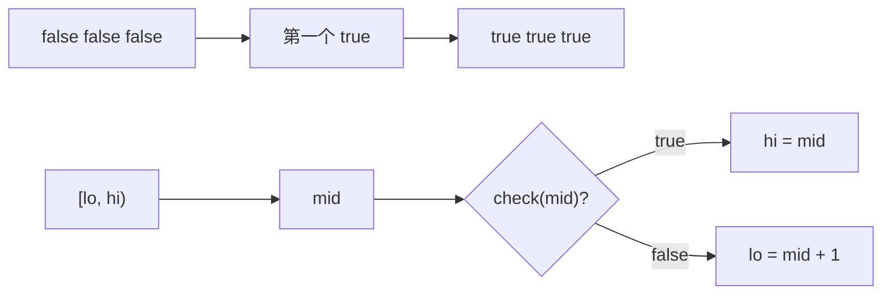

# 左闭右开找第一个满足：二分搜索训练题解

二分最稳定的写法之一，是把问题改成：在一个左闭右开区间 `[lo, hi)` 里，找第一个让 `check(x)` 为真的位置。

一句话记法：**`check(mid)` 为真，答案在左半边含 `mid`；为假，答案一定在 `mid` 右边。**

## 适用场景

适合这种写法的题：

- 搜索插入位置：找第一个 `nums[i] >= target`。
- 查找左边界：找第一个等于目标的位置，本质仍是 lower_bound。
- 第一个错误版本：找第一个 `isBadVersion(i)` 为真的版本。
- 在答案空间里找最小可行值。

前提是 `check` 有单调性：前面一段都是 `false`，后面一段都是 `true`。

## 图解思路



`hi = mid` 不会漏掉答案，因为 `mid` 自己已经可行；`lo = mid + 1` 也不会漏掉答案，因为 `mid` 不可行，左侧更不可能可行。

## 不变量

- 答案始终在 `[lo, hi)` 中。
- `lo` 左侧都不是答案。
- `hi` 右侧不需要再考虑。
- 循环条件是 `lo < hi`，结束时区间为空，`lo` 就是第一个可行位置。

## 手写步骤

1. 先写 `check(i)`，明确它何时为真。
2. 初始化 `lo = 0, hi = n`，注意 `hi` 可以取到 `n`。
3. 循环 `while lo < hi`。
4. `mid = lo + (hi - lo) / 2`。
5. 真则 `hi = mid`，假则 `lo = mid + 1`。
6. 返回 `lo`，再判断是否越界或是否真的等于目标。

## Go 参考实现

```go
func searchInsert(nums []int, target int) int {
	lo, hi := 0, len(nums)
	for lo < hi {
		mid := lo + (hi-lo)/2
		if nums[mid] >= target {
			hi = mid
		} else {
			lo = mid + 1
		}
	}
	return lo
}
```

## Rust 参考实现

```rust
pub fn search_insert(nums: Vec<i32>, target: i32) -> i32 {
    let (mut lo, mut hi) = (0usize, nums.len());
    while lo < hi {
        let mid = lo + (hi - lo) / 2;
        if nums[mid] >= target {
            hi = mid;
        } else {
            lo = mid + 1;
        }
    }
    lo as i32
}
```

## 为什么这样写

找插入位置时，目标位置就是第一个 `>= target` 的下标。如果不存在这样的下标，答案就是 `n`，表示插到数组末尾。左闭右开区间天然允许返回 `n`，比左闭右闭少一个特殊分支。

查找目标值时也可以先用 lower_bound 找左边界，再判断：

```go
i := lowerBound(nums, target)
if i == len(nums) || nums[i] != target {
	return -1
}
return i
```

这比在二分内部同时处理“命中”和“边界”更容易验证。

## 复杂度

- 时间复杂度：$O(\log n)$。
- 空间复杂度：$O(1)$。

## 易错点

- `hi` 初始化成 `len(nums)-1`，却仍然按左闭右开写，导致漏掉末尾插入位置。
- `check(mid)` 为真时写成 `hi = mid - 1`，把可能答案删掉。
- 循环结束后直接访问 `nums[lo]`，没有判断 `lo == len(nums)`。
- 没有先定义 `check` 的真假方向，边界更新写反。

## 练习顺序

建议按这个顺序刷：#35, #278, #704, #34。

先用 #35 把 lower_bound 写熟，再用 #34 体会“左边界和右边界都可以由 lower_bound 变形得到”。
