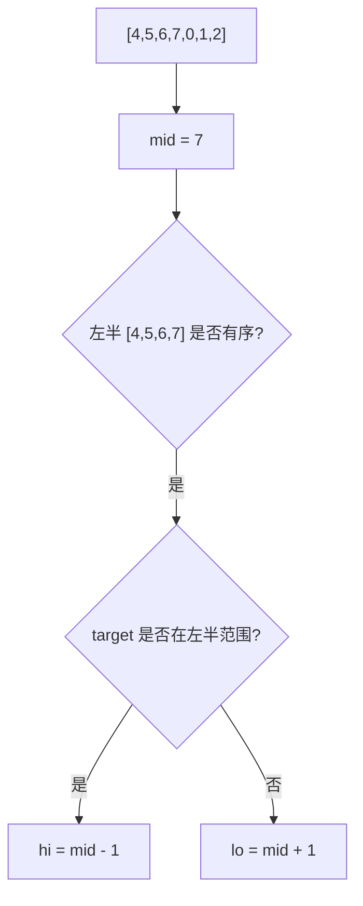

# 旋转数组判断有序半边：二分搜索训练题解

旋转排序数组的难点是：数组整体不再有序，不能直接用普通二分。但它仍然保留局部结构：任意取一个 `mid`，左右两边至少有一边是有序的。

一句话记法：**先找有序半边，再判断目标是否在这半边。**

## 适用场景

适合这种写法的题：

- 升序数组被旋转一次。
- 要查找某个目标值，或找旋转后的最小值。
- 数组无重复时，可以明确判断哪一边有序。
- 数组有重复时，需要额外处理 `nums[lo] == nums[mid] == nums[hi]` 的退化。

如果数组不是由有序数组旋转而来，这套判断就没有依据。

## 图解思路



当 `nums[lo] <= nums[mid]` 时，左半边有序；否则右半边有序。

## 不变量

- 目标如果存在，始终在 `[lo, hi]` 中。
- 每一轮至少能确认一边是单调区间。
- 如果目标落在有序半边的值域里，就收缩到那边；否则去另一边。
- 无重复数组中，每轮都能排除至少一半区间。

## 手写步骤

1. 初始化 `lo = 0, hi = n - 1`。
2. 循环 `lo <= hi`。
3. 如果 `nums[mid] == target`，直接返回。
4. 判断左半边是否有序：`nums[lo] <= nums[mid]`。
5. 如果左半有序，判断 `target` 是否在 `[nums[lo], nums[mid])`。
6. 否则右半有序，判断 `target` 是否在 `(nums[mid], nums[hi]]`。
7. 根据判断收缩区间。

## Go 参考实现

```go
func search(nums []int, target int) int {
	lo, hi := 0, len(nums)-1
	for lo <= hi {
		mid := lo + (hi-lo)/2
		if nums[mid] == target {
			return mid
		}

		if nums[lo] <= nums[mid] {
			if nums[lo] <= target && target < nums[mid] {
				hi = mid - 1
			} else {
				lo = mid + 1
			}
		} else {
			if nums[mid] < target && target <= nums[hi] {
				lo = mid + 1
			} else {
				hi = mid - 1
			}
		}
	}
	return -1
}
```

## Rust 参考实现

```rust
pub fn search(nums: Vec<i32>, target: i32) -> i32 {
    if nums.is_empty() {
        return -1;
    }

    let (mut lo, mut hi) = (0i32, nums.len() as i32 - 1);
    while lo <= hi {
        let mid = lo + (hi - lo) / 2;
        let (l, m, r) = (lo as usize, mid as usize, hi as usize);
        if nums[m] == target {
            return mid;
        }

        if nums[l] <= nums[m] {
            if nums[l] <= target && target < nums[m] {
                hi = mid - 1;
            } else {
                lo = mid + 1;
            }
        } else if nums[m] < target && target <= nums[r] {
            lo = mid + 1;
        } else {
            hi = mid - 1;
        }
    }
    -1
}
```

## 为什么这样写

普通二分依赖全局有序，旋转数组依赖局部有序。每一轮先问“哪边有序”，再问“目标是否可能在这边”。这两个问题顺序不能反。

对于 `[4,5,6,7,0,1,2]`，如果 `mid` 落在 `7`，左半 `[4,5,6,7]` 有序。若目标是 `0`，它不在 `[4,7)` 里，所以只能去右半。若目标是 `5`，它在左半值域里，就去左半。

## 复杂度

- 无重复元素时，时间复杂度是 $O(\log n)$。
- 空间复杂度是 $O(1)$。
- 有大量重复元素时，最坏可能退化到 $O(n)$，见带重复版本。

## 易错点

- 先判断目标和 `mid` 大小，而不是先判断哪边有序。
- 左半有序时把边界写成 `target <= nums[mid]`，但 `nums[mid]` 已经排除或已命中。
- 忘记空数组，Rust 中 `len() - 1` 下溢。
- 有重复元素时仍然强行用无重复判断，遇到 `[1,0,1,1,1]` 会失效。

## 练习顺序

建议按这个顺序刷：#33, #153, #81, #154。

先做无重复查找和找最小值，再处理重复元素导致的信息不足。
