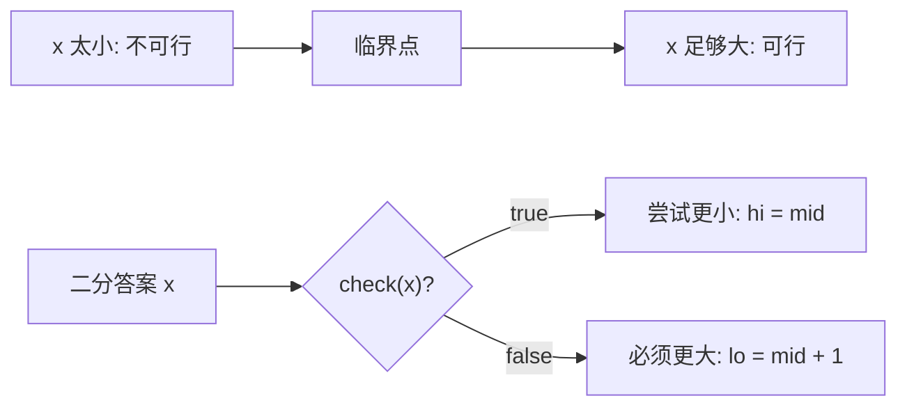

# 答案二分最小可行值：二分搜索训练题解

很多题表面不是在有序数组里找数，但答案本身有单调性：如果速度 `x` 能完成任务，那么更大的速度也能完成；如果容量 `x` 能装下，那么更大的容量也能装下。

一句话记法：**把“求最小多少”改成“给定 x 能不能做到”，再找第一个 true。**

## 适用场景

常见信号：

- 求最小速度、最小容量、最小天数、最小最大值。
- 给一个候选答案 `x`，可以在线性或接近线性的时间判断是否可行。
- `x` 越大越容易满足条件。
- 直接构造答案很难，但验证答案不难。

如果 `check(x)` 不是单调的，不能用答案二分。

## 图解思路



目标是找第一个可行值，所以用 lower_bound 模板。

## 不变量

- `[lo, hi]` 或 `[lo, hi)` 覆盖所有可能答案。
- `check(x)` 的结果从某个位置开始由 `false` 变成 `true`。
- 当 `mid` 可行时，答案不会比 `mid` 更大，可以保留 `mid`。
- 当 `mid` 不可行时，答案一定大于 `mid`。

## 手写步骤

1. 明确答案下界和上界。
2. 写 `check(x)`，只回答可不可行。
3. 验证 `check` 单调方向：`x` 变大是否更容易。
4. 套第一个 true 模板。
5. 返回 `lo`。

## Go 参考实现：爱吃香蕉

```go
func minEatingSpeed(piles []int, h int) int {
	lo, hi := 1, 0
	for _, p := range piles {
		if p > hi {
			hi = p
		}
	}

	check := func(speed int) bool {
		hours := 0
		for _, p := range piles {
			hours += (p + speed - 1) / speed
		}
		return hours <= h
	}

	for lo < hi {
		mid := lo + (hi-lo)/2
		if check(mid) {
			hi = mid
		} else {
			lo = mid + 1
		}
	}
	return lo
}
```

## Rust 参考实现：运货能力

```rust
pub fn ship_within_days(weights: Vec<i32>, days: i32) -> i32 {
    let mut lo = *weights.iter().max().unwrap();
    let mut hi: i32 = weights.iter().sum();

    let check = |cap: i32| -> bool {
        let mut used_days = 1;
        let mut load = 0;
        for &w in &weights {
            if load + w > cap {
                used_days += 1;
                load = 0;
            }
            load += w;
        }
        used_days <= days
    };

    while lo < hi {
        let mid = lo + (hi - lo) / 2;
        if check(mid) {
            hi = mid;
        } else {
            lo = mid + 1;
        }
    }
    lo
}
```

## 为什么这样写

以吃香蕉为例，速度越快，所需小时数只会不变或减少。所以 `hours <= h` 这个判断对速度是单调的：小速度可能不可行，大速度一旦可行，之后都可行。

答案二分的难点常常不是二分循环，而是上下界：

- 最小速度至少是 `1`。
- 最大速度不需要超过最大香蕉堆。
- 运货能力至少是最重包裹，最多是总重量。
- 分割数组最大和至少是最大元素，最多是总和。

上下界写得越紧，越容易检查正确性。

## 复杂度

- 时间复杂度：$O(n \log R)$，`R` 是答案范围大小。
- 空间复杂度：$O(1)$。

## 易错点

- 先写二分，不先写 `check`，导致单调方向混乱。
- 上界太小，把真实答案排除在外。
- `check` 里向上取整写成普通除法。
- `mid` 可行时写成 `lo = mid + 1`，变成找最后一个不可行。

## 练习顺序

建议按这个顺序刷：#875, #1011, #410, #1283, #1482。

先练速度/容量这类直观单调题，再做分割数组和最小天数，把贪心验证写稳。
