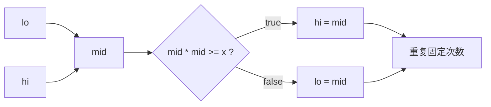

# 浮点二分控制迭代次数：二分搜索训练题解

浮点二分和整数二分最大的差别是：浮点数没有“相邻整数”的概念。`lo` 和 `hi` 会不断接近，但很难靠 `lo < hi` 自然结束。

一句话记法：**整数二分靠边界收缩到同一个点；浮点二分靠迭代次数或误差精度停下来。**

## 适用场景

适合浮点二分的题：

- 求平方根、开方、实数方程的近似解。
- 答案是连续区间上的某个实数。
- 判断函数在区间内有单调性。
- 题目允许误差，比如 `1e-6`。

LeetCode 的 #69 是整数平方根，更适合整数二分；但理解浮点二分时可以先从平方根近似开始。

## 图解思路



如果要找 `sqrt(x)`，`mid * mid >= x` 表示 `mid` 在答案右侧或正好命中。

## 不变量

- 真正答案始终在 `[lo, hi]` 中。
- `lo` 是偏小的近似值，`hi` 是偏大的近似值。
- 每次取中点后保留包含答案的一半。
- 结束时 `lo` 和 `hi` 足够接近，返回任意一个都可。

## 手写步骤

1. 确定初始区间，比如 `sqrt(x)` 在 `[0, max(1, x)]`。
2. 选择停止方式：固定迭代 60 到 100 次，或 `hi - lo > eps`。
3. 计算 `mid`。
4. 根据单调判断收缩左边或右边。
5. 返回 `lo`、`hi` 或 `(lo + hi) / 2`。

## Go 参考实现

```go
func sqrtFloat(x float64) float64 {
	lo, hi := 0.0, x
	if hi < 1 {
		hi = 1
	}

	for i := 0; i < 80; i++ {
		mid := lo + (hi-lo)/2
		if mid*mid >= x {
			hi = mid
		} else {
			lo = mid
		}
	}
	return (lo + hi) / 2
}
```

## Rust 参考实现

```rust
pub fn sqrt_float(x: f64) -> f64 {
    let (mut lo, mut hi) = (0.0, x.max(1.0));
    for _ in 0..80 {
        let mid = lo + (hi - lo) / 2.0;
        if mid * mid >= x {
            hi = mid;
        } else {
            lo = mid;
        }
    }
    (lo + hi) / 2.0
}
```

## 为什么这样写

固定迭代次数是浮点二分里很常见的工程写法。每次区间长度减半，80 次后误差已经远小于大多数题目要求，而且避免了浮点比较带来的停不下来问题。

如果题目明确要求误差，也可以写：

```go
for hi-lo > 1e-7 {
	// ...
}
```

但要注意浮点误差，不要期待 `lo == hi`。

## 复杂度

- 固定迭代时，时间复杂度是 $O(T)$，`T` 是迭代次数。
- 用误差阈值时，时间复杂度约为 $O(\log((hi-lo)/eps))$。
- 空间复杂度是 $O(1)$。

## 易错点

- 用整数二分的 `lo = mid + 1` 写浮点二分。
- 循环条件写成 `lo < hi`，可能迭代过久或受精度影响。
- 初始上界没覆盖答案，比如 `x < 1` 时 `sqrt(x) > x`。
- 用 `mid * mid` 时没有考虑特别大的数可能溢出；极大范围可改用 `mid >= x / mid`。

## 练习顺序

建议先用平方根近似手写一遍，再做 #69/#367 的整数版本，对比“连续答案”和“离散答案”的边界差异。
