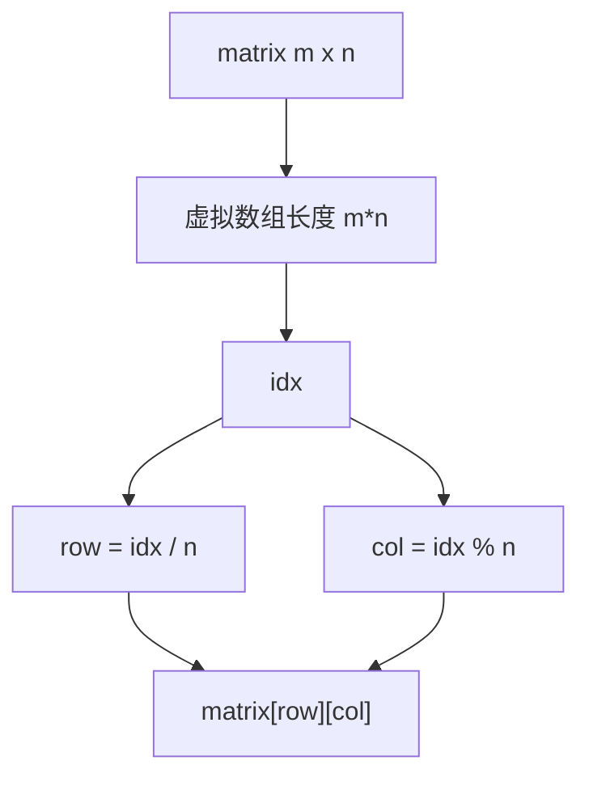

# 二维矩阵映射一维：二分搜索训练题解

有些矩阵题本质上还是普通二分。只要矩阵从左到右、从上到下连起来是一个整体有序序列，就可以把二维坐标映射成一维下标。

一句话记法：**一维下标 `idx` 对应 `row = idx / n`，`col = idx % n`。**

## 适用场景

适合一维映射二分的矩阵必须满足：

- 每一行从左到右递增。
- 每一行第一个数大于上一行最后一个数。
- 目标是判断某个值是否存在。

#240 搜索二维矩阵 II 不满足第二条，不能直接拉平成整体有序数组，更适合从右上角或左下角走。

## 图解思路



二分逻辑完全按照普通有序数组写，只是在取值时做一次坐标换算。

## 不变量

- 虚拟数组下标范围是 `[0, m*n)`。
- `idx` 越大，对应的矩阵值越大。
- 当前答案如果存在，始终在虚拟区间内。
- 坐标转换必须使用列数 `n`。

## 手写步骤

1. 处理空矩阵。
2. 设 `m = len(matrix)`，`n = len(matrix[0])`。
3. 在 `[0, m*n)` 上做 lower_bound 或普通二分。
4. 用 `matrix[mid/n][mid%n]` 取虚拟数组值。
5. 根据值和 target 比较收缩区间。

## Go 参考实现

```go
func searchMatrix(matrix [][]int, target int) bool {
	m, n := len(matrix), len(matrix[0])
	lo, hi := 0, m*n
	for lo < hi {
		mid := lo + (hi-lo)/2
		x := matrix[mid/n][mid%n]
		if x >= target {
			hi = mid
		} else {
			lo = mid + 1
		}
	}
	return lo < m*n && matrix[lo/n][lo%n] == target
}
```

## Rust 参考实现

```rust
pub fn search_matrix(matrix: Vec<Vec<i32>>, target: i32) -> bool {
    let (m, n) = (matrix.len(), matrix[0].len());
    let (mut lo, mut hi) = (0usize, m * n);

    while lo < hi {
        let mid = lo + (hi - lo) / 2;
        let x = matrix[mid / n][mid % n];
        if x >= target {
            hi = mid;
        } else {
            lo = mid + 1;
        }
    }

    lo < m * n && matrix[lo / n][lo % n] == target
}
```

## 为什么这样写

这道题真正要确认的是“能不能把矩阵看成一个有序数组”。如果每一行首元素都大于上一行末元素，那么按行展开后的序列整体递增：

```text
matrix[0][0], matrix[0][1], ..., matrix[0][n-1], matrix[1][0], ...
```

只要这个虚拟数组有序，二分就成立。代码里不需要真的创建新数组，否则会额外浪费 $O(mn)$ 空间。

## 复杂度

- 时间复杂度：$O(\log(mn))$。
- 空间复杂度：$O(1)$。

## 易错点

- 把 #240 当成 #74，用一维映射导致错误。
- 坐标转换时用 `m` 做除数或取模，正确的是列数 `n`。
- 没处理空矩阵或空行。
- `m*n` 在极大数据下可能溢出，工程代码可用更宽整数。

## 练习顺序

建议先刷 #74，再刷 #240。

对比两题的矩阵性质：#74 是整体有序，#240 只是行列分别有序，搜索策略完全不同。
