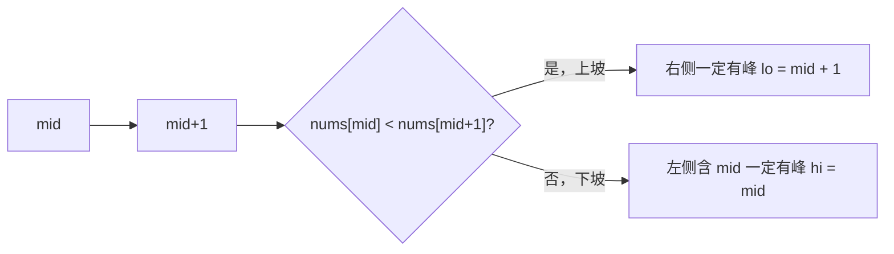

# 峰值用相邻关系判方向：二分搜索训练题解

寻找峰值容易让人困惑：数组不是有序的，为什么还能二分？原因是这题二分的不是有序值，而是“沿着上坡方向一定能到达某个峰值”。

一句话记法：**`nums[mid] < nums[mid+1]`，右边一定有峰；否则左边含 `mid` 一定有峰。**

## 适用场景

适合这种写法的题：

- 要找任意一个峰值，而不是所有峰值。
- 峰值定义为比相邻元素大。
- 可以把数组两端外侧看成负无穷。
- 只需要返回一个合法下标。

如果题目要求找最大值或特定峰值，就不能简单套这个逻辑。

## 图解思路



上坡往右走，最终要么继续上升到右边界形成峰，要么在某处开始下降形成峰。

## 不变量

- `[lo, hi]` 中始终至少存在一个峰值。
- 每次比较 `mid` 和 `mid + 1`，所以循环条件必须保证 `mid + 1` 不越界。
- 用 `while lo < hi`，`hi` 初始化为 `n - 1`。
- 收缩到单点时，这个点就是某个峰值。

## 手写步骤

1. 初始化 `lo = 0, hi = n - 1`。
2. 循环 `lo < hi`。
3. `mid = lo + (hi - lo) / 2`。
4. 如果 `nums[mid] < nums[mid+1]`，说明右侧有峰，`lo = mid + 1`。
5. 否则左侧含 `mid` 有峰，`hi = mid`。
6. 返回 `lo`。

## Go 参考实现

```go
func findPeakElement(nums []int) int {
	lo, hi := 0, len(nums)-1
	for lo < hi {
		mid := lo + (hi-lo)/2
		if nums[mid] < nums[mid+1] {
			lo = mid + 1
		} else {
			hi = mid
		}
	}
	return lo
}
```

## Rust 参考实现

```rust
pub fn find_peak_element(nums: Vec<i32>) -> i32 {
    let (mut lo, mut hi) = (0usize, nums.len() - 1);
    while lo < hi {
        let mid = lo + (hi - lo) / 2;
        if nums[mid] < nums[mid + 1] {
            lo = mid + 1;
        } else {
            hi = mid;
        }
    }
    lo as i32
}
```

## 为什么这样写

如果 `nums[mid] < nums[mid+1]`，从 `mid+1` 开始往右看：

- 如果一直上升，到最右端时，因为右侧外面是负无穷，最右端就是峰。
- 如果中途下降，那么转折点就是峰。

所以右侧一定存在峰，左侧可以整体丢掉。反过来，如果 `nums[mid] >= nums[mid+1]`，左侧含 `mid` 一定存在峰。

## 复杂度

- 时间复杂度：$O(\log n)$。
- 空间复杂度：$O(1)$。

## 易错点

- 循环写成 `lo <= hi`，导致访问 `mid + 1` 越界。
- `hi = mid - 1` 把 `mid` 这个可能峰值删掉。
- 以为数组必须有序才能二分，没有抓住“峰值存在性”的单调方向。
- Rust 中空数组或长度为 0 的情况要按题目约束处理；#162 保证非空。

## 练习顺序

建议按这个顺序刷：#162, #852。

#162 找任意峰值，#852 山脉数组找顶点；两者都依赖相邻关系判断方向。
