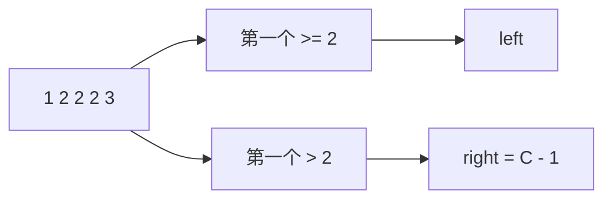

# 查找区间左右边界：二分搜索训练题解

在排序数组中找目标值的第一个和最后一个位置，本质是边界问题。最稳的写法是用两次 lower_bound。

一句话记法：**左边界是 `lower_bound(target)`，右边界是 `lower_bound(target + 1) - 1`。**

## 适用场景

适合这种写法的题：

- 数组有序。
- 目标值可能出现多次。
- 要找第一次出现、最后一次出现，或统计出现次数。
- 找不到时需要返回 `[-1, -1]`。

如果值域很大或 target 不能安全 `+1`，就写一个 `upper_bound` 找第一个 `> target`。

## 图解思路



出现次数也可以直接算：`upper_bound(target) - lower_bound(target)`。

## 不变量

- lower_bound 返回第一个 `>= x` 的位置。
- upper_bound 返回第一个 `> x` 的位置。
- 若 `left == n` 或 `nums[left] != target`，说明目标不存在。
- 目标存在时，右边界是 `upper - 1`。

## 手写步骤

1. 写一个通用 `lowerBound(nums, target)`。
2. `left := lowerBound(nums, target)`。
3. 判断 `left` 是否越界或不等于 target。
4. `right := lowerBound(nums, target + 1) - 1`，或用 upper_bound。
5. 返回 `[left, right]`。

## Go 参考实现

```go
func searchRange(nums []int, target int) []int {
	lowerBound := func(x int) int {
		lo, hi := 0, len(nums)
		for lo < hi {
			mid := lo + (hi-lo)/2
			if nums[mid] >= x {
				hi = mid
			} else {
				lo = mid + 1
			}
		}
		return lo
	}

	left := lowerBound(target)
	if left == len(nums) || nums[left] != target {
		return []int{-1, -1}
	}
	right := lowerBound(target+1) - 1
	return []int{left, right}
}
```

## Rust 参考实现

```rust
pub fn search_range(nums: Vec<i32>, target: i32) -> Vec<i32> {
    fn lower_bound(nums: &[i32], x: i32) -> usize {
        let (mut lo, mut hi) = (0usize, nums.len());
        while lo < hi {
            let mid = lo + (hi - lo) / 2;
            if nums[mid] >= x {
                hi = mid;
            } else {
                lo = mid + 1;
            }
        }
        lo
    }

    let left = lower_bound(&nums, target);
    if left == nums.len() || nums[left] != target {
        return vec![-1, -1];
    }
    let right = lower_bound(&nums, target + 1) - 1;
    vec![left as i32, right as i32]
}
```

## 为什么这样写

很多边界题写错，是因为想在一次二分里同时处理“找到目标”和“继续向左/向右”。拆成两个标准边界后，代码会更容易证明：

- `lower_bound(target)` 左侧都小于 target，所以它就是目标可能出现的第一个位置。
- `lower_bound(target+1)` 左侧都小于 `target+1`，也就是都小于等于 target，所以前一个位置就是最后一个 target。

## 复杂度

- 时间复杂度：两次二分，仍是 $O(\log n)$。
- 空间复杂度：$O(1)$。

## 易错点

- 找不到时没有判断 `left == len(nums)`。
- `target + 1` 溢出；工程代码可以写 upper_bound 避免。
- 右边界忘记减一。
- 用左闭右闭和左闭右开混写，导致空数组或单元素数组出错。

## 练习顺序

建议先刷 #34。

复盘时再用同一个 `lower_bound` 写 #35，确认插入位置和左边界其实是同一个模型。
