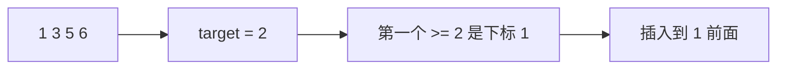

# 二分插入位置：二分搜索训练题解

搜索插入位置是 lower_bound 的最基础应用。目标存在时返回第一个等于它的位置；目标不存在时，返回它应该插入的下标。

一句话记法：**找第一个 `nums[i] >= target`，找不到就返回 `len(nums)`。**

## 适用场景

适合这种写法的题：

- 有序数组中找插入位置。
- 想知道小于目标值的元素有多少个。
- 需要把目标插入后仍保持有序。
- 目标可能不存在。

这类题不要写成“找到返回，否则返回 -1”。插入位置的语义允许答案等于 `n`。

## 图解思路



如果 `target = 7`，没有任何元素 `>= 7`，插入位置就是 `4`。

## 不变量

- `lo` 左侧元素都 `< target`。
- `hi` 及右侧是尚未确认或已经可行的位置。
- `[lo, hi)` 始终包含第一个 `>= target` 的位置。
- 循环结束后，`lo` 是最左插入点。

## 手写步骤

1. `lo = 0, hi = len(nums)`。
2. 循环 `lo < hi`。
3. 如果 `nums[mid] >= target`，说明 `mid` 可以作为插入点，继续向左找。
4. 否则 `mid` 太小，答案在右边。
5. 返回 `lo`。

## Go 参考实现

```go
func searchInsert(nums []int, target int) int {
	lo, hi := 0, len(nums)
	for lo < hi {
		mid := lo + (hi-lo)/2
		if nums[mid] >= target {
			hi = mid
		} else {
			lo = mid + 1
		}
	}
	return lo
}
```

## Rust 参考实现

```rust
pub fn search_insert(nums: Vec<i32>, target: i32) -> i32 {
    let (mut lo, mut hi) = (0usize, nums.len());
    while lo < hi {
        let mid = lo + (hi - lo) / 2;
        if nums[mid] >= target {
            hi = mid;
        } else {
            lo = mid + 1;
        }
    }
    lo as i32
}
```

## 为什么这样写

插入位置不是“随便找一个可插入位置”，而是最左边的可插入位置。对于 `[1,3,3,3,5]` 和 `target = 3`，答案应该是 `1`，因为插入到第一个 `3` 前面仍保持有序。

这也解释了为什么条件是 `>= target`，而不是 `== target`。命中 target 时不能立即返回，还要继续压左边界。

## 复杂度

- 时间复杂度：$O(\log n)$。
- 空间复杂度：$O(1)$。

## 易错点

- 命中 target 就返回，导致重复元素时不是最左插入点。
- `hi` 初始化为 `len(nums)-1`，无法返回末尾插入位置。
- 结束后再额外加判断，反而把 `n` 改错。
- 忘记空数组时答案应为 `0`。

## 练习顺序

建议按这个顺序刷：#35, #704, #34。

#35 练插入点，#704 加等值判断，#34 用两个边界组合出区间。
