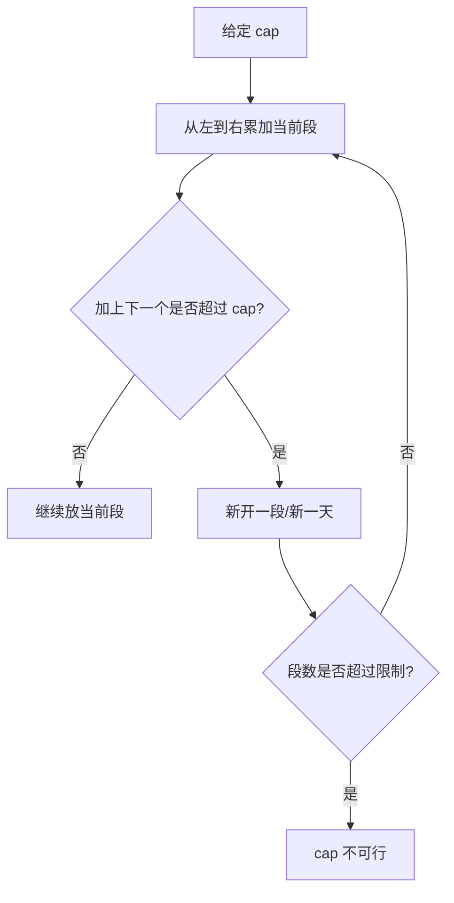

# 容量问题的可行性函数：二分搜索训练题解

容量类答案二分的关键是写 `check(cap)`：给定一个容量，能否在限制条件内完成任务。容量越大，越容易完成，所以可行性是单调的。

一句话记法：**容量够不够，用贪心从左到右装；够就试更小，不够就增大。**

## 适用场景

常见题型：

- 在 `D` 天内运完包裹，求最小船载重。
- 把数组分成 `k` 段，求最小的最大段和。
- 以某个速度处理任务，求最小速度。

共同点是：给定容量或速度后，可以线性模拟验证。

## 图解思路



这个贪心的含义是：在不超过容量的前提下，当前段尽量多装。

## 不变量

- `cap` 是本轮验证的候选答案。
- 当前段和始终不超过 `cap`。
- 一旦加入下一个元素会超，就必须新开一段。
- 贪心得到的段数是该 `cap` 下的最少段数。

## 手写步骤

1. 下界取最大单个元素。
2. 上界取所有元素总和。
3. 写 `check(cap)`：一次扫描统计需要几段。
4. 如果段数 `<= limit`，说明容量可行，收缩上界。
5. 否则容量太小，增大下界。

## Go 参考实现：运货能力

```go
func shipWithinDays(weights []int, days int) int {
	lo, hi := 0, 0
	for _, w := range weights {
		if w > lo {
			lo = w
		}
		hi += w
	}

	check := func(cap int) bool {
		usedDays, load := 1, 0
		for _, w := range weights {
			if load+w > cap {
				usedDays++
				load = 0
			}
			load += w
		}
		return usedDays <= days
	}

	for lo < hi {
		mid := lo + (hi-lo)/2
		if check(mid) {
			hi = mid
		} else {
			lo = mid + 1
		}
	}
	return lo
}
```

## Rust 参考实现：分割数组最大值

```rust
pub fn split_array(nums: Vec<i32>, k: i32) -> i32 {
    let mut lo = *nums.iter().max().unwrap();
    let mut hi: i32 = nums.iter().sum();

    let check = |cap: i32| -> bool {
        let mut parts = 1;
        let mut sum = 0;
        for &x in &nums {
            if sum + x > cap {
                parts += 1;
                sum = 0;
            }
            sum += x;
        }
        parts <= k
    };

    while lo < hi {
        let mid = lo + (hi - lo) / 2;
        if check(mid) {
            hi = mid;
        } else {
            lo = mid + 1;
        }
    }
    lo
}
```

## 为什么这样写

容量类问题的单调性非常明确：如果容量 `cap` 能完成任务，那么任何更大的容量也能完成。于是答案就是第一个可行容量。

`check` 中使用贪心，是因为要在给定容量下尽量少开段。当前段还能放就继续放，只有放不下才开新段；提前开段不会减少总段数，只可能更差。

## 复杂度

- 每次 `check` 是 $O(n)$。
- 二分答案范围是 `sum - max`，整体 $O(n \log R)$。
- 空间复杂度是 $O(1)$。

## 易错点

- 下界写成 `0`，导致 `check` 里单个元素超过容量的情况复杂化。
- 新开段后忘记把当前元素放进去。
- 可行时增大下界，方向写反。
- 分割数组要求连续子数组，不能排序。

## 练习顺序

建议按这个顺序刷：#1011, #410, #875。

先练容量装载，再练连续分割，最后做速度类题体会 `check` 不一定是分段，也可以是统计总耗时。
