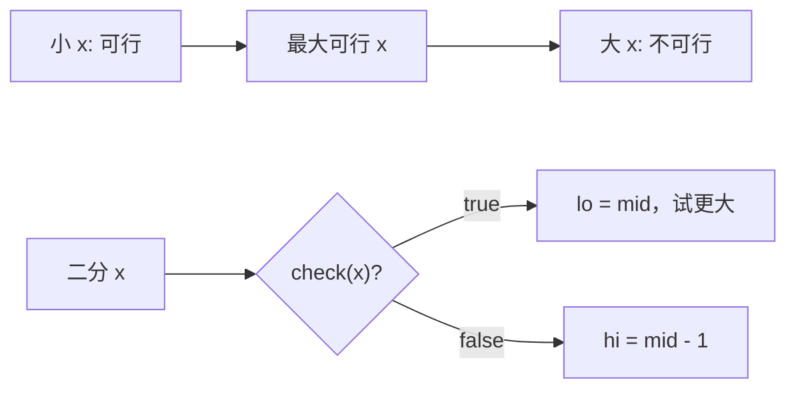

# 最大化最小值的反向二分：二分搜索训练题解

有一类题不是找最小可行值，而是找最大可行值。典型表述是“最大化最小距离”“最大化最小差值”。

一句话记法：**`x` 越大越难满足；可行就往右试，不可行就往左收。**

## 适用场景

常见信号：

- 求“最大化最小值”。
- 给定一个最小要求 `x`，可以判断能否放下或选够。
- `x` 越大，条件越苛刻。
- 排序后可以贪心验证。

磁力球、礼盒价格差等题都属于这个模型。

## 图解思路



为了避免 `lo = mid` 死循环，`mid` 要取偏右中点。

## 不变量

- `check(x)` 从 `true` 变成 `false`。
- 答案是最后一个 `true`。
- `lo` 表示当前已知可行或候选下界。
- 使用 `mid = lo + (hi - lo + 1) / 2`，保证可行时 `lo = mid` 能推进。

## 手写步骤

1. 排序。
2. 确定答案范围：最小通常为 `0` 或 `1`，最大为 `max - min`。
3. 写 `check(dist)`：贪心选择尽量靠左的位置。
4. 如果能选够，说明 `dist` 可行，尝试更大。
5. 否则缩小距离。

## Go 参考实现：磁力球

```go
func maxDistance(position []int, m int) int {
	sort.Ints(position)
	lo, hi := 1, position[len(position)-1]-position[0]

	check := func(dist int) bool {
		count, last := 1, position[0]
		for _, x := range position[1:] {
			if x-last >= dist {
				count++
				last = x
			}
		}
		return count >= m
	}

	for lo < hi {
		mid := lo + (hi-lo+1)/2
		if check(mid) {
			lo = mid
		} else {
			hi = mid - 1
		}
	}
	return lo
}
```

## Rust 参考实现

```rust
pub fn max_distance(mut position: Vec<i32>, m: i32) -> i32 {
    position.sort_unstable();
    let (mut lo, mut hi) = (1, position[position.len() - 1] - position[0]);

    let check = |dist: i32| -> bool {
        let mut count = 1;
        let mut last = position[0];
        for &x in position.iter().skip(1) {
            if x - last >= dist {
                count += 1;
                last = x;
            }
        }
        count >= m
    };

    while lo < hi {
        let mid = lo + (hi - lo + 1) / 2;
        if check(mid) {
            lo = mid;
        } else {
            hi = mid - 1;
        }
    }
    lo
}
```

## 为什么这样写

验证 `dist` 时，贪心策略是从左到右能放就放。因为越早放下当前球，越能给后面的球留空间；延后放不会让选择数量更多。

这里找的是最大可行值，不是最小可行值。若仍然用偏左 `mid` 并在可行时写 `lo = mid`，当区间只剩两个数时可能死循环。例如 `lo=3, hi=4, mid=3`，可行后 `lo` 不变。

## 复杂度

- 排序 $O(n \log n)$。
- 每次验证 $O(n)$，二分范围为坐标差，整体 $O(n \log R)$。
- 空间复杂度取决于排序实现，额外状态是 $O(1)$。

## 易错点

- 可行时收缩右边，写成找最小可行值。
- `mid` 没取偏右，`lo = mid` 死循环。
- 贪心验证时更新 `last` 的位置写错。
- 没排序就按原顺序验证距离。

## 练习顺序

建议按这个顺序刷：#1552, #2517。

先用坐标距离练最大可行二分，再做价格差这类同构题。
