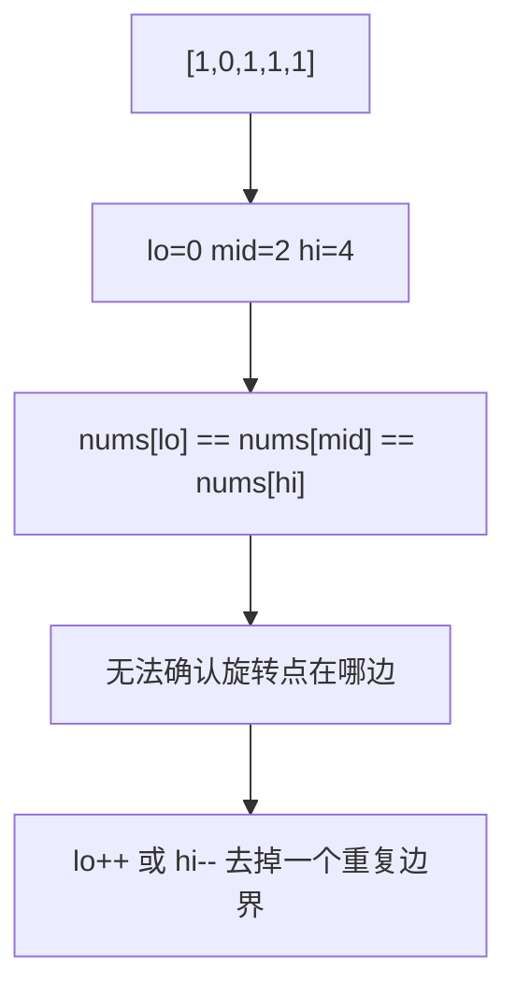

# 带重复元素的退化处理：二分搜索训练题解

重复元素会让二分失去信息。比如 `nums[lo] == nums[mid] == nums[hi]` 时，无法判断左半还是右半有序，只能安全地缩小边界。

一句话记法：**重复值挡住方向时，先丢掉一个无法提供信息的边界。**

## 适用场景

典型题目：

- 旋转排序数组中搜索目标，允许重复元素。
- 旋转排序数组中找最小值，允许重复元素。
- 普通有序数组找边界不属于这个问题，重复不会破坏单调性。

重复元素只影响“判断哪半边有序”的旋转数组类题。

## 图解思路



丢掉边界不会漏答案，因为边界值和中间值相同；如果它就是目标，前面已经可以命中判断。

## 不变量

- 目标或最小值始终在当前区间中。
- 当边界重复导致无法判断方向时，只缩小一个边界。
- 一旦能判断哪边有序，就回到无重复旋转数组逻辑。
- 最坏情况下，每次只缩小一个元素，所以可能是 $O(n)$。

## 手写步骤

搜索目标：

1. 先判断 `nums[mid] == target`。
2. 如果 `nums[lo] == nums[mid] && nums[mid] == nums[hi]`，执行 `lo++`、`hi--`。
3. 否则判断哪边有序。
4. 根据 target 是否落在有序半边收缩区间。

找最小值：

1. 比较 `nums[mid]` 和 `nums[hi]`。
2. 如果 `nums[mid] < nums[hi]`，最小值在左侧含 `mid`。
3. 如果 `nums[mid] > nums[hi]`，最小值在右侧。
4. 如果相等，只能 `hi--`。

## Go 参考实现：搜索目标

```go
func search(nums []int, target int) bool {
	lo, hi := 0, len(nums)-1
	for lo <= hi {
		mid := lo + (hi-lo)/2
		if nums[mid] == target {
			return true
		}
		if nums[lo] == nums[mid] && nums[mid] == nums[hi] {
			lo++
			hi--
			continue
		}

		if nums[lo] <= nums[mid] {
			if nums[lo] <= target && target < nums[mid] {
				hi = mid - 1
			} else {
				lo = mid + 1
			}
		} else {
			if nums[mid] < target && target <= nums[hi] {
				lo = mid + 1
			} else {
				hi = mid - 1
			}
		}
	}
	return false
}
```

## Rust 参考实现：找最小值

```rust
pub fn find_min(nums: Vec<i32>) -> i32 {
    let (mut lo, mut hi) = (0usize, nums.len() - 1);
    while lo < hi {
        let mid = lo + (hi - lo) / 2;
        if nums[mid] < nums[hi] {
            hi = mid;
        } else if nums[mid] > nums[hi] {
            lo = mid + 1;
        } else {
            hi -= 1;
        }
    }
    nums[lo]
}
```

## 为什么这样写

无重复旋转数组能靠 `nums[lo] <= nums[mid]` 判断左半有序。但有重复时，`nums[lo] == nums[mid]` 不一定说明左半有序，也可能旋转点藏在重复值中间。

这时 `lo++` 或 `hi--` 是安全但保守的选择。安全是因为它不排除唯一可能答案；保守是因为只删一个元素，所以复杂度可能退化。

## 复杂度

- 平均情况接近 $O(\log n)$。
- 最坏情况是 $O(n)$，例如大量重复值。
- 空间复杂度是 $O(1)$。

## 易错点

- 以为带重复旋转数组仍然一定是 $O(\log n)$。
- 没有先判断 `nums[mid] == target` 就丢边界。
- `hi--` 时没有保证 `lo < hi`。
- 把普通边界查找的重复处理套到旋转数组上，混淆问题。

## 练习顺序

建议按这个顺序刷：#81, #154。

先做搜索目标，理解为什么三者相等时信息不足；再做找最小值，掌握 `nums[mid]` 和 `nums[hi]` 的三分判断。
