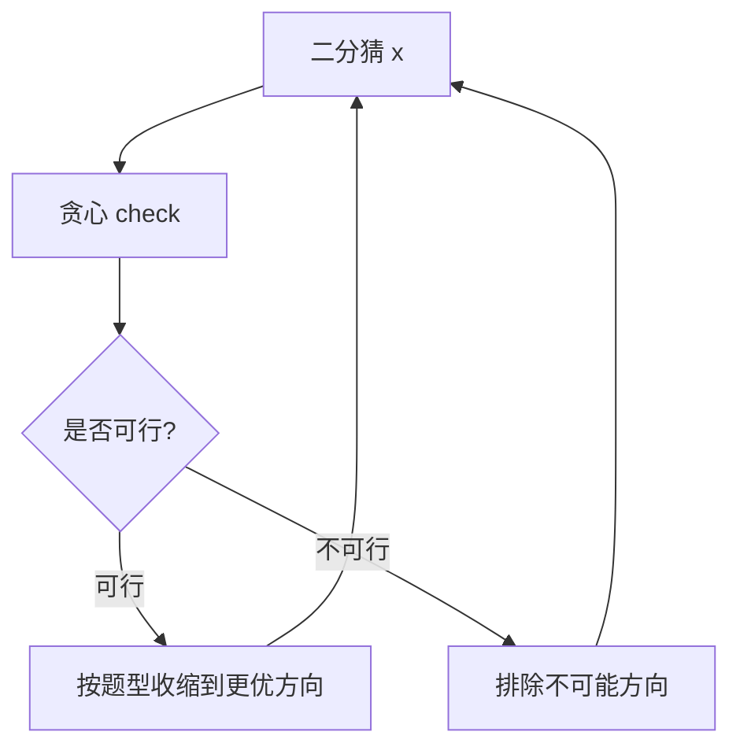

# 二分套贪心验证：二分搜索训练题解

很多答案二分题的 `check` 不是简单公式，而是一段贪心过程。二分只决定试哪个答案，贪心负责判断这个答案能不能满足题目。

一句话记法：**二分问“这个 x 行不行”，贪心用最局部的最优策略回答。**

## 适用场景

适合“二分 + 贪心”的题：

- 分割数组、运货能力：给定最大段和或容量，贪心尽量多放。
- 爱吃香蕉：给定速度，贪心或公式统计耗时。
- 制作花束：给定天数，贪心统计连续花束数。
- 磁力球：给定最小距离，贪心尽量靠左放。

共同点：给定答案后，验证过程是单调且局部选择可证明正确。

## 图解思路



二分和贪心的职责要分开，不要在 `check` 里偷偷修改二分边界。

## 不变量

- `check(x)` 必须只返回 true/false。
- 贪心验证得到的是在当前 `x` 下的最优或足够判定结果。
- `x` 变化时，`check(x)` 的真假方向必须单调。
- 二分边界更新只依赖 `check(mid)`。

## 手写步骤

1. 写出答案变量 `x` 的含义。
2. 证明 `x` 增大或减小时，可行性单调。
3. 写贪心 `check(x)`。
4. 用几个小样例手算 `check`。
5. 再写二分边界和循环。

## Go 参考实现：制作花束

```go
func minDays(bloomDay []int, m int, k int) int {
	if m*k > len(bloomDay) {
		return -1
	}
	lo, hi := bloomDay[0], bloomDay[0]
	for _, d := range bloomDay {
		if d < lo {
			lo = d
		}
		if d > hi {
			hi = d
		}
	}

	check := func(day int) bool {
		flowers, bouquets := 0, 0
		for _, d := range bloomDay {
			if d <= day {
				flowers++
				if flowers == k {
					bouquets++
					flowers = 0
				}
			} else {
				flowers = 0
			}
		}
		return bouquets >= m
	}

	for lo < hi {
		mid := lo + (hi-lo)/2
		if check(mid) {
			hi = mid
		} else {
			lo = mid + 1
		}
	}
	return lo
}
```

## Rust 参考实现：磁力球

```rust
pub fn max_distance(mut position: Vec<i32>, m: i32) -> i32 {
    position.sort_unstable();
    let (mut lo, mut hi) = (1, position[position.len() - 1] - position[0]);

    let check = |dist: i32| -> bool {
        let mut count = 1;
        let mut last = position[0];
        for &x in position.iter().skip(1) {
            if x - last >= dist {
                count += 1;
                last = x;
            }
        }
        count >= m
    };

    while lo < hi {
        let mid = lo + (hi - lo + 1) / 2;
        if check(mid) {
            lo = mid;
        } else {
            hi = mid - 1;
        }
    }
    lo
}
```

## 为什么这样写

二分套贪心最容易错在证明缺失。以花束为例，天数越多，开放的花只会更多，不会更少，所以 `check(day)` 单调。验证时从左到右统计连续开放花朵，凑够 `k` 就组成一束，这是因为花束必须相邻，当前能成束就没必要留给后面。

以磁力球为例，最小距离越大越难放。验证时每次尽量放在最靠左的可行位置，可以给后续球留下最大空间。

## 复杂度

- 通常是 $O(n \log R)$。
- 如果 `check` 内需要排序，应把排序放在二分外，避免变成 $O(n \log n \log R)$。
- 空间复杂度通常是 $O(1)$ 或取决于排序。

## 易错点

- `check` 不是单调函数，却强行二分。
- 贪心验证没有证明，局部策略可能漏可行方案。
- 最大可行值和最小可行值使用同一个边界更新。
- 在 `check` 内修改全局状态，导致多次验证互相污染。

## 练习顺序

建议按这个顺序刷：#875, #1011, #1482, #410, #1552。

从公式型验证过渡到贪心型验证，再练最大可行值。
