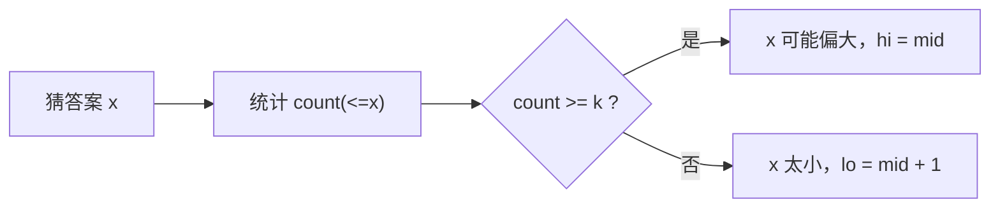

# 二分套计数函数：二分搜索训练题解

第 k 小问题不一定要真的维护 k 个元素。只要能快速计算“有多少元素 `<= x`”，就可以在答案值上二分。

一句话记法：**`count(x) >= k`，说明第 k 小不大于 x；否则 x 太小。**

## 适用场景

适合这种写法的题：

- 求有序矩阵第 k 小。
- 求乘法表第 k 小。
- 求数对距离第 k 小。
- 答案值范围可二分，且能快速统计 `<= x` 的数量。

如果计数函数本身很慢，整体可能不如堆或其他方法。

## 图解思路



这是找第一个让 `count(x) >= k` 的值。

## 不变量

- `count(x)` 随 `x` 增大不下降。
- 第 k 小答案是第一个使 `count(x) >= k` 的值。
- 二分的是值域，不是下标。
- 计数时要包含等于 `x` 的元素。

## 手写步骤

1. 确定答案值域 `[lo, hi]`。
2. 写 `count_le(x)`，统计 `<= x` 的数量。
3. 如果数量至少为 `k`，收缩右边界。
4. 否则增大左边界。
5. 返回 `lo`。

## Go 参考实现：有序矩阵第 k 小

```go
func kthSmallest(matrix [][]int, k int) int {
	n := len(matrix)
	lo, hi := matrix[0][0], matrix[n-1][n-1]

	countLE := func(x int) int {
		count := 0
		row, col := n-1, 0
		for row >= 0 && col < n {
			if matrix[row][col] <= x {
				count += row + 1
				col++
			} else {
				row--
			}
		}
		return count
	}

	for lo < hi {
		mid := lo + (hi-lo)/2
		if countLE(mid) >= k {
			hi = mid
		} else {
			lo = mid + 1
		}
	}
	return lo
}
```

## Rust 参考实现：乘法表第 k 小

```rust
pub fn find_kth_number(m: i32, n: i32, k: i32) -> i32 {
    let (mut lo, mut hi) = (1, m * n);

    let count_le = |x: i32| -> i32 {
        let mut count = 0;
        for row in 1..=m {
            count += n.min(x / row);
        }
        count
    };

    while lo < hi {
        let mid = lo + (hi - lo) / 2;
        if count_le(mid) >= k {
            hi = mid;
        } else {
            lo = mid + 1;
        }
    }
    lo
}
```

## 为什么这样写

第 k 小的定义可以转换为计数：如果 `<= x` 的元素已经有至少 `k` 个，那么第 k 小一定不大于 `x`；如果不足 `k` 个，说明 `x` 太小。

有序矩阵的计数可以从左下角开始。当前位置 `matrix[row][col] <= x` 时，该列从 `0..row` 都 `<= x`，一次加 `row + 1`，然后向右；否则当前值太大，向上。

## 复杂度

- 有序矩阵计数每次 $O(n)$，整体 $O(n \log R)$。
- 乘法表计数每次 $O(m)$，整体 $O(m \log(mn))$。
- 空间复杂度是 $O(1)$。

## 易错点

- 统计 `< x` 而不是 `<= x`，边界会偏移。
- 把二分下标和二分值域混淆。
- 有序矩阵计数方向走错，导致重复或漏计。
- 值域上界设得太小，真实答案不在区间内。

## 练习顺序

建议按这个顺序刷：#378, #668, #719。

先练矩阵计数，再练乘法表；#719 需要排序后用滑动窗口计数距离，计数函数更有训练价值。
