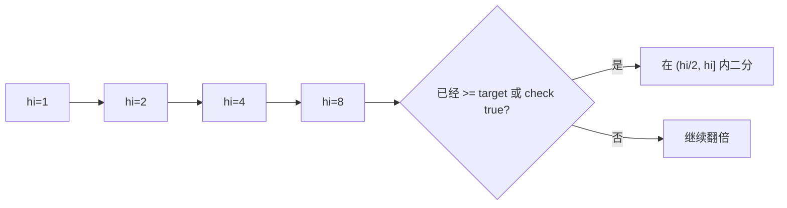

# 指数扩张再二分：二分搜索训练题解

普通二分需要已知左右边界。但有些场景不知道数组长度或答案上界，例如“未知大小的有序数组”。这时可以先用指数扩张找上界。

一句话记法：**先倍增找到一个一定越过答案的右边界，再做普通二分。**

## 适用场景

适合这种写法的题：

- 数据源支持按下标读取，但不知道长度。
- 答案上界未知，但可以判断当前上界是否已经足够大。
- 查找目标值、找第一个满足条件的位置。
- 访问越界时 API 会返回特殊大值或错误信号。

如果已知上界，就不需要指数扩张。

## 图解思路



扩张阶段只负责找到覆盖答案的区间，不负责精确定位。

## 不变量

- 扩张结束后，答案一定不在 `hi` 右侧。
- 上一次的 `hi/2` 之前已经确认不够大。
- 精确查找仍然交给普通二分。
- 翻倍时要注意整数溢出。

## 手写步骤

1. 从 `hi = 1` 开始。
2. 当 `hi` 仍然不够大时，`hi *= 2`。
3. 扩张结束后，令 `lo = hi / 2`。
4. 在 `[lo, hi]` 或 `[lo, hi)` 内二分。
5. 返回找到的位置或第一个满足的位置。

## Go 参考实现：未知长度数组搜索

```go
type ArrayReader interface {
	Get(index int) int
}

func search(reader ArrayReader, target int) int {
	hi := 1
	for reader.Get(hi) < target {
		hi *= 2
	}

	lo := hi / 2
	for lo <= hi {
		mid := lo + (hi-lo)/2
		x := reader.Get(mid)
		if x == target {
			return mid
		}
		if x < target {
			lo = mid + 1
		} else {
			hi = mid - 1
		}
	}
	return -1
}
```

## Rust 参考骨架

```rust
pub trait ArrayReader {
    fn get(&self, index: i32) -> i32;
}

pub fn search(reader: &impl ArrayReader, target: i32) -> i32 {
    let mut hi = 1;
    while reader.get(hi) < target {
        hi *= 2;
    }

    let (mut lo, mut right) = (hi / 2, hi);
    while lo <= right {
        let mid = lo + (right - lo) / 2;
        let x = reader.get(mid);
        if x == target {
            return mid;
        }
        if x < target {
            lo = mid + 1;
        } else {
            right = mid - 1;
        }
    }
    -1
}
```

## 为什么这样写

二分真正需要的是一个包含答案的区间，不一定一开始就知道。指数扩张用很少次数就能找到足够大的上界：如果答案位置是 `p`，扩张次数是 $O(\log p)$。

扩张后再二分，区间长度也在 `p` 的同一数量级，所以总复杂度仍然是对数级。

## 复杂度

- 扩张阶段 $O(\log p)$，`p` 是答案位置或插入位置。
- 二分阶段 $O(\log p)$。
- 空间复杂度是 $O(1)$。

## 易错点

- 扩张阶段从 `0` 开始翻倍，永远还是 `0`。
- 扩张后把 `lo` 设成 `0`，虽然正确但多查一段已经证明无用的区间。
- API 越界返回大值时，没有把它当成“已经足够大”。
- `hi *= 2` 可能溢出，工程环境要设置上限。

## 练习顺序

建议先刷 #702。

做完后可以把这个技巧迁移到“答案上界未知”的题：先扩张到 `check(hi) == true`，再找第一个 true。
