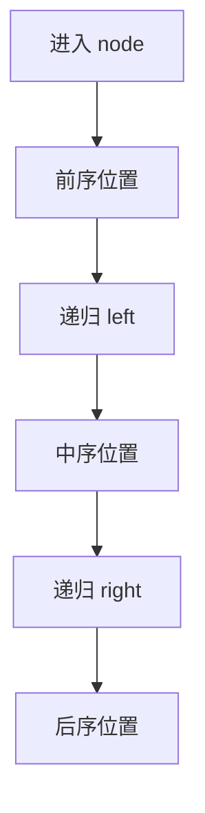

# 递归遍历三段式：二叉树训练题解

二叉树递归最核心的能力，是看懂“当前节点什么时候处理”。同一个递归框架，业务代码放在不同位置，就变成前序、中序或后序。

一句话记法：**进节点是前序，左回来是中序，右回来是后序。**

## 适用场景

- 遍历每个节点并收集值。
- 修改每个节点，比如翻转二叉树。
- 需要从子树拿结果再汇总，比如最大深度。
- 想判断一道题是自顶向下还是自底向上。

如果当前节点的答案依赖左右子树结果，通常要把逻辑放在后序位置。

## 图解思路



前序适合“把状态传下去”，后序适合“把答案汇上来”，中序常用于 BST 的有序性质。

## 不变量

- 每个非空节点都会进入一次。
- 空节点是递归边界。
- 前序位置看不到子树返回值。
- 后序位置已经拿到左右子树结果。

## Go 参考骨架

```go
func traverse(root *TreeNode) {
	if root == nil {
		return
	}
	// 前序位置
	traverse(root.Left)
	// 中序位置
	traverse(root.Right)
	// 后序位置
}
```

## 例：翻转二叉树

翻转只需要交换当前节点左右孩子，放前序或后序都可以：

```go
func invertTree(root *TreeNode) *TreeNode {
	if root == nil {
		return nil
	}
	root.Left, root.Right = root.Right, root.Left
	invertTree(root.Left)
	invertTree(root.Right)
	return root
}
```

## 例：最大深度

最大深度必须等左右子树深度回来后才能算，所以放后序：

```go
func maxDepth(root *TreeNode) int {
	if root == nil {
		return 0
	}
	left := maxDepth(root.Left)
	right := maxDepth(root.Right)
	if left > right {
		return left + 1
	}
	return right + 1
}
```

## 为什么这样写

二叉树题常见两种思路：

- 遍历思路：我走到每个节点时做点事。
- 分解思路：我要先拿到左右子树的答案，再合并成当前节点答案。

前者通常用前序，后者通常用后序。先判断思路，再决定代码位置，错误会少很多。

## 复杂度

- 时间复杂度：$O(n)$。
- 空间复杂度：递归栈 $O(h)$，最坏 $O(n)$。

## 易错点

- 当前节点依赖子树结果，却把逻辑写在前序。
- 空节点返回值没定义清楚。
- 把遍历顺序当成唯一重点，忽略返回值含义。
- 修改左右孩子后，又按旧指针递归。

## 练习顺序

建议按这个顺序刷：#144, #94, #145, #226, #104。
