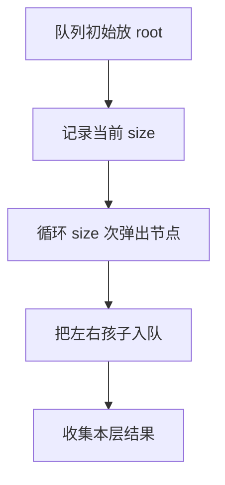

# 层序遍历按层收集：二叉树训练题解

层序遍历是二叉树 BFS。队列里保存“已经发现但还没处理”的节点；如果题目要求按层输出，必须先记录当前层大小。

一句话记法：**本轮只处理入轮前的 `size` 个节点，新入队的是下一层。**

## 适用场景

- 按层输出节点。
- 求右视图、层最大值、层平均值。
- 需要最短层数或从上到下扩散。

只要题目里有“每一层”，优先想到队列 BFS。

## 图解思路



不要用动态变化的 `len(queue)` 当本层循环终点。

## Go 参考实现

```go
func levelOrder(root *TreeNode) [][]int {
	if root == nil {
		return nil
	}
	q := []*TreeNode{root}
	ans := [][]int{}
	for len(q) > 0 {
		size := len(q)
		level := make([]int, 0, size)
		for i := 0; i < size; i++ {
			node := q[0]
			q = q[1:]
			level = append(level, node.Val)
			if node.Left != nil {
				q = append(q, node.Left)
			}
			if node.Right != nil {
				q = append(q, node.Right)
			}
		}
		ans = append(ans, level)
	}
	return ans
}
```

## 右视图怎么改

右视图只要每层最后一个节点：

```go
if i == size-1 {
	ans = append(ans, node.Val)
}
```

层最大值、层平均值也是同样结构，只是本层统计方式不同。

## 为什么这样写

BFS 队列保证先入先出，所以父节点先于孩子处理。按层输出时，当前队列长度正好是本层节点数；处理过程中入队的孩子不能混进当前层。

## 复杂度

- 时间复杂度：$O(n)$。
- 空间复杂度：$O(w)$，`w` 是最大层宽。

## 易错点

- `for i := 0; i < len(q); i++` 导致下一层混入当前层。
- 空树没有单独处理。
- 右视图取了每层第一个而不是最后一个。
- 用切片出队在超大数据下可能保留底层数组，工程里可用头指针优化。

## 练习顺序

建议按这个顺序刷：#102, #199, #515, #637, #103。
