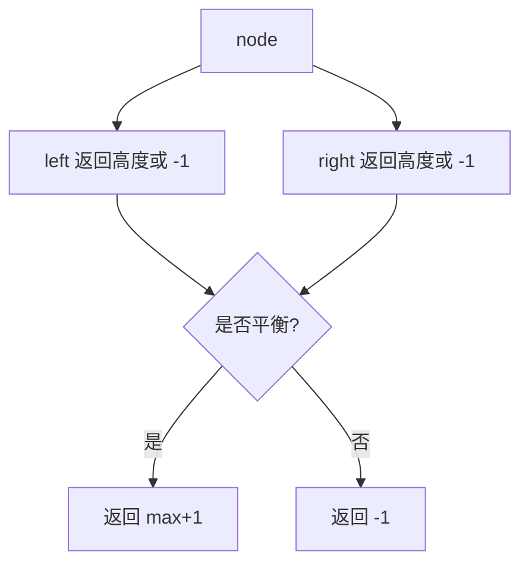

# 后序返回高度与平衡：二叉树训练题解

判断平衡二叉树时，当前节点必须先知道左右子树高度和它们是否平衡，所以这是典型后序递归。

一句话记法：**子树返回高度；不平衡就返回 -1 作为失败标记。**

## 适用场景

- 判断平衡二叉树。
- 需要左右子树高度。
- 子树失败后希望提前向上传播。

后序递归适合所有“当前答案依赖左右子树答案”的题。

## 图解思路



`-1` 表示这棵子树已经不平衡，父节点不用继续算高度。

## Go 参考实现

```go
func isBalanced(root *TreeNode) bool {
	var height func(*TreeNode) int
	height = func(node *TreeNode) int {
		if node == nil {
			return 0
		}
		left := height(node.Left)
		if left == -1 {
			return -1
		}
		right := height(node.Right)
		if right == -1 {
			return -1
		}
		if left-right > 1 || right-left > 1 {
			return -1
		}
		if left > right {
			return left + 1
		}
		return right + 1
	}
	return height(root) != -1
}
```

## 为什么这样写

朴素做法是在每个节点重新计算左右高度，这会重复扫描子树，最坏 $O(n^2)$。后序递归把“求高度”和“判断平衡”合在一次遍历里。

返回值的含义要明确：非负数是高度，`-1` 是不平衡。父节点只要看到 `-1`，也直接返回 `-1`。

## 复杂度

- 时间复杂度：$O(n)$。
- 空间复杂度：递归栈 $O(h)$。

## 易错点

- 每个节点重复调用求高度函数，复杂度退化。
- 空节点高度定义混乱。
- 子树已经不平衡还继续计算。
- 把高度差判断写成只看 `left-right > 1`，漏掉右高的情况。

## 练习顺序

建议按这个顺序刷：#104, #110, #543。
