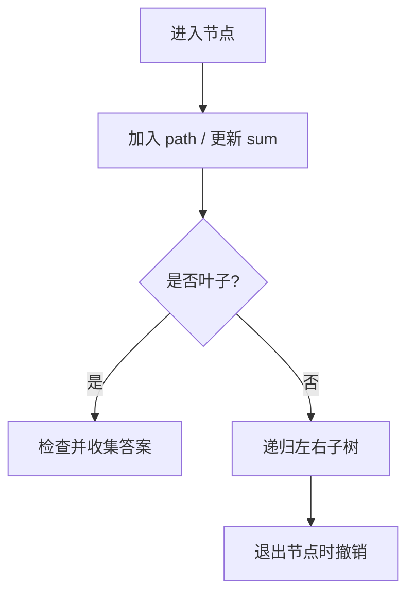

# 前序构造路径状态：二叉树训练题解

从根到叶的路径题，本质是在递归过程中维护一条当前路径。进入节点时把节点加入路径，离开节点时撤销。

一句话记法：**进节点做选择，出节点撤销选择。**

## 适用场景

- 根到叶路径和。
- 输出所有根到叶路径。
- 路径上需要维护数组、字符串、累加和。

如果只问是否存在路径，通常不需要保存完整路径，只保存剩余目标值即可。

## 图解思路



撤销是为了不污染兄弟分支。

## Go 参考实现：路径总和 II

```go
func pathSum(root *TreeNode, targetSum int) [][]int {
	ans := [][]int{}
	path := []int{}
	var dfs func(*TreeNode, int)
	dfs = func(node *TreeNode, remain int) {
		if node == nil {
			return
		}
		path = append(path, node.Val)
		remain -= node.Val
		if node.Left == nil && node.Right == nil && remain == 0 {
			ans = append(ans, append([]int(nil), path...))
		}
		dfs(node.Left, remain)
		dfs(node.Right, remain)
		path = path[:len(path)-1]
	}
	dfs(root, targetSum)
	return ans
}
```

## 为什么这样写

路径是从根到当前节点的一条链，不是整棵树的全局状态。递归进入左子树时加入的节点，回到当前节点后必须删掉，右子树才能看到正确路径。

叶子判断也很重要：路径和题要求根到叶，不是到任意节点。只有 `Left == nil && Right == nil` 时才检查答案。

## 复杂度

- 时间复杂度：$O(n)$，收集路径时还要加复制成本。
- 空间复杂度：递归栈和路径都是 $O(h)$，输出另计。

## 易错点

- 忘记撤销 `path`。
- 非叶子节点 sum 命中也直接返回 true。
- 保存答案时没有复制路径。
- 递归左右子树前后对 `remain` 的修改不一致。

## 练习顺序

建议按这个顺序刷：#112, #113, #257。
