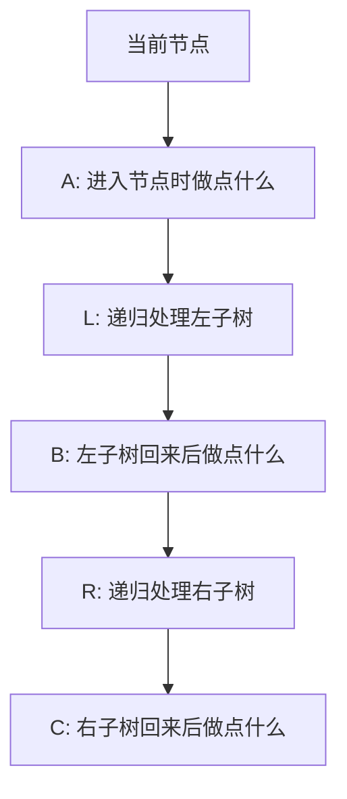
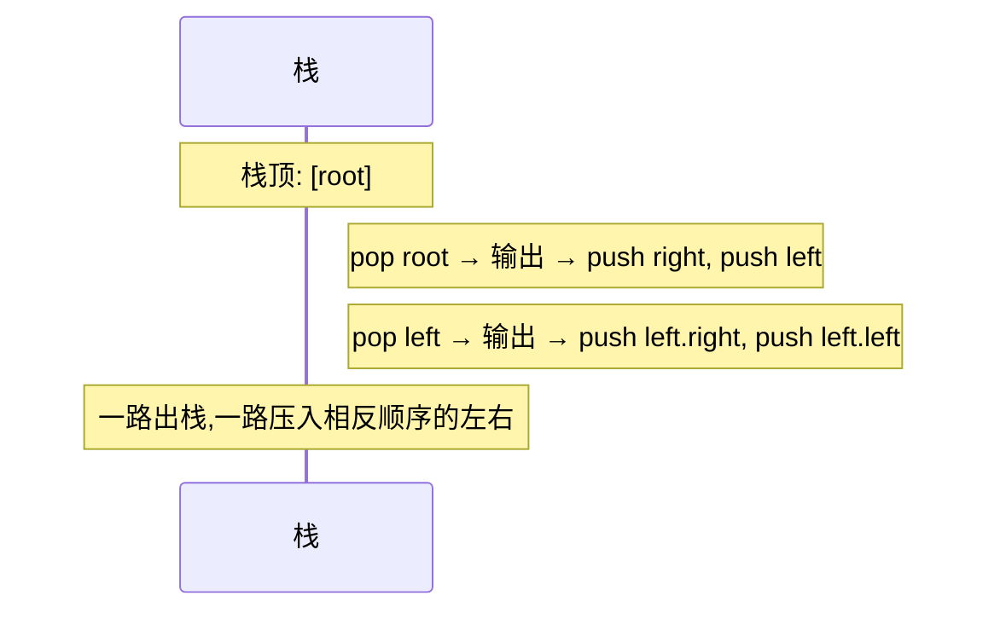
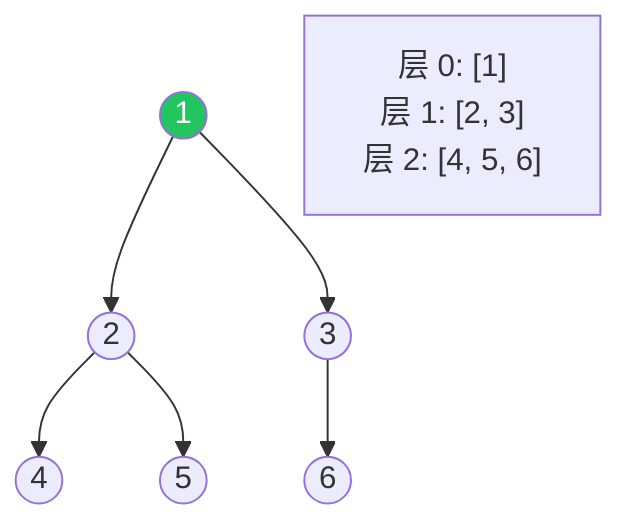

# 二叉树遍历：递归框架与迭代模拟

## 思维模型：每个节点该做三件事

不管哪种遍历，落到一个节点上时永远只有三件事可做：



把"输出当前值"放在 A 的位置 → **先序遍历**
放在 B 的位置 → **中序遍历**
放在 C 的位置 → **后序遍历**

> 关键：不是三种不同算法，是**同一个递归框架**在不同位置放业务逻辑。

## 节点定义

```rust
pub struct TreeNode {
    pub val: i32,
    pub left: Option<Box<TreeNode>>,
    pub right: Option<Box<TreeNode>>,
}
```

```go
type TreeNode struct {
    Val   int
    Left  *TreeNode
    Right *TreeNode
}
```

## 递归通解

```go
func traverse(root *TreeNode) {
    if root == nil { return }
    // A: 先序位置
    traverse(root.Left)
    // B: 中序位置（左子树刚返回）
    traverse(root.Right)
    // C: 后序位置（右子树刚返回）
}
```

很多看起来很难的题，本质就是问"在 A/B/C 哪个位置写代码"。

| 问题 | 答案出现的位置 |
| --- | --- |
| 节点个数 | A 或 C 都行（自顶向下 / 自底向上） |
| 树的最大深度 | C（左右子树深度回来后取 max+1） |
| 中序遍历升序输出（BST） | B |
| 翻转二叉树 | A 或 C（交换左右） |
| 验证 BST | B（中序遇到非递增就失败） |
| 路径和 | A 进入累加，C 退出时减回去 |

## 迭代写法：栈模拟先序

把递归改写成迭代，思路是用栈**显式**保存"还没处理的右子树"：



```rust
pub fn preorder(root: Option<Box<TreeNode>>) -> Vec<i32> {
    let mut out = Vec::new();
    let mut stack: Vec<Option<Box<TreeNode>>> = Vec::new();
    if root.is_some() { stack.push(root); }
    while let Some(Some(mut node)) = stack.pop() {
        out.push(node.val);
        let right = node.right.take();
        let left = node.left.take();
        if right.is_some() { stack.push(right); }
        if left.is_some()  { stack.push(left);  }   // 左后压栈,先弹出
    }
    out
}
```

```go
func preorderIter(root *TreeNode) []int {
    var out []int
    stack := []*TreeNode{}
    if root != nil { stack = append(stack, root) }
    for len(stack) > 0 {
        n := len(stack) - 1
        cur := stack[n]
        stack = stack[:n]
        out = append(out, cur.Val)
        if cur.Right != nil { stack = append(stack, cur.Right) }
        if cur.Left  != nil { stack = append(stack, cur.Left)  }
    }
    return out
}
```

## 迭代写法：中序

中序的迭代版本必须"先一路向左压栈"，因为根节点要等左子树完全处理完才能输出。

```go
func inorder(root *TreeNode) []int {
    var out []int
    stack := []*TreeNode{}
    cur := root
    for cur != nil || len(stack) > 0 {
        for cur != nil {                  // 一路向左压栈
            stack = append(stack, cur)
            cur = cur.Left
        }
        n := len(stack) - 1
        cur = stack[n]; stack = stack[:n]
        out = append(out, cur.Val)        // 弹出即"中序位置"
        cur = cur.Right                   // 转向右子树
    }
    return out
}
```

## 层序遍历（BFS）



```python
from collections import deque

def level_order(root):
    if not root: return []
    q, out = deque([root]), []
    while q:
        layer = []
        for _ in range(len(q)):          # 关键：先记本层大小,再循环
            node = q.popleft()
            layer.append(node.val)
            if node.left:  q.append(node.left)
            if node.right: q.append(node.right)
        out.append(layer)
    return out
```

注意 `for _ in range(len(q))` 这一行：先把**当前层**的节点数量定下来，再循环，否则会把下一层的节点也算进去。

## 两类题型的判别

二叉树题大致分两类：

**遍历类**（在每个节点上做点事就行）→ 套递归三位置框架

**分解类**（要"利用左右子树的答案"）→ 写一个返回类型有意义的递归函数

举例 —— "最大深度"用分解思路：

```go
func maxDepth(root *TreeNode) int {
    if root == nil { return 0 }
    return 1 + max(maxDepth(root.Left), maxDepth(root.Right))
}
```

举例 —— "对称二叉树"也是分解：

```go
func isSymmetric(root *TreeNode) bool {
    var check func(a, b *TreeNode) bool
    check = func(a, b *TreeNode) bool {
        if a == nil && b == nil { return true }
        if a == nil || b == nil { return false }
        if a.Val != b.Val       { return false }
        return check(a.Left, b.Right) && check(a.Right, b.Left)
    }
    return check(root, root)
}
```

## 调试技巧

- **打印当前位置 + 当前节点值**，跟着递归调用栈走一遍。
- **画递归树**，左右子树调用清楚地展示出来后，bug 一目了然。
- **小心 nil 检查**：进入函数立刻判空。
- **栈空判断**别忘**初始压根**。

## 相关题目

- #144 二叉树的前序遍历
- #94 二叉树的中序遍历
- #145 二叉树的后序遍历
- #102 二叉树的层序遍历
- #104 二叉树的最大深度
- #226 翻转二叉树
- #101 对称二叉树
