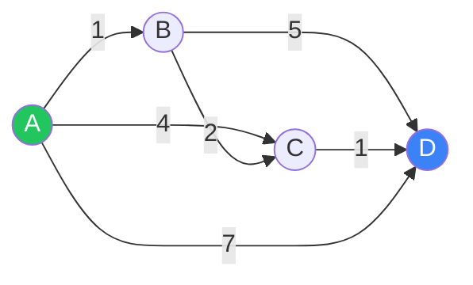

# Dijkstra 最短路：非负权图的标配

## 为什么需要它？

BFS 求最短路只对**所有边权相同**的图成立。一旦边权不等（且非负），BFS 出来的就不是最短路了。这时候用 Dijkstra。



从 A 到 D 的最短路：A→B→C→D，权重 1+2+1=4。BFS 会以为是 A→D 的 3 步路径（只看边数），错失最优。

## 核心思想

> 把已"确定最短距离"的点放进集合 S，从 S 之外的点里挑**当前估计距离最小**的那个加入 S，并松弛它的邻居。重复 V 次。

正确性来自一个不变量：

> 一旦某个节点 `u` 被弹出（加入 S），`dist[u]` 就是 A→u 的真正最短距离，不会再被更新。

这个不变量靠"**非负权**"撑着。一旦有负权边，弹出之后还可能被更新，正确性就崩了。

## 优先队列版（最实用）

只需要一个小根堆维护 `(dist[v], v)`，每次弹堆顶就是当前未处理点里最小的。

```rust
use std::collections::BinaryHeap;
use std::cmp::Reverse;

/// 返回从 src 到所有点的最短距离, 不可达填 i64::MAX
fn dijkstra(n: usize, graph: &[Vec<(usize, i64)>], src: usize) -> Vec<i64> {
    let mut dist = vec![i64::MAX; n];
    dist[src] = 0;
    let mut h: BinaryHeap<Reverse<(i64, usize)>> = BinaryHeap::new();
    h.push(Reverse((0, src)));
    while let Some(Reverse((d, u))) = h.pop() {
        if d > dist[u] { continue; }                 // 过期项, 跳过
        for &(v, w) in &graph[u] {
            let nd = d + w;
            if nd < dist[v] {
                dist[v] = nd;
                h.push(Reverse((nd, v)));
            }
        }
    }
    dist
}
```

**复杂度**：`O((V + E) log V)`，邻接表 + 二叉堆。

两个常见小细节：

1. `if d > dist[u] { continue; }` —— 我们不真的"删除堆里的过期项"，而是**懒删除**：弹出来才检查它是不是过期。
2. 堆里的元素可能比 V 多很多（每次松弛都 push），但每次松弛后 `dist[v]` 严格变小，所以总 push 数 O(E)。

## 例：网络延迟时间

> 抽象问题：N 个节点，`times[i] = (u, v, w)` 表示 u 到 v 单向耗时 w，从 K 出发把信号传到所有节点的最短时间；不可达则返回 -1。

直接套模板，最后取 `max(dist)`：

```rust
fn network_delay_time(times: Vec<Vec<i32>>, n: i32, k: i32) -> i32 {
    let n = n as usize;
    let mut graph: Vec<Vec<(usize, i64)>> = vec![vec![]; n + 1];
    for t in times {
        graph[t[0] as usize].push((t[1] as usize, t[2] as i64));
    }
    let dist = dijkstra(n + 1, &graph, k as usize);
    let mut ans = 0i64;
    for i in 1..=n {
        if dist[i] == i64::MAX { return -1; }
        ans = ans.max(dist[i]);
    }
    ans as i32
}
```

## 例：限制 K 站中转的最便宜机票

> 抽象问题：找从起点到终点**最多经过 K 次中转**的最便宜路线。

这是 Dijkstra 的"状态扩展"版本：状态从 `(节点)` 变成 `(节点, 已用步数)`。

也可以用**改良 Bellman-Ford**（恰好 K+1 轮松弛）。在边数不大时 Bellman-Ford 更简洁。

教训：**当 Dijkstra 的"状态"不止是节点编号，要把附加维度也丢进堆和 dist 表里**。

## 何时**不能**用 Dijkstra

| 场景 | 原因 | 改用 |
| --- | --- | --- |
| 有负权边 | 弹出后还可能被更新 | Bellman-Ford / SPFA |
| 有负权环 | 最短路根本不存在 | 必须先判环 |
| 求所有点对最短路 | 复杂度更优解 | Floyd-Warshall（V³） |
| 边权全为 1 | 杀鸡用牛刀 | **BFS** |
| 边权只有 0 / 1 | 优先队列开销大 | **0-1 BFS（双端队列）** |
| K 短路 / TopK 路径 | Dijkstra 只保证最短 | A\*、Yen's algorithm |

## 0-1 BFS（双端队列变种）

当边权只有 0 / 1 时，可以把 Dijkstra 的小根堆换成双端队列：

- 边权 0 → `push_front`
- 边权 1 → `push_back`

时间退化成 O(V + E)，常数也小。代表题：**01 矩阵**、**到达终点的最少代价**。

## Dijkstra vs Bellman-Ford vs Floyd

| 算法 | 复杂度 | 支持负权 | 用途 |
| --- | --- | --- | --- |
| Dijkstra（堆） | `O((V+E) log V)` | ❌ | 单源最短路、非负权 |
| Bellman-Ford | `O(V·E)` | ✅ | 单源最短路、有负权、可判负环 |
| SPFA（队列优化 BF） | 平均更快、最坏 `O(V·E)` | ✅ | 工程实用，但能被构造卡到最坏 |
| Floyd-Warshall | `O(V³)` | ✅（无负环） | **全源**最短路、传递闭包 |

## 路径还原

如果除了距离还要给出路径，加一个 `prev[v] = u` 记录"v 是从 u 走来的"。最后从终点回溯到起点。

```rust
let mut prev = vec![usize::MAX; n];
// ... 松弛时: if nd < dist[v] { ... prev[v] = u; ... }

fn path(src: usize, dst: usize, prev: &[usize]) -> Vec<usize> {
    let mut p = vec![];
    let mut cur = dst;
    while cur != usize::MAX {
        p.push(cur);
        if cur == src { break; }
        cur = prev[cur];
    }
    p.reverse();
    p
}
```

## 常见坑速查

| 坑 | 修复 |
| --- | --- |
| 有负权还硬上 Dijkstra | 改 Bellman-Ford |
| `dist` 初值用 `i32::MAX` 加边权溢出 | 用 `i64` |
| 没有"过期项"检查，复杂度劣化 | 弹出时 `if d > dist[u] continue` |
| 优先队列方向写反成大根堆 | Rust 用 `Reverse`，Python 用 `heapq`（默认小根） |
| 多次松弛同一边 | 没问题，但要靠懒删除控制 |
| 把 visited 当 dist 用 | Dijkstra **不**需要 visited，只需 dist + 懒过期 |

## 相关题目

- #743 网络延迟时间（模板）
- #787 K 站中转内最便宜的航班（带步数维度）
- #1631 最小体力消耗路径（边权取 max，二分 / Dijkstra 变体）
- #1514 概率最大的路径（最大化概率 = 改求最长路 + 不取 log 的小 Dijkstra）
- #1976 到达目的地的方案数（最短路 + 路径计数）
- #1129 颜色交替的最短路径（多源 BFS）
- #778 水位上升的泳池（Dijkstra / 并查集二分）
- #2045 到达目的地的第二短时间
