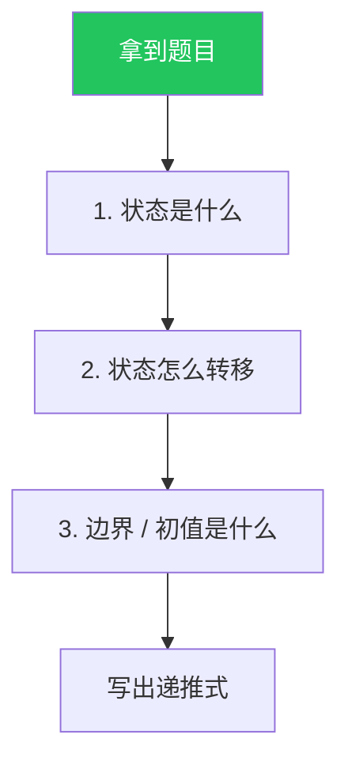
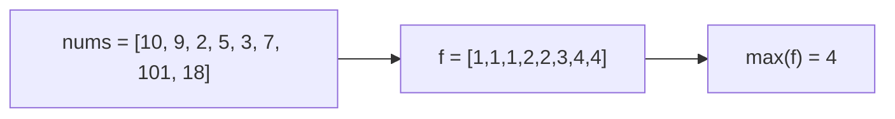

# 动态规划入门：从暴力递归到状态压缩

## 一个动态规划题要回答三个问题



- **状态**：用什么变量唯一描述子问题。多半是"前 i 个 / 容量 j / 选了第 k 个"这种带索引的。
- **转移**：当前状态由哪些更小的状态推出。
- **边界**：最小的子问题答案是什么。

## 例 0：爬楼梯（最经典的"热身"）

> 抽象问题：每次可以爬 1 或 2 个台阶，求爬到第 n 阶的方法数。

- **状态** `f(i)`：爬到第 i 阶的方法数。
- **转移**：最后一步要么从 i-1 跨 1 步，要么从 i-2 跨 2 步 → `f(i) = f(i-1) + f(i-2)`。
- **边界**：`f(0) = 1`（站在起点算 1 种），`f(1) = 1`。

```rust
fn climb_stairs(n: i32) -> i32 {
    let n = n as usize;
    if n <= 1 { return 1; }
    let (mut a, mut b) = (1, 1);          // f(0), f(1)
    for _ in 2..=n {
        let c = a + b;
        a = b;
        b = c;
    }
    b
}
```

注意空间已经从 $O(n)$ 滚动到了 $O(1)$。

## 演化四步走（以"零钱兑换"为例）

> 抽象问题：给定若干面额的硬币和目标金额，求凑出目标的**最少硬币数**，凑不出返回 -1。

### 第一步：暴力递归（直接翻译"问题"）

```python
def coin_change_naive(coins, amount):
    def dfs(rest):
        if rest == 0: return 0
        if rest < 0:  return float('inf')
        return 1 + min(dfs(rest - c) for c in coins)
    ans = dfs(amount)
    return ans if ans != float('inf') else -1
```

时间是指数级。但**这个递归函数就是状态转移**：`f(rest) = 1 + min{f(rest - c)}`。

### 第二步：加记忆化（top-down DP）

子问题重叠 → 用 `memo` 缓存：

```python
def coin_change_memo(coins, amount):
    from functools import lru_cache
    @lru_cache(maxsize=None)
    def dfs(rest):
        if rest == 0: return 0
        if rest < 0:  return float('inf')
        return 1 + min(dfs(rest - c) for c in coins)
    ans = dfs(amount)
    return ans if ans != float('inf') else -1
```

时间从指数级降到 $O(\text{amount} \cdot |coins|)$。

### 第三步：自底向上（bottom-up DP）

把递归改成 for 循环，按状态值从小到大填表：

```rust
fn coin_change(coins: Vec<i32>, amount: i32) -> i32 {
    let amount = amount as usize;
    let big = amount + 1;
    let mut f = vec![big; amount + 1];        // f[i] = 凑出 i 所需最少硬币数
    f[0] = 0;
    for i in 1..=amount {
        for &c in &coins {
            let c = c as usize;
            if c <= i && f[i - c] + 1 < f[i] {
                f[i] = f[i - c] + 1;
            }
        }
    }
    if f[amount] > amount { -1 } else { f[amount] as i32 }
}
```

### 第四步：状态压缩（如可降维就降）

零钱兑换只依赖前一个状态吗？不，它依赖所有 `f[i-c]`，所以无法滚动数组。但下面的"打家劫舍"可以：

> 抽象问题：相邻两间房不能同时偷，求能偷到的最大金额。

- 状态 `f(i)` = 处理完第 i 间房后的最大金额。
- 转移：`f(i) = max(f(i-1), f(i-2) + nums[i])`（偷 or 不偷）。
- 状态只依赖前 2 个 → 滚动到两个变量。

```go
func rob(nums []int) int {
    prev2, prev1 := 0, 0
    for _, x := range nums {
        cur := max(prev1, prev2 + x)
        prev2, prev1 = prev1, cur
    }
    return prev1
}
```

## 状态设计的几种常见形态

| 形态 | 状态 | 代表题 |
| --- | --- | --- |
| 线性 DP | `f[i]` 依赖 `f[i-1..i-k]` | 爬楼梯、打家劫舍、最大子数组和 |
| 0/1 背包 | `f[i][j]` 前 i 物品装容量 j | 分割等和子集 |
| 完全背包 | `f[i][j]` 物品可重复使用 | 零钱兑换 II |
| LIS 系列 | `f[i]` = 以 i 结尾的最长子序列 | 最长递增子序列 |
| 区间 DP | `f[l][r]` 区间 [l,r] 上的答案 | 戳气球、最长回文子串 |
| 二维网格 | `f[i][j]` = 走到 (i,j) 的解 | 最小路径和、不同路径 |
| 树形 DP | 在树的递归回溯位置算 | 打家劫舍 III |
| 状压 DP | 用位掩码表示集合状态 | 旅行商问题 |

## 例：最长递增子序列（LIS）

> 抽象问题：给定整数数组，求其**最长严格递增子序列**（不要求连续）的长度。

- 状态 `f[i]` = **以下标 i 结尾**的最长递增子序列长度。注意"以 i 结尾"，否则状态定义不闭合。
- 转移：`f[i] = max(f[j] + 1) for all j<i if nums[j]<nums[i]`，否则 `f[i] = 1`。
- 答案：`max(f[i])`，不是 `f[n-1]`。



$O(n^2)$ 解法：

```python
def length_of_LIS(nums):
    if not nums: return 0
    f = [1] * len(nums)
    for i in range(len(nums)):
        for j in range(i):
            if nums[j] < nums[i]:
                f[i] = max(f[i], f[j] + 1)
    return max(f)
```

进阶：**贪心 + 二分**做到 $O(n \log n)$，思路是维护一个"长度为 k 的递增子序列里最后一个数尽量小"的数组。

## 例：最长公共子序列（LCS）

> 抽象问题：给定两个字符串 `text1`、`text2`，返回它们**最长公共子序列**的长度（子序列不要求连续）。

- 状态 `f[i][j]` = `text1[0..i]` 与 `text2[0..j]` 的 LCS 长度。
- 转移：
  - 末位相同：`f[i][j] = f[i-1][j-1] + 1`
  - 末位不同：`f[i][j] = max(f[i-1][j], f[i][j-1])`
- 边界：`f[0][*] = f[*][0] = 0`。

```rust
fn longest_common_subsequence(a: String, b: String) -> i32 {
    let (a, b) = (a.as_bytes(), b.as_bytes());
    let (m, n) = (a.len(), b.len());
    let mut f = vec![vec![0i32; n + 1]; m + 1];
    for i in 1..=m {
        for j in 1..=n {
            f[i][j] = if a[i-1] == b[j-1] {
                f[i-1][j-1] + 1
            } else {
                f[i-1][j].max(f[i][j-1])
            };
        }
    }
    f[m][n]
}
```

## 状态压缩到一维 —— 关键看依赖方向

二维 DP 如果 `f[i][j]` 只依赖 `f[i-1][j]` 和 `f[i][j-1]`，可以用一维滚动：

- 依赖**上一行同列**：从左往右遍历（覆盖前先读）。
- 依赖**本行左侧**：从左往右遍历（自然顺序）。
- 既依赖**上一行同列**又依赖**上一行左侧**（如 0/1 背包）：从**右往左**遍历，否则会用脏数据。

```text
0/1 背包一维版:
for i in items:
    for j in capacity downTo i.weight:     # 倒序!
        f[j] = max(f[j], f[j - i.weight] + i.value)
```

## 调试 DP 的三招

1. **小数据手算**几个 `f` 值，跟代码输出对比。
2. **打印整张表**，挨个验证转移是否正确。
3. 把暴力递归版**也写一个**，对拍 50 个随机用例。

## 何时不该用 DP

- 状态空间太大（如 `f[i][j][k][l]` 都 1e5 → 内存爆炸） → 考虑贪心或数学结构。
- 子问题不重叠 → 一遍 DFS 或贪心更简单。
- 决策依赖未来 → DP 失效，需要重新建模或反向 DP。

## 相关题目

- #70 爬楼梯
- #198 打家劫舍
- #322 零钱兑换
- #300 最长递增子序列
- #1143 最长公共子序列
- #64 最小路径和
- #53 最大子数组和（Kadane 算法是一维 DP）
