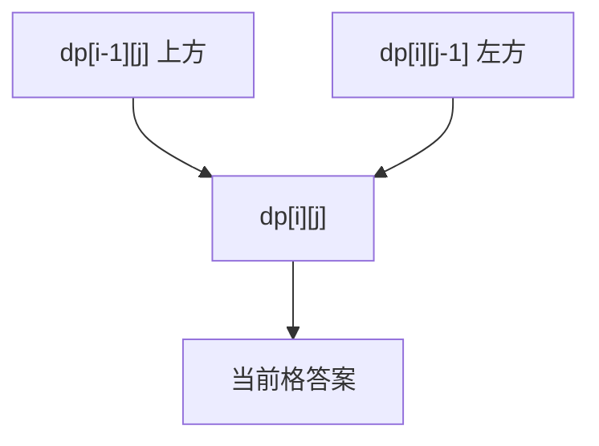

# 二维路径 DP 填表：动态规划训练题解

网格 DP 的状态很自然：`dp[i][j]` 表示走到格子 `(i,j)` 的答案。当前格通常只能从上面或左边来。

一句话记法：**格子答案来自入口方向，边界先初始化。**

## 适用场景

- 不同路径、带障碍路径。
- 最小路径和。
- 三角形最小路径和。
- 移动方向有限，且没有回头依赖。

如果可以上下左右反复走，通常不是简单 DP，而是图搜索。

## 图解思路



转移前先确认当前位置是否可达或是否有障碍。

## Go 参考实现：最小路径和

```go
func minPathSum(grid [][]int) int {
	m, n := len(grid), len(grid[0])
	dp := make([][]int, m)
	for i := range dp {
		dp[i] = make([]int, n)
	}
	dp[0][0] = grid[0][0]
	for i := 1; i < m; i++ {
		dp[i][0] = dp[i-1][0] + grid[i][0]
	}
	for j := 1; j < n; j++ {
		dp[0][j] = dp[0][j-1] + grid[0][j]
	}
	for i := 1; i < m; i++ {
		for j := 1; j < n; j++ {
			if dp[i-1][j] < dp[i][j-1] {
				dp[i][j] = dp[i-1][j] + grid[i][j]
			} else {
				dp[i][j] = dp[i][j-1] + grid[i][j]
			}
		}
	}
	return dp[m-1][n-1]
}
```

## 为什么这样写

状态 `dp[i][j]` 必须定义成“到达当前格”的答案，因为最后一步只可能来自上方或左方，转移就闭合了。

第一行只能从左边来，第一列只能从上面来，所以要单独初始化。带障碍时，边界一旦遇到障碍，后面就不可达。

## 复杂度

- 时间复杂度：$O(mn)$。
- 空间复杂度：$O(mn)$，可压缩到 $O(n)$。

## 易错点

- 第一行、第一列初始化漏掉。
- 障碍题中把不可达格子继续参与转移。
- 三角形 DP 的每行长度不同，还按矩形处理。
- 原地修改 grid 时没确认题目允许。

## 练习顺序

建议按这个顺序刷：#62, #63, #64, #120。
