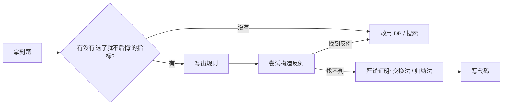

# 贪心算法：局部最优能撑起全局最优吗？

## 贪心 vs DP

贪心和 DP 都在做选择，区别是：

| | DP | 贪心 |
| --- | --- | --- |
| 子问题 | 重叠 | 不重叠 |
| 决策 | 枚举所有可能再合并 | **当前最优就直接确定** |
| 复杂度 | 多项式 | 通常线性或排序 |
| 正确性 | 状态转移自动保证 | **必须证明** |

贪心的厉害之处：能用就快。坑爹之处：**不一定能用**。所以贪心题做两件事：

1. 设计一个"局部最优"的规则。
2. **证明**这个规则能撑起全局最优。



## 怎么证明贪心是对的

工程里不一定要给数学证明，但**至少要心里过一遍**两种思路：

### 交换论证（最常用）

假设最优解和贪心解第一次不同的位置是 `k`。在那一步：

- 最优解选了 X，贪心选了 Y。
- 用 Y 替换最优解里的 X，能不能保持解仍然合法、且不劣？
- 能 → 那么交换之后等价于"贪心选 Y 也能得到最优"，归纳即证。

### 归纳法

证明"贪心走 k 步后保持的某个不变量"。具体怎么不变量看题目。

如果想不出哪个量"被贪心改变得更好"，就不要硬上。

## 经典题型 1：区间调度（活动选择）

> 抽象问题：有一堆区间，选出尽量多的**互不重叠**区间。

**贪心规则**：按**右端点升序**排序，然后从左到右扫，能选就选。

```rust
fn erase_overlap_intervals(mut intervals: Vec<Vec<i32>>) -> i32 {
    intervals.sort_by_key(|x| x[1]);
    let mut count = 0;
    let mut prev_end = i32::MIN;
    for v in intervals {
        if v[0] >= prev_end {
            count += 1;
            prev_end = v[1];
        }
    }
    intervals_count_total - count           // 题目求"要删除多少个", 这里示意
}
```

为什么是"按右端点"而不是按左端点？

> 直觉：右端点小的区间"占用未来时间最少"，留给后面更多余地。

证明（交换论证）：

> 设最优选出的第一个区间是 X，贪心选了 Y（右端点最小）。`Y.right ≤ X.right`，所以把 X 换成 Y 不会和最优的后续区间冲突，得到的解仍然是 |最优|。归纳即证。

变体：会议室碰撞、用最少箭射爆所有气球。同一个套路。

## 经典题型 2：跳跃游戏

> 抽象问题：数组每个元素表示在该位置最多能跳多远，问能否到达终点。

**贪心规则**：维护"目前能到达的最远位置 `reach`"，遍历每个下标 `i`：

- 如果 `i > reach`，跳不到了，返回 false。
- 否则 `reach = max(reach, i + nums[i])`。

```rust
fn can_jump(nums: Vec<i32>) -> bool {
    let mut reach = 0i64;
    for i in 0..nums.len() {
        if i as i64 > reach { return false; }
        reach = reach.max(i as i64 + nums[i] as i64);
    }
    true
}
```

为什么对？因为如果在 `[0, reach]` 内某个位置 `j` 能跳更远，**那么** `[j, reach]` 区间内的所有位置都自动可达。这个"区间覆盖"是 invariant。

进阶：**最少跳跃次数** —— 在每一段"能到达的范围"里看下一步能扩到多远，跳到那个位置再续。

## 经典题型 3：加油站

> 抽象问题：环形公路 N 个加油站，给定每站的油量 `gas[i]` 和到下一站要消耗 `cost[i]`，求能跑完整圈的起点；不存在返回 -1。

**贪心规则**：

1. 总油量 < 总消耗 → 无解。
2. 否则唯一解在于"**当前累计差刚好掉成负**的那一站后面"。

```rust
fn can_complete_circuit(gas: Vec<i32>, cost: Vec<i32>) -> i32 {
    let (mut total, mut tank, mut start) = (0i32, 0i32, 0i32);
    for i in 0..gas.len() {
        let diff = gas[i] - cost[i];
        total += diff;
        tank += diff;
        if tank < 0 {
            start = i as i32 + 1;                    // 从下一站重启
            tank = 0;
        }
    }
    if total < 0 { -1 } else { start }
}
```

为什么"重置起点"是对的？

> 如果从某个起点 s 跑到 i 时油箱负了，那么 s 到 i 之间**任何一个位置开始**都会更早跑空（因为前缀油更少）。所以这段所有位置都不可能是答案，下一个候选起点是 `i + 1`。

## 经典题型 4：字典序贪心 / 单调栈贪心

> 抽象问题：给定字符串 s，去除重复字母，结果字典序最小，且字符出现顺序与原串保持一致。

**贪心规则**：维护一个**单调栈**，遇到字典序更小的字符且栈顶字符后面还会出现，就 pop 栈顶。

```python
def remove_duplicate_letters(s):
    last = {c: i for i, c in enumerate(s)}
    stack = []
    seen = set()
    for i, c in enumerate(s):
        if c in seen: continue
        while stack and c < stack[-1] and i < last[stack[-1]]:
            seen.discard(stack.pop())
        stack.append(c)
        seen.add(c)
    return ''.join(stack)
```

凡是"删 k 个数字让数字最小"、"最小子序列"，全是这个套路。**贪心的方向 = 字典序更小，约束 = 后面还能补回来**。

## 经典题型 5：按身高重建队列

> 抽象问题：每人用 `(h, k)` 表示身高 h、前面有 k 个不矮于自己的人，按规则重建队列。

**贪心规则**：

1. 按"身高降序、k 升序"排序。
2. 依次插入到答案数组的第 `k` 位。

```python
def reconstruct_queue(people):
    people.sort(key=lambda x: (-x[0], x[1]))
    out = []
    for p in people:
        out.insert(p[1], p)
    return out
```

为什么对？

> 先确定高的人位置后，再插入矮的人**不会影响**已经确定的人之间的相对顺序——因为矮的对高的人来说不可见。所以从高到矮、按 k 插入位置永远准确。

## 什么时候千万别用贪心

| 信号 | 应换什么 |
| --- | --- |
| 子问题有重叠 | DP |
| 决策不能立即确定（要看后面） | DP / 搜索 |
| 让你找"方案数"或"所有方案" | DP / 回溯 |
| 反例两个之内就能想到 | 别贪 |

最常见的坑：背包问题。看起来很贪心（按性价比排序），但 0/1 背包必须 DP——一个反例就翻车。

## 常见坑速查

| 坑 | 修复 |
| --- | --- |
| 排序键挑错（按左端点 vs 右端点） | 想清楚不变量是哪个 |
| 没证明就交（赌运气） | 至少手算 3 个用例 |
| 用 `i32` 累加导致溢出 | 改 `i64` |
| 跳跃游戏 `reach` 初值写错 | 起点 `reach = 0`，因为站在 0 就算到 |
| 自定义排序方向写反 | Rust 用 `sort_by` + `Ordering`，别用减法 |

## 相关题目

- #55 跳跃游戏
- #45 跳跃游戏 II
- #134 加油站
- #435 无重叠区间（区间调度）
- #452 用最少数量的箭引爆气球
- #406 根据身高重建队列
- #376 摆动序列
- #763 划分字母区间
- #860 柠檬水找零
- #11 盛最多水的容器（贪心 + 双指针）
