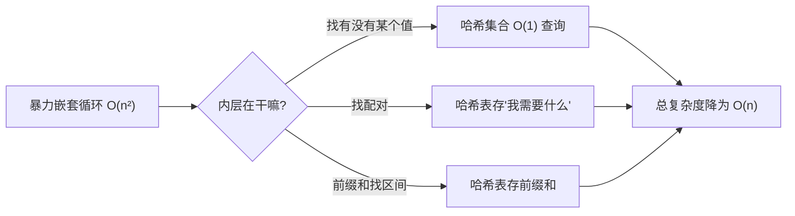
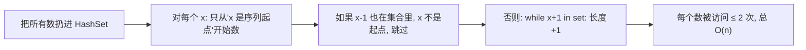

# 哈希表四大套路：计数、配对、前缀、原地

## 它到底解决了什么问题？

哈希表本质上是把"**给定 key，查询信息**"做到了平均 O(1)。在算法题里，这意味着：



下面四种套路覆盖了 80% 的哈希题。

## 套路一：计数 / 频率统计

最直白的用法。`HashMap<key, count>` 配合一次遍历，把"出现次数"问题压扁。

```rust
use std::collections::HashMap;

fn count_freq(s: &str) -> HashMap<char, i32> {
    let mut cnt = HashMap::new();
    for c in s.chars() {
        *cnt.entry(c).or_insert(0) += 1;
    }
    cnt
}
```

### 例：有效的字母异位词

> 抽象问题：判断两个字符串是否由相同字符（含数量）组成。

只要两边字符频率一致即可。优化点：如果只含小写字母，用长度 26 的数组比 HashMap 更快。

```rust
fn is_anagram(s: String, t: String) -> bool {
    if s.len() != t.len() { return false; }
    let mut cnt = [0i32; 26];
    for c in s.bytes() { cnt[(c - b'a') as usize] += 1; }
    for c in t.bytes() { cnt[(c - b'a') as usize] -= 1; }
    cnt.iter().all(|&x| x == 0)
}
```

### 例：找众数（出现次数 > n/2）

一遍 `HashMap` 计数也能做，但 Boyer-Moore **摩尔投票** 更巧妙、空间 O(1)。这里给你一个提醒：见到"绝对多数"，先想投票，再考虑哈希。

## 套路二：配对 / "我缺什么"

> 抽象问题：两数之和。给定 `nums` 和 `target`，找出两数下标使其和为 `target`。

暴力是 O(n²)。但如果**边遍历边把"自己缺的那个数"存进去**，就只要一遍：

```rust
fn two_sum(nums: Vec<i32>, target: i32) -> Vec<i32> {
    let mut seen: HashMap<i32, i32> = HashMap::new();
    for (i, &x) in nums.iter().enumerate() {
        if let Some(&j) = seen.get(&(target - x)) {
            return vec![j, i as i32];
        }
        seen.insert(x, i as i32);
    }
    vec![]
}
```

把这个套路抽象一下：

```text
for x in nums:
    if hash 里有 "x 的配对"：       # 之前的某个值能和 x 凑成答案
        汇报答案
    hash.insert(x 自己用来配对的那一面)
```

应用：

- **两数之和**：哈希存"自己"，找 `target - x`。
- **存在重复元素 II**：哈希存"x 上次出现的下标"，看距离。
- **快乐数**：哈希存"见过的中间值"，判环。

## 套路三：哈希分组 / 同类聚合

> 抽象问题：给一组字符串，把异位词分到同一组。例如 `["eat","tea","tan","ate","nat","bat"]` → `[["eat","tea","ate"],["tan","nat"],["bat"]]`。

**核心思想**：给每组定一个"指纹"（key），相同指纹归一类。常见指纹有：

- 排序后的字符串：`"eat" → "aet"`
- 字符频率向量：`"eat" → (1,0,...,1,...,1,...)`
- 质数乘积：每个字母对应一个质数，把所有字母对应质数相乘。

```rust
use std::collections::HashMap;

fn group_anagrams(strs: Vec<String>) -> Vec<Vec<String>> {
    let mut groups: HashMap<[u8; 26], Vec<String>> = HashMap::new();
    for s in strs {
        let mut key = [0u8; 26];
        for b in s.bytes() { key[(b - b'a') as usize] += 1; }
        groups.entry(key).or_default().push(s);
    }
    groups.into_values().collect()
}
```

凡是"分类计数"、"等价类"题，都是这个套路。

## 套路四：哈希集合 + 原地 / 跳跃

> 抽象问题：最长连续序列。给定无序数组，求其中**最长连续递增**整数序列的长度。例如 `[100,4,200,1,3,2]` → 4（即 1,2,3,4）。

排序是 O(n log n)。哈希能做到 O(n)：



```rust
use std::collections::HashSet;

fn longest_consecutive(nums: Vec<i32>) -> i32 {
    let set: HashSet<i32> = nums.into_iter().collect();
    let mut best = 0;
    for &x in &set {
        if set.contains(&(x - 1)) { continue; }       // 不是起点
        let mut y = x;
        while set.contains(&(y + 1)) { y += 1; }
        best = best.max(y - x + 1);
    }
    best
}
```

关键不是哈希存了什么，而是"**只从起点开始数**"这个剪枝把复杂度从 O(n²) 压到 O(n)。

## 用哈希之前的灵魂三问

下手前先问自己：

1. **真的需要哈希吗？** 字符集只有 26 / 128 / 256 → 改用数组下标。Rust 里 `[i32; 26]` 比 `HashMap<char, i32>` 快一个量级。
2. **键能 hash 吗？** 自定义结构想做 key，得给它实现 `Hash + Eq`。
3. **值要存什么？** 想清楚是存"次数"、"下标"、"是否见过"、还是"配对的另一面"。

## 常见坑速查

| 坑 | 修复 |
| --- | --- |
| 字符集小却用 HashMap 拖慢 | 改用定长数组 |
| 遍历时一边读一边写同一张表 | 收集到临时容器再修改 |
| 浮点数当 key | 想清楚精度，必要时改字符串 / 整数 |
| 把 `set` 改成 `vec.contains` | `vec.contains` 是 O(n)，等于没用哈希 |
| 哈希忘记 `entry().or_insert(0)` 直接 `cnt[k] += 1` | Rust / Go 上要保证 key 已存在 |

## 相关题目

- #1 两数之和（哈希配对模板）
- #49 字母异位词分组（哈希分组）
- #128 最长连续序列（哈希集合 + 起点剪枝）
- #219 存在重复元素 II（哈希记录下标）
- #242 有效的字母异位词
- #387 字符串中第一个唯一字符（哈希计数）
- #169 多数元素（计数 / 投票）
- #560 和为 K 的子数组（前缀和 + 哈希）
- #350 两个数组的交集 II（哈希计数取最小）
- #41 缺失的第一个正数（哈希思想 + 原地）
