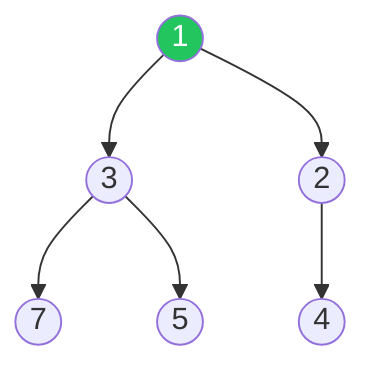
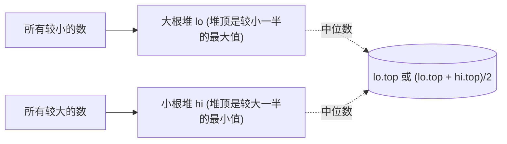

# 堆与优先队列：Top K、合并、动态中位数

## 堆到底是什么

二叉堆 = **完全二叉树 + 堆序性**。常见的小根堆里，任意节点的值 ≤ 它两个孩子的值。



它和"排序数组"的关键差异：

| 操作 | 数组（排好序） | 堆 |
| --- | --- | --- |
| 取最值 | O(1) | O(1) |
| 插入新元素 | O(n) | **O(log n)** |
| 删除最值 | O(n) 或 O(1)+移动 | **O(log n)** |
| 任意位置查询 | O(log n) 二分 | ✗ |

只要题目里出现"**动态加入新元素**，每次都要最值"，堆基本就赢了。

## 用语言自带的堆

写题别从零实现，记 API 就够：

| 语言 | 堆类型 | API |
| --- | --- | --- |
| Rust | `BinaryHeap<T>` | 默认**大根堆**，小根堆塞 `Reverse(x)` |
| Python | `heapq` | 默认**小根堆**，大根堆塞 `-x` |
| Go | `container/heap` | 自己实现 5 个方法（Less 控制方向）|
| Java | `PriorityQueue<T>` | 默认**小根堆**，传 comparator 改方向 |
| C++ | `priority_queue<T>` | 默认**大根堆**，模板第三参改方向 |

Rust 示例（小根堆维护最小值）：

```rust
use std::collections::BinaryHeap;
use std::cmp::Reverse;

let mut h: BinaryHeap<Reverse<i32>> = BinaryHeap::new();
h.push(Reverse(5));
h.push(Reverse(1));
h.push(Reverse(3));
let Reverse(min) = h.pop().unwrap();          // min = 1
```

## 套路一：Top K（前 K 大 / 前 K 小）

> 抽象问题：数组中第 K 大的元素。

朴素：排序 O(n log n)。堆的做法 O(n log k)，**用容量为 K 的小根堆**：

```rust
use std::collections::BinaryHeap;
use std::cmp::Reverse;

fn find_kth_largest(nums: Vec<i32>, k: i32) -> i32 {
    let k = k as usize;
    let mut h: BinaryHeap<Reverse<i32>> = BinaryHeap::new();
    for x in nums {
        h.push(Reverse(x));
        if h.len() > k { h.pop(); }                 // 弹掉当前最小
    }
    let Reverse(ans) = h.peek().copied().unwrap();
    ans
}
```

为什么"求第 K **大**"反而用**小**根堆？

> 因为我们要**淘汰当前最小**的那个：堆里始终保留 K 个最大的，堆顶是这 K 个里最小的，扫完所有数后堆顶就是全局第 K 大。

镜像规则：求第 K **小** → 用**大根堆**。

进阶：**快速选择**（quickselect）能做到平均 O(n)，但堆解法的优势是**支持流式数据**——数据是边来边处理的，堆永远 K 大。

## 套路二：合并 K 个有序序列

> 抽象问题：合并 K 个升序链表为一个升序链表。

每条链表把"当前头节点"塞进小根堆，弹出最小那一个接到答案末尾，再把它的 `next` 塞回堆。总复杂度 O(N log K)，N 是总节点数。

```python
import heapq

def merge_k_lists(lists):
    h = []
    for i, node in enumerate(lists):
        if node:
            heapq.heappush(h, (node.val, i, node))  # i 用来打破 val 相等时的比较
    dummy = ListNode()
    tail = dummy
    while h:
        val, i, node = heapq.heappop(h)
        tail.next = node
        tail = node
        if node.next:
            heapq.heappush(h, (node.next.val, i, node.next))
    return dummy.next
```

注意第二项 `i`：Python 比较元组时如果 `val` 相等会去比第二项，链表节点本身不能比较，所以塞个序号当 tiebreaker。

## 套路三：双堆维护动态中位数

> 抽象问题：数据流的中位数。设计一个数据结构，支持加入数字、随时查询当前所有数的中位数。



不变量：

1. `lo.size == hi.size` 或 `lo.size == hi.size + 1`。
2. `lo.top() <= hi.top()`（左半永远不大于右半）。

加入新数 `x`：先扔进 `lo`，把 `lo.top()` 转移到 `hi`，再看大小有没有失衡，失衡就从 `hi` 弹回 `lo`。

```python
import heapq

class MedianFinder:
    def __init__(self):
        self.lo = []                                # 大根堆 (用负数)
        self.hi = []                                # 小根堆

    def addNum(self, x):
        heapq.heappush(self.lo, -x)
        heapq.heappush(self.hi, -heapq.heappop(self.lo))
        if len(self.hi) > len(self.lo):
            heapq.heappush(self.lo, -heapq.heappop(self.hi))

    def findMedian(self):
        if len(self.lo) > len(self.hi):
            return -self.lo[0]
        return (-self.lo[0] + self.hi[0]) / 2
```

模板可以扩展到"维护滑动窗口的中位数"，但删除任意元素需要**懒删除**配合下面的套路。

## 套路四：懒删除

堆不支持"删除任意元素"。如果题目要求删除已知值（不是最值），有两条路：

1. **替换数据结构**：换成 `BTreeMap<K, count>`（Rust）或 `multiset`（C++），它们支持 O(log n) 任意删除。
2. **懒删除**：堆里允许"过期"元素存在，每次拿堆顶时先看它是不是过期的，过期就 pop 掉。配一个 `HashMap<value, removed_count>` 标记。

懒删除适合**删除操作不频繁**的题，比如滑动窗口最大值的某些变体、带过期任务的调度。

## 套路五：贪心 + 堆

> 抽象问题：用最少的会议室开完所有会议。

把会议按开始时间排序，扫一遍：

- 来了新会议，看小根堆顶（最早结束的会议室）是否已经空闲。
- 空闲就复用（pop 旧的、push 新结束时间）；不空闲就开新会议室（直接 push）。
- 答案就是堆的最大长度。

```rust
fn min_meeting_rooms(mut meetings: Vec<(i32, i32)>) -> i32 {
    meetings.sort_by_key(|m| m.0);
    use std::collections::BinaryHeap;
    use std::cmp::Reverse;
    let mut h: BinaryHeap<Reverse<i32>> = BinaryHeap::new();
    for (s, e) in meetings {
        if let Some(&Reverse(top)) = h.peek() {
            if top <= s { h.pop(); }                 // 复用一间房
        }
        h.push(Reverse(e));
    }
    h.len() as i32
}
```

这类题的通用模式：**排序定顺序，堆维护可用资源里的最优者**。

## 常见坑速查

| 坑 | 修复 |
| --- | --- |
| 大小根方向写反 | 想清楚是要"淘汰小的"还是"淘汰大的" |
| 容量没控制，堆变成全量排序 | Top K 题要主动 `pop` 维持容量 |
| 浮点元素入堆精度问题 | 改 i64 + 缩放，或用 BTree |
| 节点不可比较（链表 / 自定义结构） | 元组里塞 tiebreaker 序号 |
| 想要"删除任意" 堆做不到 | 懒删除 或 改 BTreeMap |
| 流式中位数没维持大小差 ≤ 1 | 加一步从大堆"反向调拨"到小堆 |

## 相关题目

- #215 数组中的第 K 个最大元素（Top K 模板）
- #347 前 K 个高频元素（频次 → Top K）
- #692 前 K 个高频单词（带字典序 tiebreaker）
- #23 合并 K 个升序链表（多路归并）
- #295 数据流的中位数（双堆）
- #373 查找和最小的 K 对数字（堆 + 多路）
- #378 有序矩阵中第 K 小的元素（堆 / 二分）
- #502 IPO（贪心 + 双堆）
- #1834 单线程 CPU（堆模拟调度）
