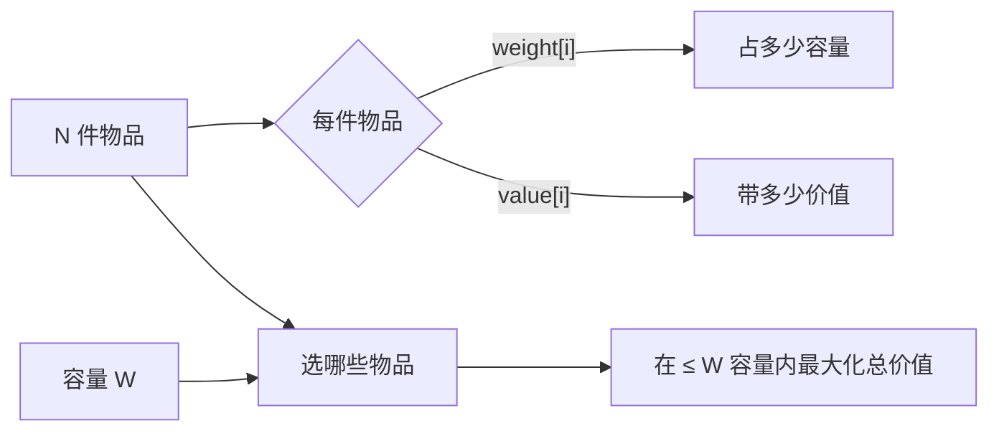

# 背包 DP 全家桶：0/1、完全、多重，外加滚动数组

## 背包问题的三件套

任何背包题，本质就是回答：



不同变体的区别只在"每件物品能用几次"：

| 类型 | 每件物品 | 经典代表 |
| --- | --- | --- |
| 0/1 背包 | 至多 1 次 | 划分等和子集 |
| 完全背包 | 无限次 | 零钱兑换 |
| 多重背包 | 给定次数 | 砝码组合 |
| 分组背包 | 同一组内最多选一件 | 多种型号选购 |

## 0/1 背包：模板与一维降维

> 抽象问题：N 件物品，每件**最多选一次**，重量 `w[i]`、价值 `v[i]`，容量上限 `W`，求能装下的最大价值。

二维状态：`f[i][j]` = 前 i 件物品在容量 j 下的最大价值。

转移：
- 不选第 i 件：`f[i][j] = f[i-1][j]`
- 选第 i 件（前提 `j >= w[i]`）：`f[i][j] = f[i-1][j-w[i]] + v[i]`
- 取两者最大值。

```rust
fn knapsack_01(w: &[i32], v: &[i32], cap: i32) -> i32 {
    let n = w.len();
    let cap = cap as usize;
    let mut f = vec![vec![0i32; cap + 1]; n + 1];
    for i in 1..=n {
        for j in 0..=cap {
            f[i][j] = f[i - 1][j];                                  // 不选
            if (j as i32) >= w[i - 1] {
                f[i][j] = f[i][j].max(f[i - 1][j - w[i - 1] as usize] + v[i - 1]);
            }
        }
    }
    f[n][cap]
}
```

**一维滚动 + 倒序遍历**：因为 `f[i][j]` 只依赖 `f[i-1][j]` 和 `f[i-1][j-w[i]]`（都是上一行的），把 i 这层"压扁"成同一个一维数组。但容量必须**从大到小**遍历，否则会用到"已经被本轮更新过的 f[j-w[i]]"，等于一件物品被选了多次。

```rust
fn knapsack_01_compact(w: &[i32], v: &[i32], cap: i32) -> i32 {
    let cap = cap as usize;
    let mut f = vec![0i32; cap + 1];
    for i in 0..w.len() {
        let wi = w[i] as usize;
        for j in (wi..=cap).rev() {                                 // 倒序!
            f[j] = f[j].max(f[j - wi] + v[i]);
        }
    }
    f[cap]
}
```

**口诀**：0/1 背包 → **倒序枚举容量**。

## 例：分割等和子集

> 抽象问题：给一个正整数数组，能否将其分成两份使两份和相等？

判断有无子集 `sum == total / 2`。把"装下尽量多价值"换成"恰好装满"的可行性：

```rust
fn can_partition(nums: Vec<i32>) -> bool {
    let total: i32 = nums.iter().sum();
    if total % 2 != 0 { return false; }
    let target = (total / 2) as usize;
    let mut f = vec![false; target + 1];
    f[0] = true;
    for &x in &nums {
        let x = x as usize;
        if x > target { continue; }
        for j in (x..=target).rev() {                               // 倒序
            f[j] |= f[j - x];
        }
    }
    f[target]
}
```

注意：`f[j] |= f[j-x]` 不能误写成 `=`，否则会丢掉"不选 x"那一支。

## 完全背包：模板与正序遍历

> 抽象问题：每件物品**无限多**件，容量 W，求最大价值。

二维：`f[i][j] = max(f[i-1][j], f[i][j-w[i]] + v[i])`。注意第二项是 `f[i][...]` 不是 `f[i-1][...]`——同一件可以再选。

一维滚动：容量**从小到大**遍历（这样 `f[j-w[i]]` 是"已经允许同一件物品再选过"的值）。

```rust
fn knapsack_unbounded(w: &[i32], v: &[i32], cap: i32) -> i32 {
    let cap = cap as usize;
    let mut f = vec![0i32; cap + 1];
    for i in 0..w.len() {
        let wi = w[i] as usize;
        for j in wi..=cap {                                         // 正序!
            f[j] = f[j].max(f[j - wi] + v[i]);
        }
    }
    f[cap]
}
```

**口诀**：完全背包 → **正序枚举容量**。

## 例：零钱兑换 II（凑数方案数）

> 抽象问题：给定面额数组和金额 amount，求**凑出 amount 的方案数**（每种硬币无限）。

完全背包，但状态意义换成"方案数"：

```rust
fn change(amount: i32, coins: Vec<i32>) -> i32 {
    let amount = amount as usize;
    let mut f = vec![0i32; amount + 1];
    f[0] = 1;                                                       // 凑 0 元的方案数: 不选任何硬币
    for &c in &coins {
        let c = c as usize;
        for j in c..=amount {
            f[j] += f[j - c];
        }
    }
    f[amount]
}
```

**外层先物品、内层再容量**：这是"组合数"（同样硬币不分顺序），结果 `{1, 2}` 和 `{2, 1}` 算一种。

如果把内外循环顺序换一下（外层容量、内层物品），就变成了"排列数"（顺序不同算不同方案）——这正是 **#377 组合总和 Ⅳ** 的解法。

**口诀**：**组合数** → 外物品、内容量；**排列数** → 外容量、内物品。

## 多重背包

> 抽象问题：每件物品给定 `count[i]` 个，求最大价值。

朴素：把第 i 件物品复制 `count[i]` 份做 0/1 背包。**复杂度 O(N·W·max_count)**，容易超时。

**二进制拆分优化**：把 `count[i]` 拆成 1, 2, 4, 8, ..., 剩余。这些"打包后"的伪物品做一遍 0/1 背包。每个原物品最多被拆成 `log(count[i])` 件，复杂度降到 O(N·W·log max_count)。

```python
def multi_knapsack(weights, values, counts, cap):
    items = []
    for w, v, c in zip(weights, values, counts):
        k = 1
        while c >= k:
            items.append((w * k, v * k))
            c -= k
            k *= 2
        if c > 0:
            items.append((w * c, v * c))
    # 然后对 items 做 0/1 背包
    f = [0] * (cap + 1)
    for w, v in items:
        for j in range(cap, w - 1, -1):
            f[j] = max(f[j], f[j - w] + v)
    return f[cap]
```

进阶有"单调队列优化"，做到 `O(N·W)`，但代码复杂，竞赛才用。

## 背包的等价变形

很多看起来不像背包的题，其实是背包：

| 题目 | 翻译 |
| --- | --- |
| 划分等和子集 | 0/1 背包，目标 `sum/2` |
| 目标和 (`+/-` 加号) | 0/1 背包，方案数 |
| 零钱兑换 | 完全背包，最小件数（min 而非 max） |
| 单词拆分 | 完全背包，可行性 |
| 一和零 | **二维**容量的 0/1 背包 |

**信号**：题目里出现"**选 / 不选**"+"**容量约束**"+"**最大 / 最小 / 计数 / 可行性**"。

## 调试 DP 的三招

1. 拿 3 个小用例**手算** `f` 表，跟代码输出对比。
2. 把暴力解（指数级搜索）也写一份，**对拍** 100 个随机用例。
3. 一维滚动前先写**二维版**调通，再降维 —— 别一上来就压一维。

## 常见坑速查

| 坑 | 修复 |
| --- | --- |
| 0/1 背包用正序 → 一件物品被多次选 | 0/1 倒序、完全正序，背下来 |
| 一维数组初始化全 0，但题目"恰好装满" | "恰好"时 `f[0]=0`，其余 `f[j]=-INF` |
| 方案数初始 `f[0]=0` | "凑 0 元有 1 种" → `f[0]=1` |
| 组合 vs 排列搞错 | 外物品=组合，外容量=排列 |
| `max(f[j], f[j-w]+v)` 写成 `+=` | 写错就成了方案数 |
| 多重背包不拆分直接 O(N·W·C) | 大数据用二进制拆分 |

## 相关题目

- #416 分割等和子集（0/1 可行性）
- #322 零钱兑换（完全背包 min）
- #518 零钱兑换 II（完全背包 组合数）
- #377 组合总和 Ⅳ（完全背包 排列数）
- #474 一和零（二维容量的 0/1 背包）
- #494 目标和（0/1 背包 方案数）
- #879 盈利计划（二维容量 + 下界约束）
- #1049 最后一块石头的重量 II（转化为 0/1）
- #198 打家劫舍（线性 DP，但近亲）
- #343 整数拆分（完全背包思路）
