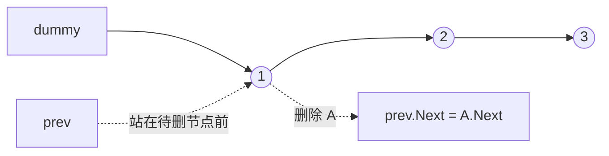

# 虚拟头节点统一删除：链表训练题解

链表删除最容易错在头节点：删中间节点很顺，删第一个节点就要单独分支。虚拟头节点 `dummy` 的价值，就是把“删除头节点”和“删除中间节点”统一成同一个动作。

一句话记法：**永远让 `prev` 站在要删除节点的前一个位置，删除的是 `prev.Next`。**

## 适用场景

- 删除倒数第 N 个节点。
- 删除指定值的节点。
- 删除有序链表中的重复节点。
- 任何可能改变头节点的链表操作。

如果只是遍历不改头，dummy 不一定需要；一旦要删除或重接头部，dummy 往往能让代码更稳。

## 图解思路



删除节点前要先确认 `prev.Next` 存在；删除后 `prev` 是否前进，取决于题目是否还要继续检查新接上来的节点。

## 不变量

- `dummy.Next` 始终指向当前链表头。
- `prev.Next` 是当前考虑删除的节点。
- 删除时只改一条边：`prev.Next = prev.Next.Next`。
- 返回时永远返回 `dummy.Next`，不要返回旧 `head`。

## 手写步骤

1. `dummy := &ListNode{Next: head}`。
2. 让 `prev := dummy`。
3. 循环检查 `prev.Next`。
4. 需要删除时，改 `prev.Next`。
5. 不删除时，`prev = prev.Next`。
6. 返回 `dummy.Next`。

## Go 参考实现：删除指定值

```go
func removeElements(head *ListNode, val int) *ListNode {
	dummy := &ListNode{Next: head}
	prev := dummy
	for prev.Next != nil {
		if prev.Next.Val == val {
			prev.Next = prev.Next.Next
		} else {
			prev = prev.Next
		}
	}
	return dummy.Next
}
```

## 为什么这样写

如果不加 dummy，删除头节点时必须写：

```go
for head != nil && head.Val == val {
	head = head.Next
}
```

然后再处理后续节点。逻辑被拆成两段，边界容易漏。dummy 把头节点前面补出一个永远存在的前驱，所以每次删除都只看 `prev.Next`。

对于 #82 删除所有重复节点，dummy 更重要：如果重复段从头开始，比如 `1->1->2`，最终头节点要变成 `2`，没有 dummy 会很别扭。

## 复杂度

- 时间复杂度：$O(n)$。
- 空间复杂度：$O(1)$。

## 易错点

- 删除后仍然 `prev = prev.Next`，会跳过新接上来的节点。
- 返回旧 `head`，导致头节点被删除时答案错误。
- 操作 `prev.Next.Next` 前没有判断 `prev.Next != nil`。
- dummy 建了但后面仍然直接改 `head`，等于没用上。

## 练习顺序

建议按这个顺序刷：#203, #19, #83, #82。

先练简单删除，再练倒数删除和有序链表去重。重点不是记代码，而是每次都说清楚 `prev` 站在哪里。
