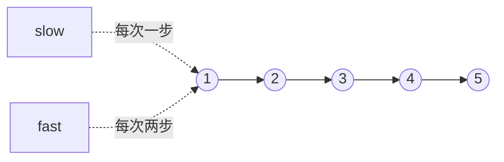

# 快慢指针找中点：链表训练题解

链表不能按下标访问，所以找中点不能像数组一样 `n/2`。快慢指针的思路是：快指针每次走两步，慢指针每次走一步；快指针到尾时，慢指针正好走了一半。

一句话记法：**快指针探路，慢指针落点；循环条件决定中点偏左还是偏右。**

## 适用场景

- 找链表中点。
- 判断回文链表：找中点后反转后半段。
- 重排链表：找中点、断开、反转后半段、交替合并。
- 链表归并排序：找中点并切成两段。

这类题最重要的是中点落在哪，以及是否需要保留中点前驱用于断链。

## 图解思路



当 `fast` 到尾时，`slow` 落在中间。偶数长度时，循环条件不同会得到左中点或右中点。

## 两种常用写法

右中点：

```go
for fast != nil && fast.Next != nil {
	slow = slow.Next
	fast = fast.Next.Next
}
```

左中点，适合排序切分：

```go
for fast.Next != nil && fast.Next.Next != nil {
	slow = slow.Next
	fast = fast.Next.Next
}
```

## 手写步骤

1. 明确要左中点还是右中点。
2. 初始化 `slow, fast := head, head`。
3. 按对应循环条件推进。
4. 如果要断链，记录 `slow.Next` 作为第二段头，再 `slow.Next = nil`。

## Go 参考实现：找中点

```go
func middleNode(head *ListNode) *ListNode {
	slow, fast := head, head
	for fast != nil && fast.Next != nil {
		slow = slow.Next
		fast = fast.Next.Next
	}
	return slow
}
```

## Go 参考实现：排序前切成两段

```go
func split(head *ListNode) (*ListNode, *ListNode) {
	slow, fast := head, head
	for fast.Next != nil && fast.Next.Next != nil {
		slow = slow.Next
		fast = fast.Next.Next
	}
	right := slow.Next
	slow.Next = nil
	return head, right
}
```

## 为什么这样写

对于长度为 4 的链表：

- 第一种条件结束时，`slow` 在第 3 个节点，是右中点。
- 第二种条件结束时，`slow` 在第 2 个节点，是左中点。

归并排序需要把链表切成两段，如果拿右中点当切点，长度为 2 时左段可能切不短，递归会卡住。所以排序时常取左中点，再从 `slow.Next` 切开。

## 复杂度

- 时间复杂度：$O(n)$。
- 空间复杂度：$O(1)$。

## 易错点

- 没想清楚偶数长度要左中点还是右中点。
- `fast.Next.Next` 前没有保证 `fast.Next != nil`。
- 切分后忘记 `slow.Next = nil`，归并排序递归不断链。
- 判断回文时没有处理奇数长度中间节点。

## 练习顺序

建议按这个顺序刷：#876, #234, #143, #148。

先只找中点，再把中点和反转、合并、排序组合起来。
