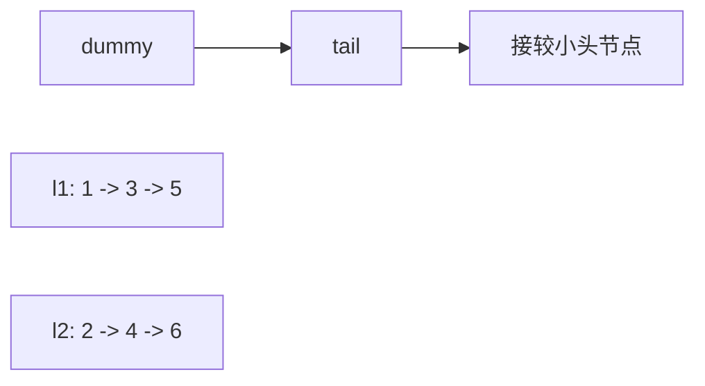

# 两链表同步归并：链表训练题解

合并有序链表的核心是维护结果链表的尾指针 `tail`。每一步从两个链表头部选较小节点，接到 `tail.Next` 后面。

一句话记法：**`tail` 永远指向已合并部分的最后一个节点。**

## 适用场景

- 合并两个有序链表。
- 归并排序链表的合并阶段。
- 合并 K 个有序链表，可以两两合并，也可以用堆。

这类题通常不要新建所有节点，直接重接原节点即可。

## 图解思路



每接一个节点，`tail` 向后移动一步，被接的链表也向后移动一步。

## 不变量

- `dummy.Next` 是结果链表头。
- `tail` 是结果链表当前尾节点。
- `l1` 和 `l2` 指向各自未合并部分的头。
- 已合并部分保持有序。

## 手写步骤

1. 建 dummy 和 `tail`。
2. 当 `l1 != nil && l2 != nil` 时比较两个头节点。
3. 把较小节点接到 `tail.Next`。
4. 推进被选择链表和 `tail`。
5. 循环结束后，把剩余链表直接接到 `tail.Next`。

## Go 参考实现

```go
func mergeTwoLists(l1 *ListNode, l2 *ListNode) *ListNode {
	dummy := &ListNode{}
	tail := dummy
	for l1 != nil && l2 != nil {
		if l1.Val <= l2.Val {
			tail.Next = l1
			l1 = l1.Next
		} else {
			tail.Next = l2
			l2 = l2.Next
		}
		tail = tail.Next
	}
	if l1 != nil {
		tail.Next = l1
	} else {
		tail.Next = l2
	}
	return dummy.Next
}
```

## 为什么这样写

有序链表的最小值一定在某个链表头部。每次拿走较小头节点后，剩余部分仍然各自有序，所以同样的选择可以继续。

`tail` 的职责只是一件事：记住结果链表尾部在哪里。没有 `tail`，每次追加都要重新扫描结果链表，复杂度会变差。

## 复杂度

- 时间复杂度：$O(m+n)$。
- 空间复杂度：$O(1)$，不计递归栈且复用原节点。

## 易错点

- 接上节点后忘记推进 `tail`。
- 循环结束后忘记接剩余链表。
- 比较后推进了错误的链表指针。
- 新建节点复制值，虽然能过，但不必要且容易破坏题目要求。

## 练习顺序

建议按这个顺序刷：#21, #148, #23。

先合并两条，再用于归并排序；最后用堆或分治合并 K 条。
