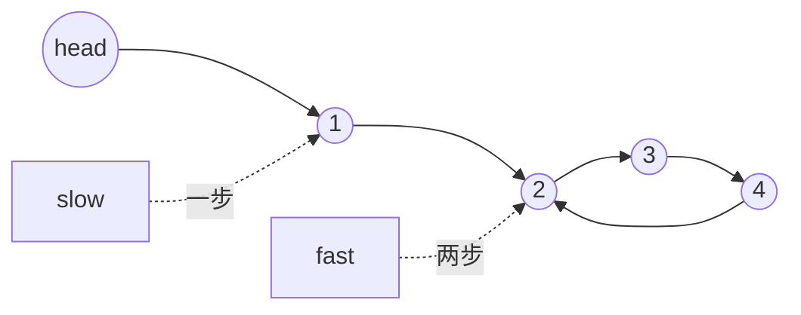

# 检测环并找入口：链表训练题解

链表环问题分两步：先判断有没有环，再找环的入口。快慢指针相遇点不是入口，它只是证明存在环。

一句话记法：**第一次相遇判有环；一个回头、一个留在相遇点，同速再走找入口。**

## 适用场景

- 判断链表是否有环。
- 找环的入口节点。
- 快乐数这类“状态转移成链表”的问题也能用同样思想。

如果允许额外空间，用哈希集合更直观；快慢指针的优势是 $O(1)$ 空间。

## 图解思路



快指针每次比慢指针多走一步，如果有环，最终一定会在环内追上慢指针。

## 不变量

- `slow` 每轮走一步，`fast` 每轮走两步。
- 如果 `fast == nil` 或 `fast.Next == nil`，说明无环。
- 第一次相遇后，把 `p1` 放到头节点，`p2` 放到相遇点。
- `p1` 和 `p2` 每次都走一步，再次相遇就是入口。

## 手写步骤

1. 初始化 `slow, fast := head, head`。
2. 循环推进，若快指针到空则无环。
3. 若 `slow == fast`，跳出。
4. 令 `p1 := head, p2 := slow`。
5. 两者同速前进，直到相遇。
6. 返回相遇节点。

## Go 参考实现

```go
func detectCycle(head *ListNode) *ListNode {
	slow, fast := head, head
	for fast != nil && fast.Next != nil {
		slow = slow.Next
		fast = fast.Next.Next
		if slow == fast {
			p1, p2 := head, slow
			for p1 != p2 {
				p1 = p1.Next
				p2 = p2.Next
			}
			return p1
		}
	}
	return nil
}
```

## 为什么这样写

设头节点到入口距离为 `a`，入口到相遇点距离为 `b`，相遇点再走回入口距离为 `c`。相遇时：

```text
慢指针走了 a + b
快指针走了 a + b + k(b + c)
快指针路程 = 2 * 慢指针路程
```

化简可得 `a = k(b+c) - b`，也就是从头走到入口的距离，等于从相遇点继续走到入口的距离再加若干圈。所以一个从头走，一个从相遇点走，同速会在入口相遇。

## 复杂度

- 时间复杂度：$O(n)$。
- 空间复杂度：$O(1)$。

## 易错点

- 把第一次相遇点当入口返回。
- 循环条件只判断 `fast != nil`，访问 `fast.Next.Next` 空指针。
- 找入口阶段仍然让 fast 走两步。
- 用节点值比较而不是节点指针比较。

## 练习顺序

建议按这个顺序刷：#141, #142。

先判断是否有环，再找入口。能推清楚第二次相遇为什么是入口，这题才算掌握。
