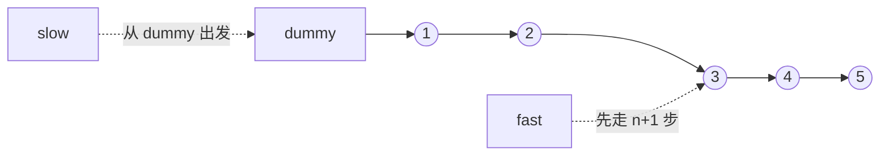

# 倒数第 K 个节点：链表训练题解

单链表不知道长度时，找倒数第 K 个节点最稳的是双指针。让两个指针之间保持 K 个节点的距离，前指针到尾时，后指针正好落在倒数位置。

一句话记法：**先拉开距离，再同步前进。**

## 适用场景

- 删除倒数第 N 个节点。
- 找倒数第 K 个节点。
- 旋转链表时找到新的尾节点。

删除节点时通常让慢指针停在“目标节点的前驱”，所以会配合 dummy 使用。

## 图解思路



删除倒数第 `n` 个节点时，让 `fast` 先从 dummy 走 `n+1` 步，这样 `slow` 最终停在待删节点前驱。

## 不变量

- `fast` 和 `slow` 之间保持固定距离。
- 删除题中，距离设置为 `n + 1`，让 `slow.Next` 是待删节点。
- 同步移动时，两者每轮都走一步。
- 返回 `dummy.Next`。

## 手写步骤

1. 建 dummy 指向 head。
2. `fast, slow := dummy, dummy`。
3. 让 `fast` 先走 `n + 1` 步。
4. 两者同步前进，直到 `fast == nil`。
5. 删除 `slow.Next`。
6. 返回 `dummy.Next`。

## Go 参考实现

```go
func removeNthFromEnd(head *ListNode, n int) *ListNode {
	dummy := &ListNode{Next: head}
	fast, slow := dummy, dummy
	for i := 0; i <= n; i++ {
		fast = fast.Next
	}
	for fast != nil {
		fast = fast.Next
		slow = slow.Next
	}
	slow.Next = slow.Next.Next
	return dummy.Next
}
```

## 为什么这样写

如果让 `fast` 先走 `n` 步，那么同步结束时 `slow` 会停在倒数第 `n` 个节点本身。删除节点需要它的前驱，所以从 dummy 出发并先走 `n+1` 步，让 `slow` 停在前驱。

dummy 还处理了删除头节点的情况：当要删的是原头节点时，`slow` 最终停在 dummy。

## 复杂度

- 时间复杂度：$O(n)$，只扫一遍。
- 空间复杂度：$O(1)$。

## 易错点

- 快指针只先走 `n` 步，却直接删除 `slow.Next`。
- 没有 dummy，删除头节点时需要额外分支。
- 题目如果不保证 `n` 合法，要先做空指针保护。
- 同步循环条件写成 `fast.Next != nil`，落点会偏一位。

## 练习顺序

建议先刷 #19。

复盘时重点画出 `n=链表长度` 的情况，确认删除头节点时 `slow` 在 dummy。
